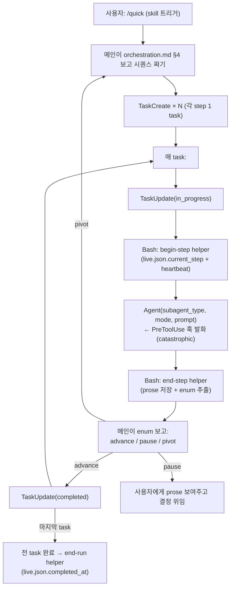

# Conveyor Design — dcNess plugin runtime

> **Status**: ACTIVE
> **Origin**: `DCN-CHG-20260429-29` (초안) / `DCN-CHG-20260429-32` (Task tool 패턴으로 rewrite)
> **Scope**: dcNess 가 plugin (`dcness@dcness`) 으로 사용자 프로젝트에 활성화될 때의 *runtime 인프라* 설계.
> **Relation**: [`orchestration.md`](orchestration.md) = WHAT 룰 (시퀀스 / 권한 / catastrophic). 본 문서 = HOW 인프라 (메인 + Task tool + helpers + 훅).

---

## 0. 정체성 / scope

### 0.1 본 문서가 정의하는 것

dcNess plugin 활성 환경의 **runtime 인프라**:
- 메인 클로드 + Claude Code 의 Task tool 기반 시퀀스 진행
- helper 모듈 (`harness/session_state.py`) — sid/rid 관리, prose 저장, enum 추출
- 훅 (`hooks/session-start.sh`, `hooks/catastrophic-gate.sh`)
- 디렉토리 layout — sid 별 격리 + by-pid 레지스트리 (멀티세션 정합)
- `live.json` 스키마 — 활성 run 메타

### 0.2 본 문서가 정의하지 *않는* 것

- agent prose 형식 / preamble — agent 자율 (proposal §2.5)
- 시퀀스 결정 룰 — `orchestration.md` §4 결정표가 SSOT, 메인이 그것 보고 결정
- agent prompt 구조 — `agents/*.md` SSOT

### 0.3 proposal §2.5 정합

> **harness 가 강제하는 것은 단 2가지 — (1) 작업 순서, (2) 접근 영역. 그 외 모두 agent 자율.**

본 문서는:
- **작업 순서** = catastrophic backbone (orchestration.md §2.3 4 룰) → PreToolUse Agent 훅 강제
- **접근 영역** = HARNESS_ONLY_AGENTS (run 컨텍스트 없으면 engineer 차단) → 동일 훅
- 그 외 = 메인 클로드 자율 결정 (시퀀스 짜기, 재계획, 사용자 위임)

### 0.4 Task tool 패턴 채택 이유 (Python 컨베이어 폐기)

이전 Iteration (`DCN-CHG-20260429-29` 초안) 은 Python `run_conveyor` 함수를 단일 진입점으로 설계. 검토 결과 폐기:

1. **Subagent 호출 분리 문제** — Python 안에서 Agent 호출 시 subprocess `claude --agent` 또는 SDK 직접 호출 필요. 메인 세션의 PreToolUse 훅이 발화 안 하거나 다른 settings 적용. catastrophic 보호 깨짐.
2. **사용자 가시성 0** — Python batch 호출 종료까지 사용자는 "실행 중…" 만 봄.
3. **메인 자율도 0** — 매 step 사이에 메인이 prose 보고 판단할 수 없음 (Python 안 갇힘).

새 모델 = Task tool + Agent + helper + 훅:
- 메인이 매 step 직접 Agent 도구 호출 → PreToolUse 훅 자동 발화
- Agent 도구 자체가 subagent 컨텍스트 격리 (메인 transcript leak 0)
- helper 호출로 ID/prose 관리 일관성 보장
- Task tool 로 진행 가시화 + 메인 매 step 자율 판단

---

## 1. 등장인물

### 1.1 책임 매트릭스

| 역할 | 무엇 | 위치 | 똑똑함 정도 |
|---|---|---|---|
| **메인 클로드** | 시퀀스 설계, Task lifecycle 운영, Agent 호출, 매 step 결과 보고 advance/pause/pivot | (사용자 세션) | 매우 똑똑 (전체 맥락) |
| **서브에이전트** | 자기 칸 작업 + prose 종이 작성 (자유 형식) | `agents/*.md` (frontmatter system prompt + 자체 도구 권한) | 똑똑 (자기 도메인) |
| **Claude Code Task tool** | 메인의 todo list 관리 — 진행 가시화 + 사용자 개입 지점 | CC 내장 | 도구 |
| **Claude Code Agent tool** | 서브에이전트 호출 + 컨텍스트 격리 | CC 내장 | 도구 |
| **해석 하이쿠** | prose → enum 1단어 추출 | `harness/signal_io.interpret_signal` (기존) | 작게 똑똑 |
| **session_state 모듈** | sid/rid 관리, by-pid 레지스트리, atomic write, prose 저장, enum 추출 | `harness/session_state.py` (신규 + 확장) | 도구 |
| **SessionStart 훅** | sid 추출 + `.by-pid/{cc_pid}` 작성 + live.json 초기화 | `hooks/session-start.sh` | 도구 |
| **catastrophic-gate 훅** | PreToolUse Agent 직전 §2.3 4룰 + HARNESS_ONLY_AGENTS 검사 | `hooks/catastrophic-gate.sh` | 도구 |
| **PM 오케스트레이터** | (옵션, 향후) 메인의 시퀀스 짜기 위임 받음 | `agents/orchestrator.md` (Phase follow-up) | — |

### 1.2 안 하는 것 (= 폐기 결정 명시)

- ❌ Python `run_conveyor` 함수 (= 옛 옵션 c JSON 결정자 / 옛 v1 멍청한 순회기) — Agent 호출 격리 + 사용자 가시성 + 메인 자율도 모두 손실
- ❌ JSON 출력 강제 LLM (옛 옵션 c "결정 하이쿠")
- ❌ 별도 관문 하이쿠 (`ADVANCE/ESCALATE` 1-bit) — 해석 하이쿠 + advance_when 비교로 충분
- ❌ 시퀀스 분기 룰 Python dict (옛 옵션 b)
- ❌ 글로벌 `~/.claude/harness-state/.session-id` 폴백 (RWH issue #19 패턴 — 도그푸딩 가치 < 4-가드 복잡도)
- ❌ 환경변수 `DCNESS_RUN_ID` 전파 (Bash subprocess 가 휘발성 — 메인 다음 호출 시 사라짐) → by-pid 레지스트리로 대체
- ❌ 단일 공유 pointer (`.session-id`, `.current-run-id`) — 멀티세션 충돌 → 디렉토리 격리 + by-pid 로 대체

---

## 2. 컨베이어 흐름 (Task lifecycle)

### 2.1 메인의 한 사이클



### 2.2 멈춤 (pause) 조건 — 메인 자율 판단

매 task 끝에 메인이 enum 보고 판단:
- enum ∈ `Step.advance_when` → TaskUpdate(completed) + 다음 task
- enum 이 escalate 계열 (orchestration.md §6) → 사용자 위임
- enum 이 ambiguous (interpret 실패) → 사용자 위임
- 메인의 추가 판단 (예: 사용자 의도 변경) → pivot 또는 pause

**핵심**: pause 가 *예외* 가 아니라 *정상 동작*. 메인이 매 step 통제 가능.

### 2.3 protocol 위반 시 보호

메인이 protocol 안 따르고 Agent 직접 호출하면:
- helper 안 부름 → live.json `current_step` 안 갱신
- prose 종이 안 만들어짐
- **PreToolUse Agent 훅이 차단**:
  - HARNESS_ONLY_AGENTS (engineer / validator-PLAN/CODE/BUGFIX_VALIDATION) 호출 시 → run_dir 안 prose 검사 → 없으면 차단
  - run_dir 자체가 없으면 → DCNESS_RUN_ID env 또는 by-pid 레지스트리 검사 → 없으면 HARNESS_ONLY_AGENTS 차단

→ 메인이 도지덜 해도 catastrophic 룰은 훅이 잡음.

---

## 3. 데이터 모델

> Python signature 수준. 실 구현은 `harness/session_state.py` 모듈.

### 3.1 Step (참고용 — 메인이 마음속으로 짜는 시퀀스)

메인이 시퀀스 짤 때 *개념적* 으로 사용:

```python
@dataclass
class Step:
    agent: str           # 13 agent 중 하나
    mode: Optional[str]  # PLAN_VALIDATION 등 또는 None
    allowed_enums: tuple # interpret_signal 후보 (예: ("PASS", "FAIL", "SPEC_MISSING"))
    advance_when: tuple  # 성공 enum (예: ("PASS",))
```

실제 시퀀스는 메인의 머리 속 또는 Task list 의 task 들로 표현. Python 코드 상 객체로 영속될 필요 없음.

### 3.2 helper 호출 인터페이스 (Bash)

메인이 매 step 호출:

```bash
# step 시작
$ python3 -m harness.session_state begin-step <agent> [<mode>]
ok

# step 끝 (prose 저장 + enum 추출)
$ python3 -m harness.session_state end-step <agent> [<mode>] \
    --allowed-enums "PASS,FAIL,SPEC_MISSING" \
    --prose-file /tmp/prose.md
PASS
# stdout: 추출된 enum 1단어 (또는 "AMBIGUOUS")
```

### 3.3 run lifecycle helper

```bash
# run 시작
$ python3 -m harness.session_state begin-run <entry_point>
run-a3f81b29
# stdout: 새 run_id

# run 종료 (성공)
$ python3 -m harness.session_state end-run

# (멈춤은 별도 처리 안 함 — live.json 의 슬롯이 미완료로 남음, 24h 후 cleanup)
```

---

## 4. 멀티세션 — session_id / run_id 관리

### 4.1 멀티세션 = 기본 가정

사용자가 같은 프로젝트에 동시 두 CC 세션 띄우는 건 흔함. 모든 자원 격리 필수.

### 4.2 session_id 출처 (3 경로)

| 경로 | 누가 사용 |
|---|---|
| **CC stdin payload** (`sessionId` / `session_id` / `sessionid` 3 변형) | 모든 훅 (SessionStart, PreToolUse, PostToolUse, Stop) |
| **`.by-pid/{cc_pid}` 파일** (SessionStart 훅이 작성) | helper (Bash subprocess) — `$PPID = CC main pid` 로 lookup |
| **메인 세션 자체 알고 있음** | (메인 LLM 이 sid 명시 처리는 어려움 — 위 두 경로로 충분) |

### 4.3 session_id 검증 (OMC 차용)

```python
SESSION_ID_RE = re.compile(r"^[a-zA-Z0-9][a-zA-Z0-9_-]{0,255}$")
```

### 4.4 run_id 형식

```python
import secrets
run_id = f"run-{secrets.token_hex(4)}"   # run-a3f81b29
```

- 16M 조합 → sid 안 충돌 사실상 0
- 짧고 가독성 OK

### 4.5 by-pid 레지스트리 (env 변수 대체)

env 전파 안 통하는 이유:
- 메인 → Bash subprocess (env set)
- Bash 끝나면 메인 process 의 env 변경 0
- 다음 Bash 호출 시 메인의 env 그대로

해결 = **PID-keyed 파일**:
- `.by-pid/{cc_pid}` ← sid (SessionStart 훅이 작성)
- `.by-pid-current-run/{cc_pid}` ← rid (begin-run helper 가 작성)
- helper / 훅 모두 `$PPID` (Bash) 또는 hook 의 `$PPID` (CC main pid) 로 lookup

```bash
# helper 안에서
CC_PID=$PPID  # Bash subprocess 의 부모 = CC main
SID=$(cat .claude/harness-state/.by-pid/$CC_PID)
RID=$(cat .claude/harness-state/.by-pid-current-run/$CC_PID 2>/dev/null)
```

### 4.6 PID 재사용 보호

OS 가 PID 재할당 가능 (CC 12345 종료 후 다른 프로세스가 12345 받음).

완화책:
- `.by-pid/{cc_pid}` 안에 `sid` + `start_ts` 같이 저장 → 검증 시 timestamp 체크
- Stop 훅 (선택) 으로 종료 시 cleanup
- `cleanup_stale_runs` 가 6h 이상 stale 한 by-pid 도 정리

---

## 5. 디렉토리 layout

```
.claude/harness-state/
├── .sessions/                                  # sid 별 격리 (멀티세션 핵심)
│   ├── {sid-A}/
│   │   ├── live.json                           # 세션 A 의 active_runs (§6 스키마)
│   │   └── runs/
│   │       ├── {run_id-A1}/                    # 세션 A 의 첫 번째 run
│   │       │   ├── architect-MODULE_PLAN.md    # prose 종이
│   │       │   ├── validator-PLAN_VALIDATION.md
│   │       │   ├── test-engineer.md            # mode 없는 agent 는 agent.md
│   │       │   ├── engineer-IMPL.md
│   │       │   ├── validator-CODE_VALIDATION.md
│   │       │   └── pr-reviewer.md
│   │       └── {run_id-A2}/...
│   └── {sid-B}/...
├── .by-pid/                                    # cc_pid → sid 매핑
│   ├── {cc_pid_A}                              # 세션 A 의 CC main pid
│   └── {cc_pid_B}
├── .by-pid-current-run/                        # cc_pid → 현재 활성 rid
│   ├── {cc_pid_A}
│   └── {cc_pid_B}
├── .global.json                                # 전역 신호 (lenient — 세션 무관)
└── .logs/
```

**격리 보증**:
- sid 별 디렉토리 → 세션 간 충돌 0
- by-pid 별 파일 → 세션 간 pointer 충돌 0
- attempt 별 prose 보존 X (= 옵션 D, 덮어쓰기) — 마지막 시도만 디스크에 남음

---

## 6. live.json 스키마

### 6.1 스키마 (OMC active_runs 패턴)

```json
{
  "_meta": {
    "sessionId": "abc-def-...",
    "writtenAt": "2026-04-29T12:00:00Z",
    "version": 1
  },
  "session_id": "abc-def-...",

  "active_runs": {
    "run-a3f81b29": {
      "run_id": "run-a3f81b29",
      "entry_point": "quick",
      "started_at": "2026-04-29T12:00:00Z",
      "last_confirmed_at": "2026-04-29T12:01:30Z",
      "completed_at": null,
      "run_dir": ".claude/harness-state/.sessions/abc-def/runs/run-a3f81b29",
      "current_step": {
        "agent": "engineer",
        "mode": "IMPL",
        "started_at": "2026-04-29T12:01:30Z"
      },
      "issue_num": 42
    }
  }
}
```

### 6.2 차용 표

| 필드 | 출처 | 이유 |
|---|---|---|
| `_meta.sessionId/writtenAt/version` | RWH | leftover 방어 + 스키마 진화 |
| `session_id` 자기참조 | RWH | envelope 검증 (다른 세션 덮어쓰기 거부) |
| `active_runs` map | OMC SkillActiveStateV2 | 동시 다중 run 지원 |
| `started_at` / `completed_at` | OMC | soft tombstone (디버깅/감사) |
| `last_confirmed_at` | OMC | heartbeat — stale run 탐지 |
| `current_step` | dcNess 신규 | 컨베이어가 어느 칸 진행 중 |
| `entry_point` | dcNess 신규 | quick / product-plan / qa 등 진입점 |
| `run_dir` | dcNess 신규 | 훅이 prose 디렉토리 직접 찾는 폴백 |
| `issue_num` | RWH | GitHub 연동 시 |

### 6.3 lifecycle

| 시점 | 동작 |
|---|---|
| SessionStart 훅 | `live.json` 초기 (`active_runs: {}`) |
| begin-run helper | `active_runs[run_id] = {...}` 추가 + `.by-pid-current-run/{cc_pid}` 작성 |
| begin-step helper | `current_step` 갱신 + `last_confirmed_at` |
| end-step helper | (선택) `last_confirmed_at` 갱신만 |
| end-run helper | `completed_at` 채움 + `current_step = null` + `.by-pid-current-run/{cc_pid}` 삭제 |
| 24h cleanup | completed 이거나 heartbeat dead 슬롯 삭제 |

---

## 7. 훅 책임 분담

### 7.1 SessionStart 훅 (신규)

**파일**: `hooks/session-start.sh`
**트리거**: CC 세션 시작
**책임**:
1. stdin payload 에서 sessionId 추출 (3 변형 fallback)
2. regex 검증
3. `$PPID` 로 CC main pid 추출
4. `.by-pid/{cc_pid}` ← sid 작성 (atomic, 0o600)
5. `.sessions/{sid}/live.json` 초기화 (이미 있으면 envelope 검증 후 보존)

### 7.2 PreToolUse Agent 훅 (`catastrophic-gate`, 신규)

**파일**: `hooks/catastrophic-gate.sh`
**트리거**: PreToolUse, tool=Agent
**책임**: orchestration.md §2.3 4룰 + HARNESS_ONLY_AGENTS 강제 (§8 참조)
**차단 시**: stderr 메시지 + exit 1 → CC 가 Agent 호출 거부

### 7.3 PostToolUse Agent 훅 (선택, 후속)

**파일**: `hooks/post-agent.sh`
**책임**: `last_confirmed_at` 자동 갱신 (메인이 end-step 안 불러도 heartbeat 보장)

### 7.4 git pre-commit 훅 (기존)

**책임**: Document Sync (governance §2.5). 컨베이어 / catastrophic 검사와 직교.

---

## 8. catastrophic backbone — 훅 강제

### 8.1 4룰 매핑

| 룰 | 훅 검사 |
|---|---|
| §2.3.1 src/ 변경 후 CODE_VALIDATION 없이 pr-reviewer 금지 | PreToolUse(Agent), subagent=pr-reviewer → run_dir 안 `validator-CODE_VALIDATION.md` 또는 `validator-BUGFIX_VALIDATION.md` 안 PASS 확인 |
| §2.3.2 LGTM 없이 merge 금지 | branch protection (governance §2.8) — 외부화 |
| §2.3.3 architect plan READY 없이 engineer 금지 | PreToolUse(Agent), subagent=engineer, mode≠POLISH → run_dir 안 `architect-MODULE_PLAN.md` (READY_FOR_IMPL) 또는 `architect-LIGHT_PLAN.md` (LIGHT_PLAN_READY) 확인 |
| §2.3.4 PRD 변경 후 plan-reviewer + ux-architect 없이 architect SD/TD 금지 | PreToolUse(Agent), subagent=architect, mode∈{SYSTEM_DESIGN,TASK_DECOMPOSE} → 가장 최근 product-planner 후 plan-reviewer PASS + ux-architect READY 확인 |

### 8.2 HARNESS_ONLY_AGENTS

```
HARNESS_ONLY_AGENTS = {
    ("engineer", "*"),
    ("validator", "PLAN_VALIDATION"),
    ("validator", "CODE_VALIDATION"),
    ("validator", "BUGFIX_VALIDATION"),
}
```

이 agent/mode 조합은 *컨베이어 컨텍스트 (run_dir + by-pid 레지스트리)* 가 있어야 호출 가능. 없으면 차단.

### 8.3 훅 동작 (pseudo-bash)

```bash
#!/usr/bin/env bash
INPUT=$(cat)
SID=$(jq -r '.sessionId // .session_id // .sessionid' <<< "$INPUT")
[[ "$SID" =~ ^[a-zA-Z0-9][a-zA-Z0-9_-]{0,255}$ ]] || exit 0  # invalid → silent skip

CC_PID=$PPID  # 훅 실행 컨텍스트 — CC main 의 자식
RID=$(cat .claude/harness-state/.by-pid-current-run/$CC_PID 2>/dev/null)

SUBAGENT=$(jq -r '.tool_input.subagent_type // empty' <<< "$INPUT")
MODE=$(jq -r '.tool_input.mode // empty' <<< "$INPUT")

# 1. HARNESS_ONLY_AGENTS — RID 없으면 차단
case "$SUBAGENT:$MODE" in
    engineer:*|validator:PLAN_VALIDATION|validator:CODE_VALIDATION|validator:BUGFIX_VALIDATION)
        if [ -z "$RID" ]; then
            echo "[catastrophic] $SUBAGENT$([ -n "$MODE" ] && echo ":$MODE") 는 컨베이어 경유 필수 (run 미시작)" >&2
            exit 1
        fi
        ;;
esac

[ -z "$RID" ] && exit 0  # run 외부 호출 — 그 외 agent 는 통과

RUN_DIR=".claude/harness-state/.sessions/$SID/runs/$RID"

# 2. §2.3.3 — engineer 직전 검사
if [ "$SUBAGENT" = "engineer" ] && [ "$MODE" != "POLISH" ]; then
    if grep -q "READY_FOR_IMPL" "$RUN_DIR/architect-MODULE_PLAN.md" 2>/dev/null \
       || grep -q "LIGHT_PLAN_READY" "$RUN_DIR/architect-LIGHT_PLAN.md" 2>/dev/null; then
        :
    else
        echo "[catastrophic §2.3.3] engineer 호출은 architect plan READY 후만" >&2
        exit 1
    fi
fi

# 3. §2.3.1 — pr-reviewer 직전 검사
if [ "$SUBAGENT" = "pr-reviewer" ]; then
    if [ -f "$RUN_DIR/engineer-IMPL.md" ] || [ -f "$RUN_DIR/engineer-POLISH.md" ]; then
        if grep -q "PASS" "$RUN_DIR/validator-CODE_VALIDATION.md" 2>/dev/null \
           || grep -q "PASS" "$RUN_DIR/validator-BUGFIX_VALIDATION.md" 2>/dev/null; then
            :
        else
            echo "[catastrophic §2.3.1] pr-reviewer 호출은 validator CODE/BUGFIX_VALIDATION PASS 후만" >&2
            exit 1
        fi
    fi
fi

# 4. §2.3.4 — architect SD/TD 직전 검사
if [ "$SUBAGENT" = "architect" ] && { [ "$MODE" = "SYSTEM_DESIGN" ] || [ "$MODE" = "TASK_DECOMPOSE" ]; }; then
    if [ -f "$RUN_DIR/product-planner.md" ]; then
        grep -q "PLAN_REVIEW_PASS" "$RUN_DIR/plan-reviewer.md" 2>/dev/null \
            || { echo "[catastrophic §2.3.4] PRD 변경 후 plan-reviewer PLAN_REVIEW_PASS 필수" >&2; exit 1; }
        grep -qE "UX_FLOW_READY|UX_FLOW_PATCHED" "$RUN_DIR/ux-architect.md" 2>/dev/null \
            || { echo "[catastrophic §2.3.4] PRD 변경 후 ux-architect UX_FLOW_READY 필수" >&2; exit 1; }
    fi
fi

exit 0
```

### 8.4 보호 다중화

| 위치 | 무엇 막나 | 룰 |
|---|---|---|
| **PreToolUse Agent 훅** (catastrophic-gate) | engineer / pr-reviewer / architect 잘못된 호출 | §2.3.1 / §2.3.3 / §2.3.4 |
| **branch protection** (이미 있음) | merge (LGTM 없이) | §2.3.2 |
| **git pre-commit** (이미 있음) | docs 미동반 commit | governance |

훅 1곳만 막혀도 차단. 메인 의도적 우회 시 3 단계 모두 우회는 불가.

---

## 9. atomic write 정책

### 9.1 RWH 패턴 차용 (이미 `session_state.atomic_write` 구현)

```python
def atomic_write(target: Path, content: bytes, *, mode: int = 0o600) -> None:
    """O_EXCL+fsync+rename+dir fsync — POSIX atomic 보장."""
```

### 9.2 적용 대상

| 파일 | 적용 |
|---|---|
| `live.json` | ✅ |
| `.by-pid/{cc_pid}` | ✅ |
| `.by-pid-current-run/{cc_pid}` | ✅ |
| prose `.md` (signal_io.write_prose) | ⚠️ 현재 `os.replace` — 강화 필요 (별도 Task) |
| `.attempts.json` | ✅ |
| `.metrics/*.jsonl` | ❌ append-only, line < 4KB → POSIX atomic 자연 |

### 9.3 권한

모든 atomic write 파일 `0o600` (소유자 전용).

---

## 10. PM 오케스트레이터 (옵션, 향후)

### 10.1 도입 여부 — 미정

현재 디자인: **메인 클로드가 시퀀스 결정**. PM 별도 agent 도입 안 함.

### 10.2 도입 시 design

`agents/orchestrator.md` (frontmatter prose-only):
- 입력 (prompt 으로): 작업 목표 / 최근 prose 종이 경로 / 멈춘 이유
- 출력 (자유 prose): 권장 시퀀스 prose 권장 + 결론 enum (`SEQUENCE_READY` 등)
- 메인이 PM prose 읽고 자체 LLM 두뇌로 task list 구성 — JSON 파싱 0

### 10.3 메인 직접 vs PM 위임 트레이드오프

| 측면 | 메인 직접 | PM 위임 |
|---|---|---|
| 추가 호출 | 0 | +1 / 결정 |
| 사용자 의도 누적 | ✅ 자동 | ⚠️ 호출자가 매번 prompt |
| 메인 컨텍스트 청소 | ❌ 결정표 prose 누적 | ✅ 분리 |
| 결정 일관성 | 메인 모델 의존 | PM system prompt 통일 |
| 재사용 (다중 진입점) | skill 마다 중복 | ✅ 한 PM |

### 10.4 도입 시점

별도 Task. 본 문서는 hook + 위치만 명시.

---

## 11. 폐기한 것들

### 11.1 PR #28 (`DCN-CHG-20260429-28`) — 옵션 c JSON 결정자 모델

폐기 이유: LLM JSON 출력 강제 = proposal §2.5 (prose-only) 충돌. 도그푸딩 결과 LLM JSON 형식 미준수 빈발 → 휴리스틱 파싱 추가는 dcNess 정신 위반.

폐기 대상:
- `harness/orchestration_agent.py` (`decide_next_sequence`, `parse_sequence_json`, system prompt)
- `harness/impl_driver.py` v1 의 catastrophic / retry hardcode
- ESCALATE_ENUMS hardcode

### 11.2 PR #29 (`DCN-CHG-20260429-29`) 의 v1 design — Python 멍청한 컨베이어

이전 conveyor-design.md 가 정의한 `run_conveyor` 함수 모델. 폐기 이유:

1. **Subagent 호출 격리 부족** — Python 안에서 Agent 호출 시 subprocess `claude --agent` 또는 SDK 직접 호출. 메인 세션의 PreToolUse 훅 미발화 또는 다른 settings 적용. catastrophic 보호 깨짐.
2. **사용자 가시성 0** — Python batch 종료까지 진행 안 보임.
3. **메인 자율도 0** — 매 step 사이 메인 개입 불가.

대체: 본 문서 (Task tool + Agent + helper + 훅 패턴).

### 11.3 토론 중 검토 후 폐기한 옵션

| 옵션 | 이유 |
|---|---|
| (α) 단일 라벨 결정 하이쿠 (`ADVANCE/RETRY/INSERT_SPEC_GAP/ESCALATE`) | 라벨 늘면 driver hardcode 부담. 메인 결정 + 훅이 더 단순 |
| (β) 정적 dict 라우팅 (옵션 b 부활) | 분기 룰 코드 박힘 — proposal §2.5 원칙 1 약화 |
| 글로벌 `~/.claude` 폴백 (RWH issue #19) | 도그푸딩 가치 < 4-가드 복잡도 |
| 관문 하이쿠 별도 LLM 호출 | 해석 하이쿠 + advance_when 비교로 충분 |
| 환경변수 `DCNESS_RUN_ID` 전파 | Bash subprocess 휘발성 — 메인 다음 호출 시 사라짐 |
| 단일 `.session-id` / `.current-run-id` pointer | 멀티세션 충돌 — by-pid 레지스트리로 대체 |

---

## 12. 참조

### 12.1 외부

- **OMC** (Yeachan-Heo/oh-my-claudecode) — 원조 패턴
  - `src/lib/session-isolation.ts` — `isStateForSession()` strict-by-default
  - `src/hooks/skill-state/index.ts` — `SkillActiveStateV2` (active_skills map + soft tombstone)
  - `templates/hooks/session-start.mjs` — SessionStart 훅 패턴
- **RWHarness** — 진화된 패턴
  - `hooks/session_state.py` — 3-tier resolution + `_meta` envelope + atomic write
  - `harness/executor.py` — `update_live(harness_active=True, ...)` 패턴
  - `docs/impl/19-session-id-fallback.md` — 글로벌 폴백 동기 (dcNess 미채택)

### 12.2 내부

- [`orchestration.md`](orchestration.md) — 시퀀스 / 권한 / catastrophic 룰 SSOT
- [`process/governance.md`](process/governance.md) — Task-ID / doc-sync / branch protection
- [`status-json-mutate-pattern.md`](status-json-mutate-pattern.md) — proposal §2.5 대 원칙
- [`process/branch-protection-setup.md`](process/branch-protection-setup.md) — §2.3.2 외부화
- `harness/signal_io.py` — interpret_signal 단일 호출
- `harness/interpret_strategy.py` — heuristic-first + LLM-fallback
- `harness/llm_interpreter.py` — Anthropic haiku interpreter
- `harness/session_state.py` — sid/rid 관리, atomic write, live.json (`DCN-CHG-20260429-30` 머지)
- `agents/*.md` — 13 agent prose writing guide

### 12.3 향후 작업 (별도 Task-ID)

- `harness/session_state.py` 확장 — by-pid 레지스트리 함수 + CLI subcommands (`init-session/begin-run/end-run/begin-step/end-step`)
- `hooks/session-start.sh` 신규
- `hooks/catastrophic-gate.sh` 신규
- `hooks/post-agent.sh` (선택, heartbeat 자동화)
- `.claude/settings.json` 템플릿 — plugin 활성 시 hook 자동 등록
- `signal_io.write_prose` atomic write 강화
- `agents/orchestrator.md` PM 도입 검토 (plugin Phase)
- skill prompt 템플릿 — `/quick`, `/product-plan`, `/qa` 등이 helper protocol 따르도록
