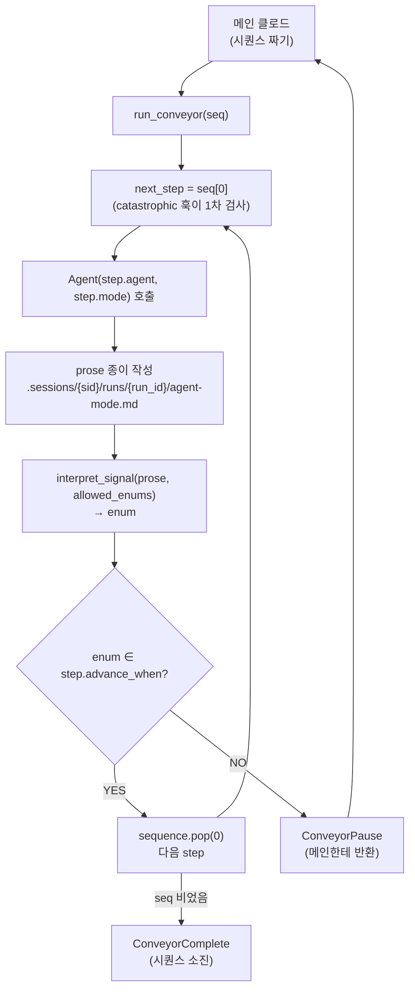

# Conveyor Design — dcNess plugin runtime

> **Status**: ACTIVE
> **Origin**: `DCN-CHG-20260429-29`
> **Scope**: dcNess 가 plugin (`dcness@dcness`) 으로 사용자 프로젝트에 활성화될 때의 *runtime 인프라* 설계.
> **Relation**: [`orchestration.md`](orchestration.md) = WHAT 룰 (시퀀스 / 권한 / catastrophic). 본 문서 = HOW 인프라 (컨베이어 / 세션 / 디렉토리 / 훅).

---

## 0. 정체성 / scope

### 0.1 본 문서가 정의하는 것

dcNess 가 plugin 으로 사용자 프로젝트에 활성화됐을 때 동작하는 **runtime 인프라**:
- 컨베이어 (Python driver) — 시퀀스 순회
- 세션/run 식별 — 멀티세션 격리
- 디렉토리 layout — prose 종이 + state 파일
- `live.json` 스키마 — 활성 run 메타
- 훅 책임 분담 — SessionStart / PreToolUse / PostToolUse
- catastrophic backbone 강제 메커니즘
- atomic write 정책

### 0.2 본 문서가 정의하지 *않는* 것

- agent prose 형식 / preamble — agent 자율 (proposal §2.5)
- 시퀀스 결정 룰 — `orchestration.md` §4 결정표가 SSOT, 메인 클로드가 그것 보고 결정
- agent prompt 구조 — `agents/*.md` SSOT

### 0.3 proposal §2.5 정합

> **harness 가 강제하는 것은 단 2가지 — (1) 작업 순서, (2) 접근 영역. 그 외 모두 agent 자율.**

본 문서는:
- **작업 순서** = catastrophic backbone (orchestration.md §2.3 4 룰) → PreToolUse 훅 강제
- **접근 영역** = HARNESS_ONLY_AGENTS (DCNESS_RUN_ID 없으면 engineer 차단) → 동일 훅
- 그 외 = 메인 클로드의 자율 결정 (시퀀스 짜기, 재계획, 사용자 위임)

---

## 1. 등장인물

### 1.1 책임 매트릭스

| 역할 | 무엇 | 코드 위치 | 똑똑함 정도 |
|---|---|---|---|
| **메인 클로드** | 시퀀스 설계, ConveyorPause 받고 재계획, 사용자 의도 파악 | (사용자 세션) | 매우 똑똑 (전체 맥락) |
| **컨베이어** | 시퀀스 순회, Agent 호출, prose 수집, 결과 반환 | `harness/impl_driver.py` (~50줄) | 멍청 (loop 만) |
| **서브에이전트** | 자기 칸 작업 + prose 종이 작성 | `agents/*.md` | 똑똑 (자기 도메인) |
| **해석 하이쿠** | prose → enum 1단어 추출 | `harness/signal_io.interpret_signal` (기존) | 작게 똑똑 (단일 enum) |
| **세션 인프라** | session_id / run_id 추적, live.json 갱신 | `harness/session_state.py` (신규, OMC+RWH 차용) | 도구 |
| **catastrophic 훅** | Agent 호출 직전 §2.3 4룰 검사 | `hooks/catastrophic-gate.sh` (신규) | 도구 |
| **PM 오케스트레이터** | (옵션) 시퀀스 짜기 위임 받음 | `agents/orchestrator.md` (Phase follow-up) | — |

### 1.2 안 하는 것 (= 폐기 결정 명시)

- ❌ JSON 출력 강제 LLM (옛 옵션 c "결정 하이쿠")
- ❌ 별도 관문 하이쿠 (`ADVANCE/ESCALATE` 1-bit) — 해석 하이쿠 + advance_when 비교로 충분
- ❌ 컨베이어 코드 안 catastrophic / retry hardcode (모두 훅으로 이전)
- ❌ 시퀀스 분기 룰 Python dict (옛 옵션 b)
- ❌ 글로벌 `~/.claude/harness-state/.session-id` 폴백 (RWH issue #19 패턴 — 도그푸딩 가치 < 복잡도)

---

## 2. 컨베이어 흐름

### 2.1 정상 흐름 (시퀀스 완주)



### 2.2 멈춤 트리거 3종

| reason | 의미 | 메인이 받는 정보 |
|---|---|---|
| `judge_escalate` | enum ∉ advance_when (예: validator FAIL) | 직전 step + prose + enum |
| `agent_emit_escalate` | enum 자체가 ESCALATE 계열 (orchestration.md §6) | 동일 + escalate 종류 |
| `interpret_failed` | interpret_signal 이 ambiguous (휴리스틱 + LLM fallback 모두 실패) | step + prose + ambiguous reason |
| `hook_blocked` | PreToolUse 훅이 catastrophic 위반 차단 | step + 위반 룰 (예: §2.3.3) |

### 2.3 메인의 자율 처리

ConveyorPause 받은 메인이 할 수 있는 것 — 무제한:
- 새 시퀀스로 `run_conveyor` 재호출 (같은 run_id 또는 새 run_id)
- 컨베이어 안 쓰고 다른 agent 직접 호출
- 사용자한테 prose 보여주고 결정 위임
- 작업 종료

컨베이어는 메인의 결정에 강제 0. 멈춤 = 정상 동작.

---

## 3. 데이터 모델

> Python dataclass / type 시그니처 수준. 실 구현은 `harness/impl_driver.py` 별도 Task.

### 3.1 Step

```python
@dataclass(frozen=True)
class Step:
    agent: str                    # 13 agent 중 하나 (validator/engineer/...)
    mode: Optional[str]           # 모드 (PLAN_VALIDATION/IMPL/...) 또는 None
    allowed_enums: tuple[str]     # interpret_signal 에 전달 (모든 가능 결론)
    advance_when: tuple[str]      # 이 enum 들 중 하나면 컨베이어가 다음 step 진행
                                  # advance_when ⊆ allowed_enums
```

**왜 둘로 나뉘는가**:
- `allowed_enums` = 해석 하이쿠한테 "이 중 하나로 답해" 라고 알려주는 후보 집합 (PASS/FAIL/SPEC_MISSING/IMPL_DONE/SPEC_GAP_FOUND/...)
- `advance_when` = 그 중 "성공으로 간주할 enum" 부분집합. 나머지는 ConveyorPause 트리거.

예시:
```python
Step(
    agent="validator",
    mode="PLAN_VALIDATION",
    allowed_enums=("PASS", "FAIL", "SPEC_MISSING"),
    advance_when=("PASS",),
)
Step(
    agent="engineer",
    mode="IMPL",
    allowed_enums=("IMPL_DONE", "SPEC_GAP_FOUND", "TESTS_FAIL", "IMPLEMENTATION_ESCALATE"),
    advance_when=("IMPL_DONE",),
)
```

### 3.2 StepResult

```python
@dataclass
class StepResult:
    step: Step
    prose: str                    # agent 가 emit 한 자유 텍스트
    prose_path: Path              # .sessions/{sid}/runs/{run_id}/agent-mode.md
    parsed_enum: str              # interpret_signal 결과
    started_at: str               # ISO8601
    finished_at: str              # ISO8601
```

### 3.3 ConveyorPause / ConveyorComplete

```python
@dataclass
class ConveyorPause:
    reason: str                   # judge_escalate / agent_emit_escalate / interpret_failed / hook_blocked
    last_step: Step
    last_prose: str
    last_prose_path: Path
    parsed_enum: Optional[str]    # interpret 실패 시 None
    history: list[StepResult]
    remaining_sequence: list[Step]
    run_id: str
    state_dir: Path
    detail: Optional[str]         # 훅 차단 reason / interpret ambiguous detail

@dataclass
class ConveyorComplete:
    history: list[StepResult]
    run_id: str
    state_dir: Path

ConveyorResult = ConveyorPause | ConveyorComplete
```

`run_conveyor()` 가 둘 중 하나 반환. 예외 raise 안 함 (메인이 isinstance 로 분기).

### 3.4 DriverContext (내부)

컨베이어가 한 사이클 동안 들고 다니는 상태:

```python
@dataclass
class DriverContext:
    run_id: str
    session_id: str
    base_dir: Path                # .claude/harness-state/.sessions/{sid}/runs/{run_id}/
    history: list[StepResult] = field(default_factory=list)
    attempts: dict[str, int] = field(default_factory=dict)  # `.attempts.json` 영속화
```

---

## 4. 멀티세션 — session_id 와 run_id

### 4.1 session_id resolution (3-tier, RWH 차용)

```python
def current_session_id() -> str:
    # 1. env var (subprocess 전파 — 가장 권위)
    sid = os.environ.get("DCNESS_SESSION_ID", "")
    if valid_session_id(sid):
        return sid
    # 2. 프로젝트 .session-id pointer (SessionStart 훅이 작성)
    sid = read_pointer(Path.cwd() / ".claude" / "harness-state" / ".session-id")
    if valid_session_id(sid):
        return sid
    # 3. 글로벌 폴백 — 채택 안 함 (도그푸딩 복잡도 회피)
    return ""
```

### 4.2 session_id 형식

OMC 차용 — Claude Code 가 자체 발급:
```python
SESSION_ID_RE = re.compile(r"^[a-zA-Z0-9][a-zA-Z0-9_-]{0,255}$")
```

훅 stdin payload 의 3 변형 fallback (OMC 패턴):
```python
sid = data.get("session_id") or data.get("sessionId") or data.get("sessionid") or ""
```

### 4.3 run_id 형식

```python
import secrets
run_id = f"run-{secrets.token_hex(4)}"   # 예: run-a3f81b29
```

- 16M 조합 → 한 세션 안 충돌 사실상 0
- 짧고 가독성 OK
- session_id 안에서만 unique 보장 필요 (디렉토리가 sid 별 격리됨)

### 4.4 환경변수 전파

컨베이어가 시작/종료 시 set/unset:

```python
def run_conveyor(...) -> ConveyorResult:
    sid = current_session_id()
    run_id = f"run-{secrets.token_hex(4)}"
    os.environ["DCNESS_SESSION_ID"] = sid
    os.environ["DCNESS_RUN_ID"] = run_id
    try:
        ... loop ...
    finally:
        os.environ.pop("DCNESS_RUN_ID", None)
        # DCNESS_SESSION_ID 는 그대로 (다른 컨베이어가 또 돌 수 있음)
```

훅은 `os.environ.get("DCNESS_RUN_ID")` 로 읽음. subprocess Agent 호출은 부모 env 상속.

### 4.5 멀티세션 안전성 보장

| 자원 | 충돌 가능성 | 격리 메커니즘 |
|---|---|---|
| session_id | 0 (CC 자체 발급) | — |
| run_id (한 세션 안) | ~0 (token_hex(4)) | secrets.token_hex |
| `.sessions/{sid}/` 디렉토리 | 0 (sid 격리) | filesystem |
| `live.json` | 0 (sid 별 1개) | — |
| `DCNESS_RUN_ID` env | 0 (프로세스별) | OS env vars |
| `.attempts.json` | 0 (run_id 별) | — |
| `.metrics/*.jsonl` | 가능 | append-only + atomic line write |

---

## 5. 디렉토리 layout

```
.claude/harness-state/
├── .session-id                                  # 현재 세션 pointer (SessionStart 훅 작성)
├── .global.json                                  # 전역 신호 (lenient — 세션 무관 상태)
├── .sessions/
│   └── {sid}/                                    # 세션 스코프 (멀티세션 격리)
│       ├── live.json                             # 활성 run 메타 (§6 스키마)
│       └── runs/
│           ├── {run_id}/                         # 컨베이어 사이클 스코프
│           │   ├── architect-MODULE_PLAN.md      # prose 종이 (덮어쓰기, attempt 별 X)
│           │   ├── validator-PLAN_VALIDATION.md
│           │   ├── test-engineer.md              # mode 없는 agent 는 agent.md
│           │   ├── engineer-IMPL.md
│           │   ├── validator-CODE_VALIDATION.md
│           │   ├── pr-reviewer.md
│           │   └── .attempts.json                # 카운터 (덮어쓰기 방어)
│           └── {run_id-2}/...
└── .logs/
```

**디렉토리 격리 자체가 멀티세션 leftover 방어**. 다른 세션이 같은 파일 만질 경로 없음.

**attempt 별 prose 보존 X (옵션 D)**: 같은 (agent, mode) 가 여러 번 돌아도 마지막만 디스크에 남음. `.attempts.json` 이 카운트만 유지. 옛 prose 손실 인정 — 디버깅은 git history 또는 최신 prose 로 충분.

---

## 6. live.json 스키마 (OMC active_runs 패턴)

### 6.1 스키마

```json
{
  "_meta": {
    "sessionId": "abc-def-...",
    "writtenAt": "2026-04-29T12:00:00Z",
    "version": 1
  },
  "session_id": "abc-def-...",

  "active_runs": {
    "run-a3f81b29": {
      "run_id": "run-a3f81b29",
      "entry_point": "quick",
      "started_at": "2026-04-29T12:00:00Z",
      "last_confirmed_at": "2026-04-29T12:01:30Z",
      "completed_at": null,
      "run_dir": ".claude/harness-state/.sessions/abc-def/runs/run-a3f81b29",
      "current_step": {
        "agent": "engineer",
        "mode": "IMPL",
        "started_at": "2026-04-29T12:01:30Z"
      },
      "issue_num": 42
    }
  }
}
```

### 6.2 차용 표

| 필드 | 출처 | 이유 |
|---|---|---|
| `_meta.sessionId/writtenAt/version` | RWH | leftover 방어 + 스키마 진화 |
| `session_id` 자기참조 | RWH | envelope 검증 (다른 세션 덮어쓰기 거부) |
| `active_runs` map | OMC SkillActiveStateV2 | 동시 다중 run 지원 (한 세션 안 백그라운드 + foreground) |
| `started_at` / `completed_at` | OMC | soft tombstone (디버깅 / 감사) |
| `last_confirmed_at` | OMC | heartbeat — stale run 탐지 (PostToolUse 훅이 갱신) |
| `current_step` | dcNess 신규 | 컨베이어가 어느 칸 진행 중 (훅이 prose 위치 추론) |
| `entry_point` | dcNess 신규 | quick / product-plan / qa 등 진입점 trigger 추적 |
| `run_dir` | dcNess 신규 | 훅이 prose 디렉토리 직접 찾는 폴백 (env 없을 때) |
| `issue_num` | RWH | GitHub 연동 시 (선택) |

### 6.3 폐기한 필드

OMC `SkillActiveStateV2`:
- `parent_skill` (nested lineage) — dcNess 컨베이어는 1차원 시퀀스
- `mode_state_path` / `initialized_*_path` — `run_dir` + 디렉토리 스캔으로 충분
- `support_skill` — OMC 특화 개념
- dual-copy (root + session) — dcNess 는 sid 격리만
- `source` — `entry_point` 흡수

RWH `live.json`:
- `harness_active: bool` — `active_runs` 비었으면 inactive (별도 플래그 불요)
- `prefix`, `mode` (executor mode) — RWHarness executor 특화
- `_harness_canary` — 디버깅 잔재
- top-level `agent` 단일 — `active_runs.{run_id}.current_step.agent` 흡수

### 6.4 lifecycle

| 시점 | 동작 |
|---|---|
| SessionStart | `live.json` 초기 (`active_runs: {}`) |
| 컨베이어 시작 | `active_runs[run_id] = {...}` 추가 |
| 매 step 시작 | `active_runs[run_id].current_step` 갱신 + `last_confirmed_at` |
| 매 step 끝 | `last_confirmed_at` 갱신 (PostToolUse 훅 또는 컨베이어) |
| ConveyorComplete | `active_runs[run_id].completed_at` 채움 |
| ConveyorPause | `active_runs[run_id]` 그대로 (재진입 가능) |
| 24h 후 cleanup | `completed_at` 채워진 슬롯 + 6h 이상 stale `last_confirmed_at` 슬롯 삭제 |

### 6.5 version 마이그레이션 정책

- v1 시작
- v2 변경 시 `_meta.version` 비교 후 마이그레이션 함수 호출
- backward compat: read 시 모름 version 만나면 lenient (필드 무시)
- write 시 항상 최신 version

---

## 7. 훅 책임 분담

### 7.1 SessionStart 훅 (신규)

**파일**: `hooks/session-start.sh` (또는 `.py`)
**트리거**: Claude Code SessionStart event
**책임**:
1. stdin payload 에서 session_id 추출 (3 변형 fallback)
2. regex 검증
3. `.claude/harness-state/.session-id` pointer atomic write
4. `.claude/harness-state/.sessions/{sid}/live.json` 초기화 (없으면)

### 7.2 PreToolUse Agent 훅 (`catastrophic-gate`, 신규)

**파일**: `hooks/catastrophic-gate.sh`
**트리거**: PreToolUse, tool=Agent
**책임**: orchestration.md §2.3 4룰 강제 (§8 참조)
**차단 시**: stderr 메시지 + exit 1 → Claude Code 가 Agent 호출 거부

### 7.3 PostToolUse Agent 훅 (선택, 후속 Task)

**파일**: `hooks/post-agent.sh`
**트리거**: PostToolUse, tool=Agent
**책임**:
- `live.json.active_runs[run_id].last_confirmed_at` 갱신 (heartbeat)
- 필요 시 `current_step` 정리

선택 사항 — 컨베이어가 직접 `live.json` 갱신해도 됨. 훅으로 빼면 컨베이어 외부 호출 (메인 직접 Agent 호출) 도 추적 가능.

### 7.4 git pre-commit 훅 (기존)

**파일**: `scripts/hooks/pre-commit` + `scripts/hooks/cc-pre-commit.sh`
**책임**: Document Sync 게이트 (governance §2.5)
**무관**: 컨베이어 / catastrophic 검사와 직교

---

## 8. catastrophic backbone — 훅 강제

### 8.1 4룰 (orchestration.md §2.3) 매핑

| 룰 | 검사 위치 | 검사 방법 |
|---|---|---|
| §2.3.1 src/ 변경 후 CODE_VALIDATION 없이 pr-reviewer 금지 | PreToolUse Agent (subagent=pr-reviewer) | 가장 최근 `engineer-IMPL.md` 후 `validator-CODE_VALIDATION.md` PASS 확인 |
| §2.3.2 LGTM 없이 merge 금지 | branch protection (governance §2.8) | GitHub UI/API |
| §2.3.3 architect.module-plan READY_FOR_IMPL 없이 engineer 금지 | PreToolUse Agent (subagent=engineer, mode≠POLISH) | `architect-MODULE_PLAN.md` 안 READY_FOR_IMPL 확인 |
| §2.3.4 PRD 변경 후 plan-reviewer + ux-architect 없이 architect SD 금지 | PreToolUse Agent (subagent=architect, mode∈{SYSTEM_DESIGN,TASK_DECOMPOSE}) | 가장 최근 product-planner 후 plan-reviewer PASS + ux-architect READY 확인 |

### 8.2 훅 동작 (pseudo-bash)

```bash
#!/usr/bin/env bash
# hooks/catastrophic-gate.sh
# PreToolUse Agent 훅 — orchestration.md §2.3 + HARNESS_ONLY_AGENTS 강제

set -euo pipefail
INPUT=$(cat)   # stdin = Claude Code 가 주는 hook payload (JSON)

# subagent_type / mode 추출 (jq 또는 python -c)
SUBAGENT=$(echo "$INPUT" | jq -r '.tool_input.subagent_type // empty')
MODE=$(echo "$INPUT" | jq -r '.tool_input.mode // empty')

# 1. session_id / run_id 결정
SID="${DCNESS_SESSION_ID:-}"
[ -z "$SID" ] && SID=$(echo "$INPUT" | jq -r '.session_id // empty')
[ -z "$SID" ] && SID=$(cat .claude/harness-state/.session-id 2>/dev/null || echo "")

RUN_ID="${DCNESS_RUN_ID:-}"

# 2. HARNESS_ONLY_AGENTS — RUN_ID 없으면 engineer / validator(plan/code/bugfix) 차단
if [ -z "$RUN_ID" ]; then
    case "$SUBAGENT:$MODE" in
        engineer:*|validator:PLAN_VALIDATION|validator:CODE_VALIDATION|validator:BUGFIX_VALIDATION)
            echo "[catastrophic-gate] HARNESS_ONLY_AGENTS — $SUBAGENT$([ -n "$MODE" ] && echo ":$MODE") 는 컨베이어 경유 필수 (DCNESS_RUN_ID 미설정)" >&2
            exit 1
            ;;
    esac
    exit 0   # 그 외 agent 는 컨베이어 밖 호출 허용
fi

PROSE_DIR=".claude/harness-state/.sessions/$SID/runs/$RUN_ID"

# 3. §2.3.3 — engineer 직전 검사
if [ "$SUBAGENT" = "engineer" ] && [ "$MODE" != "POLISH" ]; then
    if ! grep -q "READY_FOR_IMPL" "$PROSE_DIR/architect-MODULE_PLAN.md" 2>/dev/null \
       && ! grep -q "LIGHT_PLAN_READY" "$PROSE_DIR/architect-LIGHT_PLAN.md" 2>/dev/null; then
        echo "[catastrophic §2.3.3] engineer 호출은 architect.module-plan READY_FOR_IMPL 또는 LIGHT_PLAN_READY 후에만 가능" >&2
        exit 1
    fi
fi

# 4. §2.3.1 — pr-reviewer 직전 검사
if [ "$SUBAGENT" = "pr-reviewer" ]; then
    # 가장 최근 engineer 가 IMPL_DONE/POLISH_DONE 인 경우, 그 후 CODE/BUGFIX VALIDATION PASS 필수
    if [ -f "$PROSE_DIR/engineer-IMPL.md" ] || [ -f "$PROSE_DIR/engineer-POLISH.md" ]; then
        if ! grep -q "PASS" "$PROSE_DIR/validator-CODE_VALIDATION.md" 2>/dev/null \
           && ! grep -q "PASS" "$PROSE_DIR/validator-BUGFIX_VALIDATION.md" 2>/dev/null; then
            echo "[catastrophic §2.3.1] pr-reviewer 호출은 validator CODE/BUGFIX_VALIDATION PASS 후에만 가능" >&2
            exit 1
        fi
    fi
fi

# 5. §2.3.4 — architect SYSTEM_DESIGN/TASK_DECOMPOSE 직전 검사
if [ "$SUBAGENT" = "architect" ] && [ "$MODE" = "SYSTEM_DESIGN" -o "$MODE" = "TASK_DECOMPOSE" ]; then
    if [ -f "$PROSE_DIR/product-planner.md" ]; then
        # PRD 변경됨 → plan-reviewer PASS + ux-architect READY 필수
        grep -q "PLAN_REVIEW_PASS" "$PROSE_DIR/plan-reviewer.md" 2>/dev/null \
            || { echo "[catastrophic §2.3.4] PRD 변경 후 plan-reviewer PLAN_REVIEW_PASS 필수" >&2; exit 1; }
        grep -qE "UX_FLOW_READY|UX_FLOW_PATCHED" "$PROSE_DIR/ux-architect.md" 2>/dev/null \
            || { echo "[catastrophic §2.3.4] PRD 변경 후 ux-architect UX_FLOW_READY/PATCHED 필수" >&2; exit 1; }
    fi
fi

exit 0
```

### 8.3 보호막 다중화

| 위치 | 무엇 막나 | 룰 |
|---|---|---|
| **PreToolUse 훅** (catastrophic-gate) | engineer / pr-reviewer / architect 잘못된 호출 | §2.3.1, §2.3.3, §2.3.4 |
| **branch protection** (이미 있음) | merge (LGTM 없이) | §2.3.2 |
| **git pre-commit** (이미 있음) | docs 미동반 commit | governance |

훅 1곳만 있어도 막힘. 메인이 의도적 우회 시 3 단계 모두 우회는 불가.

---

## 9. atomic write 정책

### 9.1 RWH 패턴 차용

```python
def atomic_write(target: Path, content: bytes, mode: int = 0o600) -> None:
    """O_EXCL+fsync+rename+dir fsync — POSIX atomic 보장."""
    tmp = target.with_suffix(target.suffix + f".tmp.{os.getpid()}.{uuid.uuid4().hex[:8]}")
    fd = os.open(str(tmp), os.O_WRONLY | os.O_CREAT | os.O_EXCL, mode)
    try:
        os.write(fd, content)
        os.fsync(fd)
    finally:
        os.close(fd)
    os.replace(tmp, target)
    # dir fsync (POSIX 강제)
    dir_fd = os.open(str(target.parent), os.O_RDONLY)
    try:
        os.fsync(dir_fd)
    finally:
        os.close(dir_fd)
```

### 9.2 적용 대상

| 파일 | 적용 |
|---|---|
| `live.json` | ✅ atomic_write (read-modify-write 패턴) |
| `.attempts.json` | ✅ atomic_write |
| prose `.md` (signal_io.write_prose) | ✅ atomic_write 로 강화 (현재 `os.replace` 만) |
| `.session-id` pointer | ✅ atomic_write |
| `.metrics/*.jsonl` | ❌ append-only, line < 4KB → POSIX atomic 보장 (별도 lock 불요) |

### 9.3 권한

모든 atomic write 파일 `0o600` (소유자만 읽기/쓰기). prose 종이도 동일 — 다른 사용자가 같은 머신에서 cat 못 하게.

---

## 10. PM 오케스트레이터 (옵션, 향후)

### 10.1 도입 여부 — 미정

현재 디자인: **메인 클로드가 시퀀스 결정**. PM 별도 agent 도입 안 함.

향후 plugin Phase 에서 도입 검토:
- 사용자 메인 클로드의 결정 품질 분산 (haiku 메인 사용자 vs opus 메인 사용자)
- skills/* prompt 에 결정 로직 분산 → 일관성 약화
- skill 진입점 (quick / product-plan / qa) 마다 결정 prompt 중복

### 10.2 도입 시 design

`agents/orchestrator.md` (frontmatter prose-only):
- 입력 (prompt 으로 전달):
  - 작업 목표 (예: impl docs/impl/00-foo.md)
  - 최근 prose 종이 경로들 (있으면)
  - 멈춘 이유 (있으면)
- 출력 (자유 prose):
  - 권장 시퀀스를 번호 매겨 prose 로 작성
  - 각 step: agent 이름 / mode / advance_when (= 성공 enum)
- 결론 enum: `SEQUENCE_READY` / `NO_SEQUENCE_POSSIBLE` / `NEED_USER_INPUT`

### 10.3 메인 직접 vs PM 위임 트레이드오프

| 측면 | 메인 직접 | PM 위임 |
|---|---|---|
| 추가 호출 | 0 | +1 / 결정 |
| 사용자 의도 누적 | ✅ 자동 | ⚠️ 호출자가 매번 prompt 로 전달 |
| 메인 컨텍스트 청소 | ❌ 결정표 prose 누적 | ✅ 분리 |
| 결정 일관성 | 메인 모델 의존 | PM system prompt 통일 |
| 재사용 (다중 진입점) | skill 마다 중복 | ✅ 한 PM |

### 10.4 도입 시점

별도 Task. 본 문서는 hook + 위치만 명시.

---

## 11. 폐기한 것들

### 11.1 PR #28 (DCN-CHG-20260429-28) retraction

PR #28 이 채택했던 옵션 (c) JSON 결정자 모델은 **본 문서로 대체**:

| 폐기 | 이유 |
|---|---|
| `harness/orchestration_agent.py` (`decide_next_sequence`) | LLM JSON 출력 강제가 proposal §2.5 (prose-only) 충돌 |
| `parse_sequence_json` (JSON 파싱 로직) | LLM 응답 형식 휴리스틱 = dcNess 정신 위반 |
| 결정 하이쿠 system prompt | 결정 자체를 메인이 함, 별도 LLM 불요 |
| `harness/impl_driver.py` 의 catastrophic / retry hardcode | 훅으로 이전 |
| ESCALATE_ENUMS hardcode | 메인이 prose 보고 판단 |

PR #28 의 ~95% 코드 폐기. 살아남는 것:
- `Step` dataclass (단, `advance_when` 추가)
- `StepResult` / `DriverContext` 껍데기
- atomic write 패턴 (단, RWH O_EXCL+fsync 로 강화)
- 테스트 헬퍼 패턴 (drain decider, mock invoker)

### 11.2 토론 중 검토 후 폐기한 옵션

| 옵션 | 이유 |
|---|---|
| (α) 단일 라벨 결정 하이쿠 (`ADVANCE/RETRY/INSERT_SPEC_GAP/ESCALATE` 1단어) | 라벨 수 늘면 driver 코드 hardcode 부담. 결국 메인 결정 + 훅이 더 단순 |
| (β) 정적 dict 라우팅 (옵션 b 부활) | 분기 룰 코드 박힘 — proposal §2.5 원칙 1 (룰 순감소) 약화 |
| 글로벌 `~/.claude/harness-state/.session-id` 폴백 (RWH issue #19) | 도그푸딩 가치 < 4-가드 복잡도. dcNess 자체 도그푸딩 시 로컬 SessionStart 훅이 작성되도록 만들면 됨 |
| 관문 하이쿠 별도 LLM 호출 (`ADVANCE/ESCALATE` 1-bit) | 해석 하이쿠가 이미 enum 추출 + advance_when 비교로 충분. 추가 호출 불요 |

---

## 12. 참조

### 12.1 외부

- **OMC** (Yeachan-Heo/oh-my-claudecode) — 원조 패턴
  - `src/lib/session-isolation.ts` — `isStateForSession()` strict-by-default
  - `src/hooks/skill-state/index.ts` — `SkillActiveStateV2` (active_skills map + soft tombstone)
  - `templates/hooks/session-start.mjs` — SessionStart 훅 패턴
- **RWHarness** — 진화된 패턴
  - `hooks/session_state.py` — 3-tier resolution + `_meta` envelope + atomic write
  - `harness/executor.py` — `update_live(harness_active=True, ...)` 패턴
  - `docs/impl/19-session-id-fallback.md` — 글로벌 폴백 도입 동기 (dcNess 는 미채택)

### 12.2 내부

- [`orchestration.md`](orchestration.md) — 시퀀스 / 권한 / catastrophic 룰 SSOT
- [`process/governance.md`](process/governance.md) — Task-ID / doc-sync / branch protection
- [`status-json-mutate-pattern.md`](status-json-mutate-pattern.md) — proposal §2.5 대 원칙 (prose-only)
- [`process/branch-protection-setup.md`](process/branch-protection-setup.md) — §2.3.2 외부화
- `harness/signal_io.py` — interpret_signal 단일 호출
- `harness/interpret_strategy.py` — heuristic-first + LLM-fallback
- `harness/llm_interpreter.py` — Anthropic haiku interpreter
- `agents/*.md` — 13 agent prose writing guide (결론 enum 출처)

### 12.3 향후 작업 (별도 Task-ID)

- `harness/session_state.py` 신규 작성 (OMC+RWH 차용, 글로벌 폴백 제외)
- `hooks/session-start.sh` 신규
- `hooks/catastrophic-gate.sh` 신규
- `harness/impl_driver.py` 새로 작성 (~50줄 컨베이어)
- `harness/orchestration_agent.py` 폐기 (PR #28 코드)
- `agents/orchestrator.md` (PM 도입 시, plugin Phase follow-up)
