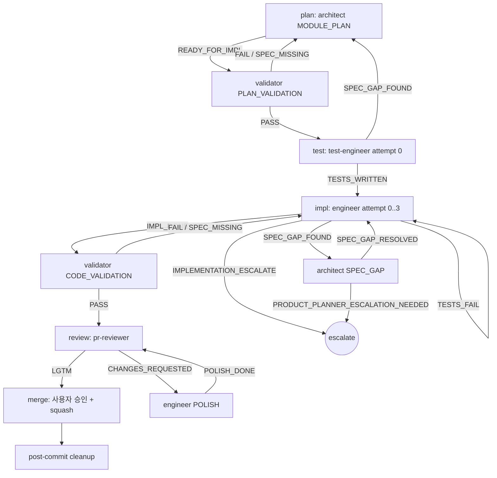
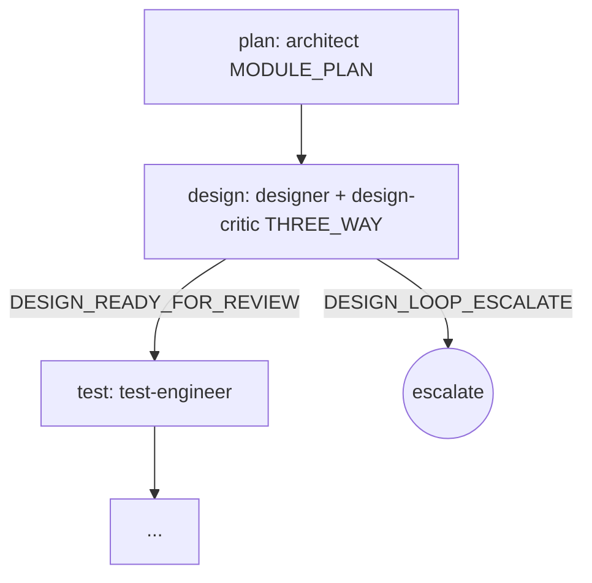
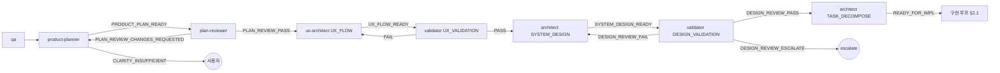
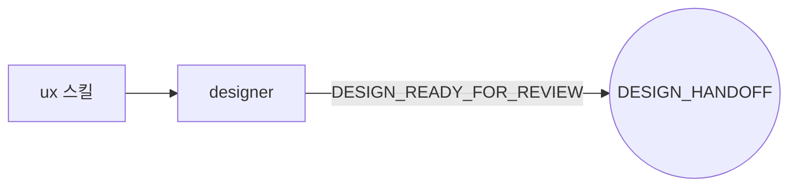
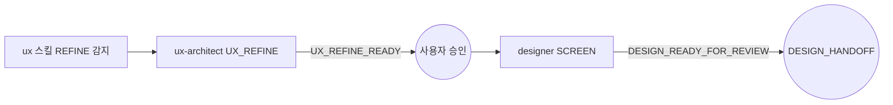
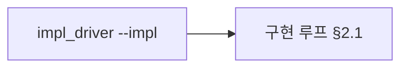
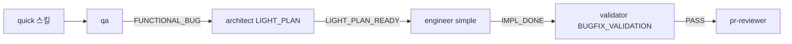
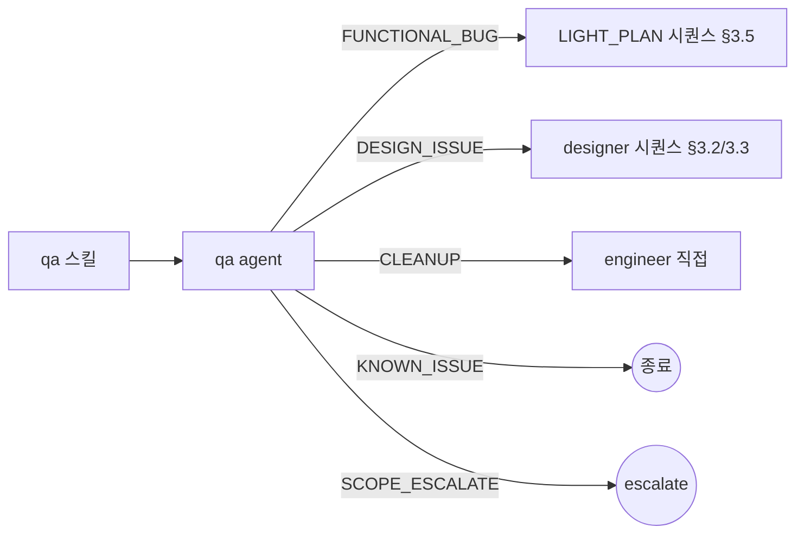

# Orchestration Rules — dcNess SSOT

> **Status**: ACTIVE
> **Origin**: `DCN-CHG-20260429-25` (Phase 3 사후 보강)
> **Scope**: 본 문서는 dcNess 가 plugin 으로 배포돼 *사용자 프로젝트* 에서 활성화될 때의 시퀀스 / 핸드오프 / 권한 매트릭스 SSOT.
> **메인 dcNess 자체 작업 모드 (현재)**: 본 문서는 *권고* (CLAUDE.md §0 정합 — 위임 강제 없음).
> **출처 매핑**:
> - RWHarness `docs/harness-spec.md` §4.2 (게이트 시퀀스) + §4.3 (진입 경로) → 본 문서 §2 + §3
> - RWHarness `docs/harness-architecture.md` §3 (핸드오프 매트릭스) → 본 문서 §7
> - dcNess proposal `status-json-mutate-pattern.md` §2.5 (대 원칙) + §11.4 (도입할 것) → 본 문서 §0 + §8

---

## 0. 정체성 — 강제하는 것 / 강제 안 하는 것

> **🔴 대 원칙** (proposal §2.5 직접 인용):
> **harness 가 강제하는 것은 단 2가지 — (1) 작업 순서, (2) 접근 영역. 그 외 모두 agent 자율.**
> - **작업 순서** = 시퀀스 (validator → engineer → pr-reviewer 등) + retry 정책
> - **접근 영역** = file path 경계 (agent-boundary ALLOW/READ_DENY) + 외부 시스템 mutation 차단 (push, gh issue, plugin 디렉토리)
> - **출력 형식 / handoff 형식 / preamble 구조 / marker / status JSON / Flag / 모든 형식적 강제 = agent 자율. harness 가 강제하지 않는다.**

본 SSOT 는 위 2개 강제 영역 만 정의한다. 형식 강제 (마커 / status JSON / Flag) 는 [`status-json-mutate-pattern.md`](status-json-mutate-pattern.md) 에 의해 폐기 — 본 문서 안에서도 그 어휘는 사용하지 않는다.

### 0.1 RWHarness 와의 차이

| 영역 | RWHarness | dcNess |
|---|---|---|
| 시퀀스 (게이트) | 보존 (harness-spec §4.2) | **동일 보존** (본 문서 §2) |
| 진입 경로 (시나리오) | 보존 (harness-spec §4.3) | **동일 보존** (본 문서 §3) |
| 핸드오프 매트릭스 | 보존 (harness-architecture §3) | **동일 보존** (본 문서 §7) |
| 마커 (`---MARKER:X---` + alias) | 강제 | → **prose 마지막 단락 enum 단어** + `signal_io.interpret_signal` |
| 핸드오프 페이로드 (`_handoffs/{from}_to_{to}_{ts}.md`) | 강제 형식 | → **`.claude/harness-state/<run_id>/<agent>[-<MODE>].md` prose 디렉토리, 별도 형식 0** |
| Flag 시스템 (boolean 파일) | 강제 | → **`.attempts.json` 단순 카운터** (recovery state 만, 결정론 영역) |
| status JSON schema | (RWHarness 미도입) | (dcNess 도 폐기 — DCN-CHG-20260429-13) |
| enum 해석 | 없음 | **`harness/interpret_strategy.py` heuristic-only** (DCN-CHG-20260430-04 정착, LLM fallback 폐기 — 메인 Claude 가 ambiguous 시 cascade) |

---

## 1. 적용 모드

### 1.1 Plugin 사용자 프로젝트 모드 (본 SSOT 정 scope)

dcNess 가 plugin (`dcness@dcness`) 으로 사용자 프로젝트에 활성화된 환경. 다음 모두 강제:

- 본 문서 §2 게이트 시퀀스 (catastrophic 보존)
- 본 문서 §7 권한 매트릭스 (agent-boundary hook 으로 강제 — 후속 Task 에서 도입)
- proposal §2.5 catastrophic 원칙 (src/ 외 mutation 차단, plugin-write-guard, READ_DENY)

### 1.2 메인 dcNess 자체 작업 모드 (현재 본 저장소)

dcNess 저장소 자체에서 메인 Claude 가 직접 작업하는 환경. 본 문서는 *권고*.

- CLAUDE.md §0 정합 — "architect / validator / engineer 위임 강제 없음"
- 단 거버넌스 (Task-ID + Document Sync + branch protection) 는 강제 (governance.md)
- 본 시퀀스 / 권한 매트릭스는 *읽고 따르는 가이드*. 위반 시 hook 차단 X.

---

## 2. 게이트 시퀀스 (큰 흐름)

> RWHarness `harness-spec.md` §4.2 의 dcNess 변환. 형식 어휘 (mark/flag) 만 변경, 시퀀스 자체는 동일.

### 2.1 최소 패스 (구현 루프)

### 2.2 UI 작업 추가 시 design 단계 삽입

`[design]` 단계가 `[plan]` 과 `[test]` 사이에 삽입. THREE_WAY 시 design-critic 의 `VARIANTS_APPROVED` 1개 이상 필수, `VARIANTS_ALL_REJECTED` 3 round 누적 시 `UX_REDESIGN_SHORTLIST` 로 escalate.

### 2.3 catastrophic 시퀀스 (보존 의무)

다음은 *어떤 동적 결정* 으로도 우회 금지:

1. **src/ 변경 후 validator(CODE_VALIDATION) 통과 없이 pr-reviewer 호출 금지**
2. **pr-reviewer LGTM 없이 merge 금지**
3. **engineer 가 architect.module-plan 통과 (READY_FOR_IMPL) 없이 src/ 작성 금지**
4. **PRD 변경 후 plan-reviewer + ux-architect 검토 없이 architect 진입 금지**
5. **architect TASK_DECOMPOSE 직전 validator DESIGN_VALIDATION (DESIGN_REVIEW_PASS) 없이 진입 금지** (DCN-CHG-20260430-05) — 시스템 설계가 구현 가능성 검증 통과 안 했으면 impl batch 분해 무의미.

이는 proposal §2.5 원칙 4 ("흐름 강제는 catastrophic 시퀀스만") 의 catastrophic 백본. 코드 driver 도입 시 hook 으로 강제.

---

## 3. 진입 경로별 시나리오 (mini graph 6개)

> RWHarness `harness-spec.md` §4.3 의 dcNess 변환.
> **실행 절차** (Step 0~8 mechanics — begin-run / TaskCreate / agent 호출 / finalize-run / 7a 7b / auto-review) 는 [`loop-procedure.md`](loop-procedure.md) SSOT.
> **8 loop 행별 풀스펙** (entry_point / task_list / advance / clean_enum / branch_prefix / Step 별 allowed_enums / 분기 / sub_cycles) = [`loop-catalog.md`](loop-catalog.md). 본 §3 = *시퀀스 mini-graph* (what), loop-catalog = *행별 풀스펙* (how) 1:1.
> 8 loop name (`feature-build-loop` §3.1, `impl-batch-loop` §2.1, `impl-ui-design-loop` §2.2, `quick-bugfix-loop` §3.5, `qa-triage` §3.6, `ux-design-stage` §3.2, `ux-refine-stage` §3.3, `direct-impl-loop` §3.4) — loop-catalog 행 ID.

### 3.1 신규 기능 / PRD 변경

DESIGN_VALIDATION cycle 한도 = 2 (DCN-CHG-20260430-05). 초과 시 사용자 위임. catastrophic 룰 §2.3.5 — TASK_DECOMPOSE 직전 DESIGN_REVIEW_PASS 필수.

진입: `product-plan` 스킬 호출 또는 사용자가 "기능 추가" 발화.

### 3.2 UI 만 변경 (하네스 루프 없음)

엔지니어 호출은 *사용자 결정*. 시퀀스 게이트 없음.

### 3.3 화면 리디자인 (REFINE)

### 3.4 일반 구현 (impl 직접 호출)

`impl_driver` 코드는 후속 Task — 본 SSOT §9 옵션 (a)/(b)/(c) 중 채택 후 구현.

### 3.5 작은 버그 (quick)

LIGHT_PLAN 은 정식 MODULE_PLAN 보다 가볍고 test-engineer 단계 생략 가능 (사용자 판단).

### 3.6 버그 보고 (qa 분류)

---

## 4. Agent 측 강제 영역 — `handoff-matrix.md` (cross-ref)

결론 enum → 다음 agent trigger 결정표 / Retry 한도 / Escalate 카탈로그 / 접근 권한 매트릭스 (호출 / Write / Read / 인프라 패턴) = [`handoff-matrix.md`](handoff-matrix.md) §1~§4 SSOT.

본 §3 시퀀스의 *상세 분기 spec* + 두 번째 강제 영역 ("접근 영역") 모두 그쪽으로 이전 (DCN-CHG-20260430-32 split — 행동지침 md 300줄 cap 정합). 이전 본문 §4 결정표 / §5 Retry / §6 Escalate / §7 핸드오프 매트릭스 → handoff-matrix §1/§2/§3/§4.

---

## 5. Catastrophic vs 자율 영역 (was §8)

> proposal §2.5 원칙 4 직접 인용:
> **"impl_loop 시퀀스 (validator → engineer → pr-reviewer) = 보존"**
> **"시퀀스 *내부* 행동 = agent 자율"**

### 5.1 보존 (catastrophic — 코드 강제)

- §2.3 catastrophic 시퀀스 4 항목 (validator/pr-reviewer 우회 금지 등)
- handoff-matrix §4.1 HARNESS_ONLY_AGENTS (engineer 직접 호출 차단)
- handoff-matrix §4.2 ALLOW_MATRIX (Write 경계)
- handoff-matrix §4.3 READ_DENY_MATRIX (Read 격리)
- handoff-matrix §4.4 DCNESS_INFRA_PATTERNS (인프라 보호)
- handoff-matrix §3 escalate 결론은 자동 복구 금지

### 5.2 자율 (agent 결정)

- prose 출력 형식 (markdown / 평문 / 표 자유)
- handoff 페이로드 형식 (prose 디렉토리 path 만 강제, 본문 구조 자유)
- preamble 구조 / agent prompt 안 thinking 분량
- agent 가 어떤 도구를 어떤 순서로 호출할지 (단 handoff-matrix §4 권한 매트릭스 안에서)
- mode 별 결론 enum 외 추가 emit (예: validator 가 PASS 외 보강 설명)

### 5.3 권고 (강제 X, 측정 + 사용자 개입)

- handoff-matrix §1 결정표의 "다음 trigger" — driver 가 자동 호출 시 따름. 메인 Claude 직접 작업 모드는 *권고*.
- handoff-matrix §2 retry 한도 — 카운터로 측정. 한도 도달 시 escalate, 사용자 결정.
- 휴리스틱 hit rate 90%+ 목표 (`scripts/analyze_metrics.mjs` fitness)

---

## 6. 코드 Driver — 메인-주도 컨베이어 + PreToolUse 훅 채택 (`DCN-CHG-20260429-29`)

본 SSOT 의 §2~§5 + handoff-matrix.md 를 *코드로 강제* 하는 driver 디자인은 **`docs/conveyor-design.md`** 를 SSOT 로 분리. 본 절은 결정 요약만 보존.

### 채택 모델 (요약)

> **메인 클로드 = 시퀀스 결정자. 컨베이어 (Python) = 멍청한 순회기. catastrophic backbone = PreToolUse 훅 강제.**

- 메인 클로드가 `handoff-matrix.md` §1 결정표 보고 `list[Step]` 짜서 컨베이어 호출.
- 컨베이어는 시퀀스 순회 + Agent 호출 + `signal_io.interpret_signal` 로 enum 추출 + `Step.advance_when` 비교.
- enum ∈ advance_when 이면 다음 step. 아니면 `ConveyorPause` 반환 (예외 아님) — 메인이 받아 자율 처리 (재계획 / 사용자 위임 / 종료).
- §2.3 catastrophic 4룰 + handoff-matrix §4.1 HARNESS_ONLY_AGENTS = `hooks/catastrophic-gate.sh` (PreToolUse Agent) 가 코드 hardcode 0 으로 강제.
- 형식 강제 LLM 출력 (JSON 등) **사용 안 함** — proposal §2.5 (prose-only) 정합.

### 폐기된 옵션 카탈로그 (참조)

본 결정 전 검토했던 3 옵션 — `docs/conveyor-design.md` §11.2 에서 폐기 사유 보존.

- **옵션 (a)** RWHarness `impl_loop.py` fork + parse_marker → interpret_signal 치환: RWHarness 강결합 코드 흡수 부담 → 미채택.
- **옵션 (b)** `harness/impl_driver.py` 신작 + 정적 dict 라우팅: 시퀀스 분기 룰 코드 hardcode → proposal §2.5 원칙 1 (룰 순감소) 약화 → 미채택.
- **옵션 (c)** Orchestration Agent + 동적 시퀀스 (LLM JSON 결정자, `DCN-CHG-20260429-28` PR #28 구현): JSON 출력 강제 = prose-only 원칙 충돌 + 도그푸딩 결과 LLM JSON 형식 미준수 빈발 → **PR #28 close, 미채택**.

채택 모델은 위 3 옵션 중 어느 것도 아님 — 메인 클로드 (사용자 세션 LLM) 자체가 결정자 역할을 흡수해 별도 결정 LLM 불요.

---

## 7. proposal 인용 (cross-ref)

본 SSOT 의 강제 영역 정의 = [`status-json-mutate-pattern.md`](status-json-mutate-pattern.md) §2.5 원칙 4 + §11.4 (도입 / 도입 안 할 항목). §2~§5 + handoff-matrix §1~§4 는 위 원전의 *적용 표현* — 어휘 변환만, 의미 보존.

---

## 8. 참조 (was §11)

- [`handoff-matrix.md`](handoff-matrix.md) — agent 결정표 / Retry / Escalate / 접근 권한 SSOT (§4 cross-ref)
- [`loop-procedure.md`](loop-procedure.md) — 루프 실행 Step 0~8 mechanics
- [`loop-catalog.md`](loop-catalog.md) — 8 loop 행별 풀스펙 (allowed_enums / 분기 / sub_cycles)
- [`status-json-mutate-pattern.md`](status-json-mutate-pattern.md) — proposal SSOT (정체성·Phase·원칙)
- [`migration-decisions.md`](migration-decisions.md) §2.1 — RWHarness 모듈 분류 (impl_loop.py DISCARD 결정 정합 + 본 SSOT 로 *룰* 만 부활)
- [`process/governance.md`](process/governance.md) — Task-ID + Document Sync (commit/PR 룰, 본 SSOT 와 직교)
- [`process/branch-protection-setup.md`](process/branch-protection-setup.md) — main 브랜치 보호 (governance §2.8)
- [`process/plugin-dryrun-guide.md`](process/plugin-dryrun-guide.md) — plugin 배포 dry-run 절차
- `agents/*.md` 13 docs — 각 agent 의 prose writing guide + 결론 enum 출처
- `harness/signal_io.py` — interpret_signal 단일 호출 인프라
- `harness/interpret_strategy.py` — heuristic-only enum 추출 + telemetry (DCN-CHG-20260430-04)
- `scripts/analyze_metrics.mjs` — fitness 측정
- RWHarness `docs/harness-spec.md` §4.2 / §4.3 — 시퀀스 출처
- RWHarness `docs/harness-architecture.md` §3 — 핸드오프 매트릭스 출처
