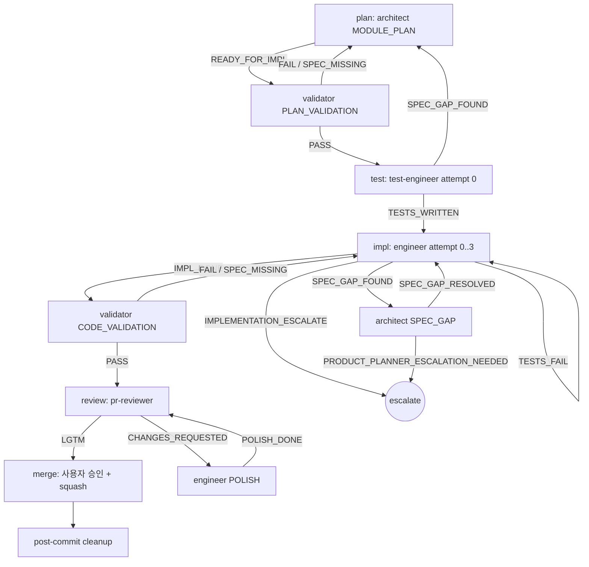
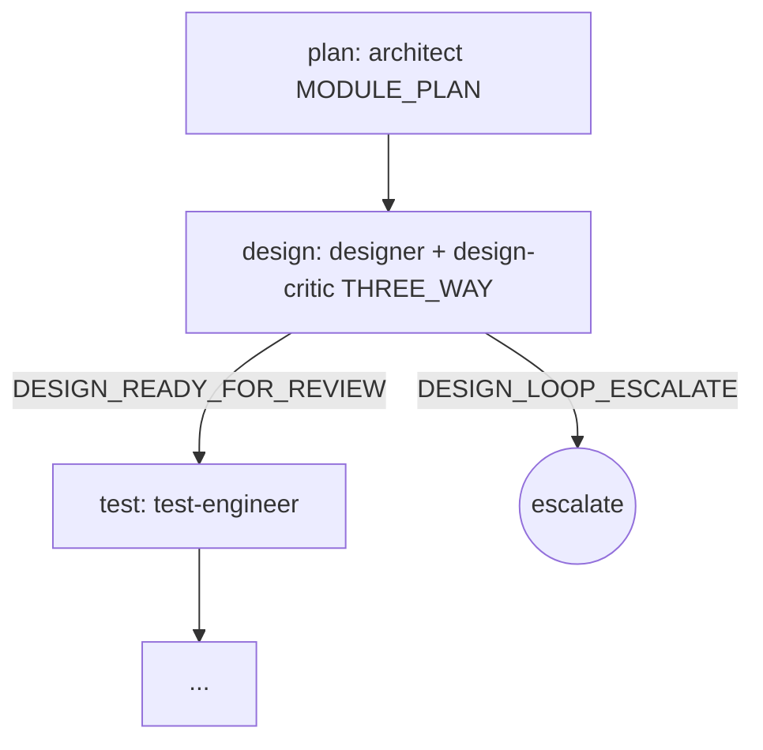
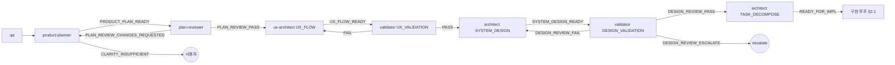
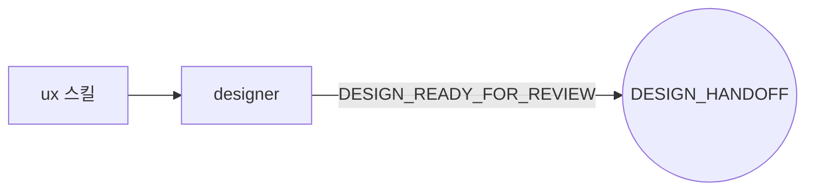
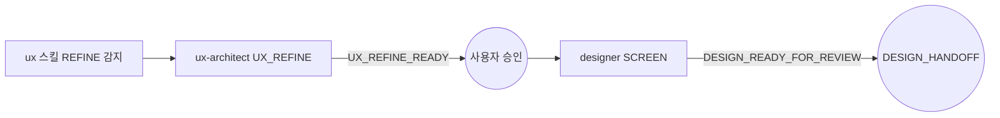
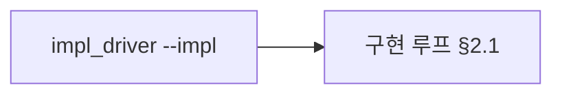
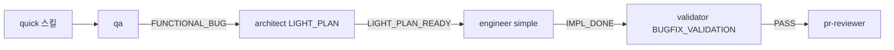
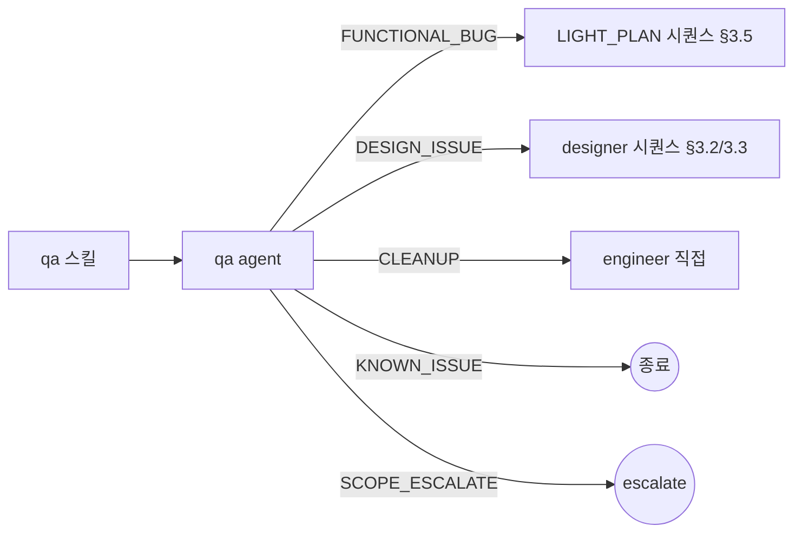

# Orchestration Rules — dcNess SSOT

> **Status**: ACTIVE
> **Scope**: dcNess 가 plugin 으로 배포돼 *사용자 프로젝트* 에서 활성화될 때의 시퀀스 / 진입 경로 / 8 loop 행별 풀스펙 SSOT.
> **본 문서 = "what"** (어떤 시퀀스 / 어떤 loop). **mechanics ("how")** = [`loop-procedure.md`](loop-procedure.md). **agent 측 강제 ("who")** = [`handoff-matrix.md`](handoff-matrix.md).

---

## 0. 정체성 — 강제하는 것 / 강제 안 하는 것

> **🔴 대 원칙** ([`status-json-mutate-pattern.md`](status-json-mutate-pattern.md) §2.5 직접 인용):
> **harness 가 강제하는 것은 단 2가지 — (1) 작업 순서, (2) 접근 영역. 그 외 모두 agent 자율.**
> - **작업 순서** = 시퀀스 (validator → engineer → pr-reviewer 등) + retry 정책
> - **접근 영역** = file path 경계 (agent-boundary ALLOW/READ_DENY) + 외부 시스템 mutation 차단 (push, gh issue, plugin 디렉토리)
> - **출력 형식 / handoff 형식 / preamble 구조 / marker / status JSON / Flag = agent 자율, harness 강제 X.**

본 SSOT 는 위 2 개 강제 영역만 정의. 형식 강제 (마커 / status JSON / Flag) 는 [`status-json-mutate-pattern.md`](status-json-mutate-pattern.md) 에 의해 폐기 — 본 문서 안에서도 그 어휘는 사용하지 않는다.

### 0.1 형식 변환 메모 (RWHarness → dcness)

- 마커 (`---MARKER:X---`) → **prose 마지막 단락 enum 단어** + `harness/signal_io.py interpret_signal`
- 핸드오프 페이로드 → **`.claude/harness-state/<run_id>/<agent>[-<MODE>].md` prose 디렉토리** (구조 자유)
- Flag 시스템 → **`.attempts.json` 단순 카운터** (recovery state 만)
- enum 해석 = `harness/interpret_strategy.py` heuristic-only (LLM fallback 폐기 — ambiguous 시 메인이 cascade)

---

## 1. 적용 모드

### 1.1 Plugin 사용자 프로젝트 모드 (본 SSOT 정 scope)

dcNess 가 plugin (`dcness@dcness`) 으로 사용자 프로젝트에 활성화된 환경. 다음 모두 강제:

- 본 문서 §2 게이트 시퀀스 (catastrophic 보존)
- handoff-matrix §4 권한 매트릭스 (agent-boundary hook 으로 강제)
- proposal §2.5 catastrophic 원칙 (src/ 외 mutation 차단, plugin-write-guard, READ_DENY)

### 1.2 메인 dcNess 자체 작업 모드 (현재 본 저장소)

dcNess 저장소 자체에서 메인 Claude 가 직접 작업하는 환경. 본 문서는 *권고*.

- CLAUDE.md §0 정합 — "architect / validator / engineer 위임 강제 없음"
- 거버넌스 (Task-ID + Document Sync + branch protection) 만 강제 (`process/governance.md`)
- 시퀀스 / 권한 매트릭스는 *읽고 따르는 가이드*. 위반 시 hook 차단 X.

---

## 2. 게이트 시퀀스 (큰 흐름)

### 2.1 최소 패스 (구현 루프)

### 2.2 UI 작업 추가 시 design 단계 삽입

`[design]` 단계가 `[plan]` 과 `[test]` 사이에 삽입. THREE_WAY 시 design-critic 의 `VARIANTS_APPROVED` 1 개 이상 필수, `VARIANTS_ALL_REJECTED` 3 round 누적 시 `UX_REDESIGN_SHORTLIST` 로 escalate.

### 2.3 catastrophic 시퀀스 (보존 의무)

다음은 *어떤 동적 결정* 으로도 우회 금지 — `hooks/catastrophic-gate.sh` 가 PreToolUse 강제:

1. **src/ 변경 후 validator(CODE_VALIDATION) 통과 없이 pr-reviewer 호출 금지**
2. **pr-reviewer LGTM 없이 merge 금지**
3. **engineer 가 architect.module-plan 통과 (READY_FOR_IMPL) 없이 src/ 작성 금지**
4. **PRD 변경 후 plan-reviewer + ux-architect 검토 없이 architect 진입 금지**
5. **architect TASK_DECOMPOSE 직전 validator DESIGN_VALIDATION (DESIGN_REVIEW_PASS) 없이 진입 금지**

이는 proposal §2.5 원칙 4 ("흐름 강제는 catastrophic 시퀀스만") 의 catastrophic 백본.

---

## 3. 진입 경로별 시나리오 (mini-graph 6 개)

> 8 loop 행별 풀스펙 = 본 문서 §4. 본 §3 = mini-graph (what), §4 = 행별 풀스펙 (how) 1:1.
> 8 loop name (`feature-build-loop` §3.1, `impl-task-loop` §2.1, `impl-ui-design-loop` §2.2, `quick-bugfix-loop` §3.5, `qa-triage` §3.6, `ux-design-stage` §3.2, `ux-refine-stage` §3.3, `direct-impl-loop` §3.4) — §4 행 ID.
> 실행 절차 (Step 0~8 mechanics) = [`loop-procedure.md`](loop-procedure.md).

### 3.1 신규 기능 / PRD 변경 → `feature-build-loop` (§4.2)

DESIGN_VALIDATION cycle 한도 = 2. 초과 시 사용자 위임. catastrophic §2.3.5 — TASK_DECOMPOSE 직전 DESIGN_REVIEW_PASS 필수.
진입: `product-plan` 스킬 또는 사용자 "기능 추가" 발화.

### 3.2 UI 만 변경 → `ux-design-stage` (§4.7, 하네스 루프 없음)

엔지니어 호출은 *사용자 결정*. 시퀀스 게이트 없음.

### 3.3 화면 리디자인 → `ux-refine-stage` (§4.8)

### 3.4 일반 구현 직접 호출 → `direct-impl-loop` (§4.9)

`impl_driver` 코드는 후속 Task — §6 옵션 (a)/(b)/(c) 중 채택 후 구현.

### 3.5 작은 버그 → `quick-bugfix-loop` (§4.5)

LIGHT_PLAN 은 정식 MODULE_PLAN 보다 가볍고 test-engineer 단계 생략 가능 (사용자 판단).

### 3.6 버그 보고 분류 → `qa-triage` (§4.6)

---

## 4. 8 loop 행별 풀스펙

> *행별 풀스펙* SSOT (entry_point / task_list / advance / clean_enum / branch_prefix / Step 4.5 적용 / Step 별 allowed_enums / 분기 / sub_cycles).
> 시퀀스 mini-graph + 진입 경로 = §3. 실행 절차 = [`loop-procedure.md`](loop-procedure.md).

### 4.1 한눈 인덱스

| loop | entry_point | task_list (Step 1) | advance | clean_enum | expected_steps |
|------|-------------|--------------------|---------|------------|----------------|
| `feature-build-loop` (§3.1, §4.2) | `product-plan` | product-planner / plan-reviewer / ux-architect:UX_FLOW / validator:UX_VALIDATION / architect:SYSTEM_DESIGN / validator:DESIGN_VALIDATION / architect:TASK_DECOMPOSE | `PRODUCT_PLAN_READY` → `PLAN_REVIEW_PASS` → `UX_FLOW_READY` → `PASS` → `SYSTEM_DESIGN_READY` → `DESIGN_REVIEW_PASS` → `READY_FOR_IMPL` | advance 동일 | 7 |
| `impl-task-loop` (§2.1, §4.3) | `impl` | architect:MODULE_PLAN / test-engineer / engineer:IMPL / validator:CODE_VALIDATION / pr-reviewer | `READY_FOR_IMPL` → `TESTS_WRITTEN` → `IMPL_DONE` → `PASS` → `LGTM` | advance 동일 | 5 |
| `impl-ui-design-loop` (§2.2, §4.4) | `impl` (UI 감지) | architect:MODULE_PLAN / designer / design-critic / test-engineer / engineer:IMPL / validator:CODE_VALIDATION / pr-reviewer | `READY_FOR_IMPL` → `DESIGN_READY_FOR_REVIEW` → `VARIANTS_APPROVED` → `TESTS_WRITTEN` → `IMPL_DONE` → `PASS` → `LGTM` | advance 동일 | 7 |
| `quick-bugfix-loop` (§3.5, §4.5) | `quick` | qa / architect:LIGHT_PLAN / engineer:IMPL / validator:BUGFIX_VALIDATION / pr-reviewer | `FUNCTIONAL_BUG`/`CLEANUP` → `LIGHT_PLAN_READY` → `IMPL_DONE` → `PASS` → `LGTM` | advance 동일 | 5 |
| `qa-triage` (§3.6, §4.6) | `qa` | qa | (5 enum 모두 — 라우팅 추천) | advance 개념 X | 1 |
| `ux-design-stage` (§3.2, §4.7) | `ux` | ux-architect:UX_FLOW / designer:SCREEN(THREE_WAY) / design-critic | `UX_FLOW_READY` → `DESIGN_READY_FOR_REVIEW` → `VARIANTS_APPROVED` | advance 동일 | 3 |
| `ux-refine-stage` (§3.3, §4.8) | `ux` (REFINE) | ux-architect:UX_REFINE / designer:SCREEN(THREE_WAY) / design-critic | `UX_REFINE_READY` → `DESIGN_READY_FOR_REVIEW` → `VARIANTS_APPROVED` | advance 동일 | 3 |
| `direct-impl-loop` (§3.4, §4.9) | `impl_driver` (future) | `impl-task-loop` 동일 | `impl-task-loop` 동일 | `impl-task-loop` 동일 | 5 |

### 4.2 `feature-build-loop` 풀스펙

**branch_prefix**: commit X (spec/design 종료, 구현 진입은 별도 루프). **Step 4.5 적용**: X.

**Step 별 allowed_enums** (`end-step --allowed-enums`):
| step | agent[:mode] | allowed_enums |
|---|---|---|
| 2 | product-planner | `PRODUCT_PLAN_READY,CLARITY_INSUFFICIENT,PRODUCT_PLAN_CHANGE_DIFF,PRODUCT_PLAN_UPDATED` |
| 3 | plan-reviewer | `PLAN_REVIEW_PASS,PLAN_REVIEW_CHANGES_REQUESTED` |
| 4 | ux-architect:UX_FLOW | `UX_FLOW_READY,UX_FLOW_PATCHED,UX_REFINE_READY,UX_FLOW_ESCALATE` |
| 5 | validator:UX_VALIDATION | `PASS,FAIL` |
| 6 | architect:SYSTEM_DESIGN | `SYSTEM_DESIGN_READY` |
| 6.5 | validator:DESIGN_VALIDATION | `DESIGN_REVIEW_PASS,DESIGN_REVIEW_FAIL,DESIGN_REVIEW_ESCALATE` |
| 7 | architect:TASK_DECOMPOSE | `READY_FOR_IMPL` |

**분기**:
- `PRODUCT_PLAN_READY` → product-planner 가 epic + story 이슈 동시 생성 후 plan-reviewer 진입 ([`issue-lifecycle.md`](issue-lifecycle.md) §1)
- `PRODUCT_PLAN_UPDATED` → plan-reviewer skip + ux-architect 직행 (이전 PLAN_REVIEW_PASS 활용)
- `PRODUCT_PLAN_CHANGE_DIFF` → plan-reviewer 변경분만 재심사
- `CLARITY_INSUFFICIENT` → 사용자 역질문 후 product-planner 재호출
- `PLAN_REVIEW_CHANGES_REQUESTED` → product-planner 재진입 (cycle ≤ 2)
- `UX_REFINE_READY` → designer SCREEN 분기 (ux-design-stage / ux-refine-stage 권장)
- `UX_FLOW_ESCALATE` → 사용자 위임
- validator UX `FAIL` → ux-architect 재진입 (cycle ≤ 2)
- `DESIGN_REVIEW_FAIL` → architect:SYSTEM_DESIGN 재진입 (cycle ≤ 2)
- `DESIGN_REVIEW_ESCALATE` → 사용자 위임

**sub_cycles**: 위 분기에서 재호출 시 step 이름 컨벤션 = `<agent>-RETRY-<n>` (별도 begin/end-step 1쌍, DCN-30-25).

### 4.3 `impl-task-loop` 풀스펙

**branch_prefix decision rule**:
- task 내 신규 기능 (src 신규 파일 또는 인터페이스 추가) → `feat/<task-slug>`
- 리팩토링 / 정리 / 테스트 보강 only → `chore/<task-slug>`
- 버그픽스 (의도 vs 실제 격차 수정) → `fix/<task-slug>`
- 메인 Claude 가 task 의 ## 변경 요약 / engineer prose 보고 결정.

**3-commit 구조** ([`loop-procedure.md`](loop-procedure.md) §3.4 — catastrophic §2.3.6~§2.3.8):
| stage | 시점 | 내용 |
|---|---|---|
| commit1 (docs) | MODULE_PLAN READY_FOR_IMPL 직후 | docs/impl/NN.md 등 + `record-stage-commit docs` |
| commit2 (tests) | TESTS_WRITTEN 직후 | test 파일 + `record-stage-commit tests` |
| commit3 (src) + PR | CODE_VALIDATION PASS 직후 | src 파일 + push + `gh pr create` + `record-stage-commit src` |
| merge | LGTM 직후 | `gh pr merge` (NO --squash — 3 commit 히스토리 보존) |

**Step 4.5 적용**: ✓ (engineer `IMPL_DONE` 직후, validator 진입 *전* — [`loop-procedure.md`](loop-procedure.md) §4).

**Step 별 allowed_enums**:
| step | agent[:mode] | allowed_enums |
|---|---|---|
| 2 | architect:MODULE_PLAN | `READY_FOR_IMPL,SPEC_GAP_FOUND,TECH_CONSTRAINT_CONFLICT` |
| 3 | test-engineer | `TESTS_WRITTEN,SPEC_GAP_FOUND` |
| 4 | engineer:IMPL | `IMPL_DONE,IMPL_PARTIAL,SPEC_GAP_FOUND,TESTS_FAIL,IMPLEMENTATION_ESCALATE` |
| 5 | validator:CODE_VALIDATION | `PASS,FAIL,SPEC_MISSING` |
| 6 | pr-reviewer | `LGTM,CHANGES_REQUESTED` |

**분기**:
- `IMPL_PARTIAL` → engineer:IMPL-SPLIT-<n> 재호출 (split < 3, 새 context window — DCN-30-34). 초과 시 `IMPLEMENTATION_ESCALATE` (작업 분해 부족 — architect TASK_DECOMPOSE 재진입 권고).
- `SPEC_GAP_FOUND` → architect:SPEC_GAP cycle (≤ 2) → engineer 재진입
- `TESTS_FAIL` → engineer:IMPL-RETRY-<n> (attempt < 3, 초과 → `IMPLEMENTATION_ESCALATE`)
- `SPEC_MISSING` → architect:SPEC_GAP
- `TECH_CONSTRAINT_CONFLICT` / `IMPLEMENTATION_ESCALATE` → 사용자 위임
- `CHANGES_REQUESTED` → engineer:POLISH-<n> cycle (≤ 2)
- `validator:FAIL` → engineer:IMPL-RETRY-<n>

**sub_cycles**:
- `architect:SPEC_GAP` (engineer/test-engineer SPEC_GAP_FOUND 시) — allowed_enums = `SPEC_GAP_RESOLVED,PRODUCT_PLANNER_ESCALATION_NEEDED,TECH_CONSTRAINT_CONFLICT`
- `engineer:POLISH-<n>` (CHANGES_REQUESTED 시, ≤ 2) — allowed_enums = `POLISH_DONE,IMPLEMENTATION_ESCALATE`
- `engineer:IMPL-RETRY-<n>` (TESTS_FAIL/FAIL 시, attempt < 3) — engineer:IMPL 동일
- `engineer:IMPL-SPLIT-<n>` (IMPL_PARTIAL 시, split < 3, DCN-30-34) — engineer:IMPL 동일. prose 의 `## 남은 작업` 컨텍스트로 진입.

**state-aware skip** (DCN-CHG-30-13): task 파일 끝에 `MODULE_PLAN_READY` 마커 박혀있으면 Step 2 (architect:MODULE_PLAN) skip — TaskUpdate completed("skipped") + task 파일 자체를 `<RUN_DIR>/architect-MODULE_PLAN.md` 로 복사. catastrophic §2.3.3 통과용.

### 4.4 `impl-ui-design-loop` 풀스펙

**branch_prefix**: §4.3 와 동일 (`feat` / `chore` / `fix`). **Step 4.5 적용**: ✓.

**Step 별 allowed_enums**:
| step | agent[:mode] | allowed_enums |
|---|---|---|
| 2 | architect:MODULE_PLAN | §4.3 동일 |
| 3 | designer:SCREEN(THREE_WAY) | `DESIGN_READY_FOR_REVIEW,DESIGN_LOOP_ESCALATE` |
| 4 | design-critic | `VARIANTS_APPROVED,VARIANTS_ALL_REJECTED,UX_REDESIGN_SHORTLIST` |
| 5 | test-engineer | §4.3 동일 |
| 6 | engineer:IMPL | §4.3 동일 |
| 7 | validator:CODE_VALIDATION | §4.3 동일 |
| 8 | pr-reviewer | §4.3 동일 |

**분기**:
- `VARIANTS_ALL_REJECTED` → designer:SCREEN 재호출 (round < 3)
- `UX_REDESIGN_SHORTLIST` → ux-architect:UX_REFINE (round ≥ 3, ux-refine-stage 진입)
- `DESIGN_LOOP_ESCALATE` → 사용자 위임
- 나머지 = §4.3 분기 동일

**sub_cycles**: §4.3 동일 + `designer:SCREEN-ROUND-<n>` (variants 재생성, round < 3).

### 4.5 `quick-bugfix-loop` 풀스펙

**branch_prefix**:
- qa enum `FUNCTIONAL_BUG` → `fix/<slug>` / `CLEANUP` → `chore/<slug>` / 그 외 → 자동 진행 X (라우팅 추천 후 종료)

**Step 4.5 적용**: △ (light path — stories.md 갱신은 사용자 결정. backlog 변경 X).

**Step 별 allowed_enums**:
| step | agent[:mode] | allowed_enums |
|---|---|---|
| 2 | qa | `FUNCTIONAL_BUG,CLEANUP,DESIGN_ISSUE,KNOWN_ISSUE,SCOPE_ESCALATE` |
| 3 | architect:LIGHT_PLAN | `LIGHT_PLAN_READY,SPEC_GAP_FOUND,TECH_CONSTRAINT_CONFLICT` |
| 4 | engineer:IMPL | `IMPL_DONE,IMPL_PARTIAL,SPEC_GAP_FOUND,TESTS_FAIL,IMPLEMENTATION_ESCALATE` |
| 5 | validator:BUGFIX_VALIDATION | `PASS,FAIL` |
| 6 | pr-reviewer | `LGTM,CHANGES_REQUESTED` |

**qa 분기**:
- `DESIGN_ISSUE` → 종료 + ux-design-stage 추천 (구현 후)
- `KNOWN_ISSUE` → 종료
- `SCOPE_ESCALATE` → 사용자 위임 (분류 모호)

**sub_cycles**: §4.3 동일 (`SPEC_GAP` / `POLISH` / `IMPL-RETRY`). test-engineer 단계가 없으므로 TESTS_FAIL 은 engineer 자체 검증 실패 의미.

### 4.6 `qa-triage` 풀스펙

**branch_prefix**: commit X (분류만, 코드 변경 X). **Step 4.5 적용**: X.

**Step 별 allowed_enums**:
| step | agent[:mode] | allowed_enums |
|---|---|---|
| 2 | qa | `FUNCTIONAL_BUG,CLEANUP,DESIGN_ISSUE,KNOWN_ISSUE,SCOPE_ESCALATE` |

**enum 별 라우팅 추천** (advance 개념 없음 — 메인이 사용자 결정 받음):
- `FUNCTIONAL_BUG` → `quick-bugfix-loop` (`/quick`) 또는 `impl-task-loop`
- `CLEANUP` → `quick-bugfix-loop` (`/quick`) 또는 engineer 직접
- `DESIGN_ISSUE` → `ux-design-stage` (`/ux`) 또는 designer 직접
- `KNOWN_ISSUE` → 종료
- `SCOPE_ESCALATE` → 사용자 위임 (큰 변경 / 다중 모듈)

**sub_cycles**: 없음. AMBIGUOUS 시 [`process/dcness-guidelines.md`](process/dcness-guidelines.md) §6 cascade.

### 4.7 `ux-design-stage` 풀스펙

**branch_prefix**: commit X (design handoff, 코드 X). **Step 4.5 적용**: X.

**Step 별 allowed_enums**:
| step | agent[:mode] | allowed_enums |
|---|---|---|
| 2 | ux-architect:UX_FLOW | `UX_FLOW_READY,UX_FLOW_PATCHED,UX_REFINE_READY,UX_FLOW_ESCALATE` |
| 3 | designer:SCREEN(THREE_WAY) | `DESIGN_READY_FOR_REVIEW,DESIGN_LOOP_ESCALATE` |
| 4 | design-critic | `VARIANTS_APPROVED,VARIANTS_ALL_REJECTED,UX_REDESIGN_SHORTLIST` |

**designer mode**: THREE_WAY 권장 (3 variant + critic 심사). 사용자 발화에 "한 안만" / "ONE" 키워드 시 ONE_WAY (allowed_enums = `DESIGN_READY_FOR_REVIEW,DESIGN_LOOP_ESCALATE`, design-critic 단계 제거 → expected_steps = 2).

**분기**:
- `VARIANTS_APPROVED` → 사용자 PICK 1 개 → DESIGN_HANDOFF 패키지 출력 → 종료
- `VARIANTS_ALL_REJECTED` → designer 재호출 (round < 3)
- `UX_REDESIGN_SHORTLIST` → ux-refine-stage 진입
- `UX_REFINE_READY` (ux-architect) → ux-refine-stage 진입
- `DESIGN_LOOP_ESCALATE` / `UX_FLOW_ESCALATE` → 사용자 위임

**sub_cycles**: `designer:SCREEN-ROUND-<n>` (round < 3).

### 4.8 `ux-refine-stage` 풀스펙

**branch_prefix**: commit X. **Step 4.5 적용**: X.

**Step 별 allowed_enums**:
| step | agent[:mode] | allowed_enums |
|---|---|---|
| 2 | ux-architect:UX_REFINE | `UX_REFINE_READY,UX_FLOW_ESCALATE` |
| 2.5 | (사용자 승인) | — (메인이 사용자에게 ux refine 결과 검토 요청. 거절 시 ux-architect 재호출) |
| 3 | designer:SCREEN(THREE_WAY) | `DESIGN_READY_FOR_REVIEW,DESIGN_LOOP_ESCALATE` |
| 4 | design-critic | `VARIANTS_APPROVED,VARIANTS_ALL_REJECTED,UX_REDESIGN_SHORTLIST` |

**designer mode**: §4.7 동일.

**Step 2.5 — 사용자 승인**: ux-architect UX_REFINE_READY 후 designer 진입 *전* 메인이 사용자에게 refine 결과 prose 발췌 + 진행 여부 확인. 거절 시 ux-architect 재호출 (cycle ≤ 2). step 컨벤션 = `user-approval-2.5` (helper begin/end-step 비대상).

**분기**: §4.7 동일.

### 4.9 `direct-impl-loop` 풀스펙

§4.3 (`impl-task-loop`) 와 100% 동일. 차이점:
- entry_point = `impl_driver` CLI (현재 미구현, 후속 Task 예정)
- 사용자 task 경로 직접 명시 (skill UI 없음)

allowed_enums / 분기 / sub_cycles / branch_prefix decision rule / Step 4.5 = §4.3 인용.

### 4.10 다중 task chain (`impl-loop`)

`/impl-loop` = `impl-task-loop` × N. outer task `impl-<i>: <task>` + inner 5 sub-task `b<i>.<agent>` (DCN-CHG-30-12). 각 task clean → 자동 7a + 다음 task. caveat → 멈춤 + 사용자 위임 (Step 2.5 — `commands/impl-loop.md` 참조).

---

## 5. Catastrophic vs 자율 영역

> proposal §2.5 원칙 4: **"impl_loop 시퀀스 (validator → engineer → pr-reviewer) = 보존, 시퀀스 *내부* 행동 = agent 자율"**

### 5.1 보존 (catastrophic — 코드 강제)

- §2.3 catastrophic 시퀀스 4 항목 (validator/pr-reviewer 우회 금지 등)
- handoff-matrix §4.1 HARNESS_ONLY_AGENTS (engineer 직접 호출 차단)
- handoff-matrix §4.2 ALLOW_MATRIX (Write 경계)
- handoff-matrix §4.3 READ_DENY_MATRIX (Read 격리)
- handoff-matrix §4.4 DCNESS_INFRA_PATTERNS (인프라 보호)
- handoff-matrix §3 escalate 결론은 자동 복구 금지

### 5.2 자율 (agent 결정)

- prose 출력 형식 (markdown / 평문 / 표 자유)
- handoff 페이로드 형식 (prose 디렉토리 path 만 강제, 본문 구조 자유)
- preamble 구조 / agent prompt 안 thinking 분량
- agent 가 어떤 도구를 어떤 순서로 호출할지 (단 handoff-matrix §4 권한 매트릭스 안에서)
- mode 별 결론 enum 외 추가 emit (예: validator 가 PASS 외 보강 설명)

### 5.3 권고 (강제 X, 측정 + 사용자 개입)

- handoff-matrix §1 결정표의 "다음 trigger" — driver 자동 호출 시 따름. 메인 직접 작업 모드는 *권고*.
- handoff-matrix §2 retry 한도 — 카운터 측정. 한도 도달 시 escalate, 사용자 결정.
- 휴리스틱 hit rate 90%+ 목표 (`scripts/analyze_metrics.mjs` fitness)

---

## 6. 코드 Driver — 메인-주도 컨베이어 + PreToolUse 훅

> **메인 클로드 = 시퀀스 결정자. 컨베이어 (Python) = 멍청한 순회기. catastrophic backbone = PreToolUse 훅 강제.**

- 메인이 handoff-matrix §1 결정표 보고 `list[Step]` 짜서 컨베이어 호출
- 컨베이어 = 시퀀스 순회 + Agent 호출 + `signal_io.interpret_signal` 로 enum 추출 + `Step.advance_when` 비교
- enum ∈ advance_when 이면 다음 step. 아니면 `ConveyorPause` 반환 (예외 아님) — 메인이 받아 자율 처리
- §2.3 catastrophic 4 룰 + handoff-matrix §4.1 HARNESS_ONLY_AGENTS = `hooks/catastrophic-gate.sh` (PreToolUse Agent) 가 코드 hardcode 0 으로 강제
- 형식 강제 LLM 출력 (JSON 등) **사용 안 함** — proposal §2.5 (prose-only) 정합

상세 디자인 + 폐기된 옵션 카탈로그 (3 옵션 — RWHarness fork / 정적 dict / Orchestration Agent) = [`archive/conveyor-design.md`](archive/conveyor-design.md).

---

## 7. 참조

- [`handoff-matrix.md`](handoff-matrix.md) — agent 결정표 / Retry / Escalate / 접근 권한 SSOT
- [`loop-procedure.md`](loop-procedure.md) — 루프 실행 Step 0~8 mechanics
- [`status-json-mutate-pattern.md`](status-json-mutate-pattern.md) §2.5 / §11.4 — 본 SSOT 의 강제 영역 정의 원전 (어휘 변환만, 의미 보존)
- [`archive/conveyor-design.md`](archive/conveyor-design.md) — 코드 driver 디자인 + 폐기된 옵션 카탈로그 (역사 자료)
- [`process/dcness-guidelines.md`](process/dcness-guidelines.md) — cross-cutting 룰 (echo / yolo / self-verify)
- [`process/governance.md`](process/governance.md) — Task-ID + Document Sync (commit/PR 룰)
- [`process/branch-protection-setup.md`](process/branch-protection-setup.md) — main 브랜치 보호
- [`archive/plugin-dryrun-guide.md`](archive/plugin-dryrun-guide.md) — plugin 배포 dry-run (역사 자료)
- [`archive/migration-decisions.md`](archive/migration-decisions.md) §2.1 — RWHarness 모듈 분류 (impl_loop.py DISCARD) (역사 자료)
- `agents/*.md` — 각 agent prose writing guide + 결론 enum 출처
- `harness/signal_io.py` / `harness/interpret_strategy.py` — interpret_signal + heuristic
- `scripts/analyze_metrics.mjs` — fitness 측정
- RWHarness `docs/harness-spec.md` §4.2/§4.3 + `harness-architecture.md` §3 — 시퀀스 / 핸드오프 매트릭스 출처
