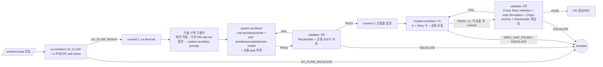
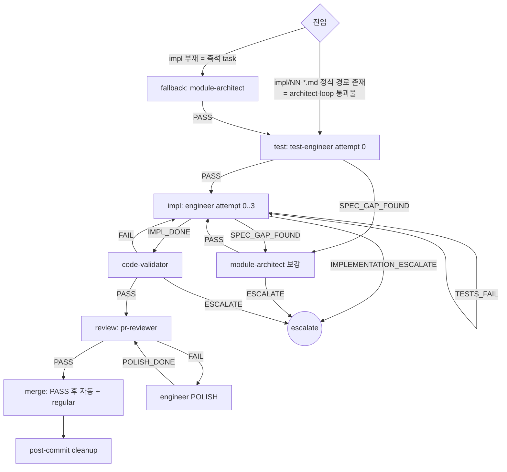

# Orchestration Rules — dcNess SSOT

> **Status**: ACTIVE
> **Scope**: dcNess 가 plugin 으로 배포돼 *사용자 프로젝트* 에서 활성화될 때의 시퀀스 / 진입 경로 / 7 loop 행별 풀스펙 SSOT.
> **본 문서 = "what"** (어떤 시퀀스 / 어떤 loop). **mechanics ("how")** = [`loop-procedure.md`](loop-procedure.md). **agent 측 강제 ("who")** = [`handoff-matrix.md`](handoff-matrix.md).

---

## 0. 정체성 — 강제하는 것 / 강제 안 하는 것

> **🔴 대 원칙** (dcness 의 SSOT — 매 세션 SessionStart inject 로 자동 노출):
> **harness 가 강제하는 것은 단 2가지 — (1) 작업 순서, (2) 접근 영역. 그 외 모두 agent 자율.**
> - **작업 순서** = 시퀀스 (code-validator → engineer → pr-reviewer 등) + retry 정책
> - **접근 영역** = file path 경계 (agent-boundary ALLOW/READ_DENY) + 외부 시스템 mutation 차단 (push, gh issue, plugin 디렉토리)
> - **출력 형식 / handoff 형식 / preamble 구조 / marker / status JSON / Flag = agent 자율, harness 강제 X.**

### 안티패턴 (룰 추가 시 피하기)

1. **룰이 룰을 부르는 reactive cycle** — 신규 룰 추가 전 기존 룰 제거 가능성 먼저 검토. 추가→제거 비대칭이 기술 부채.
2. **강제 vs 권고 혼동** — 강제(block) = catastrophic 만. 권고(warn) = 형식 위반 / 비용 폭증 등은 측정 + 경고 + 사용자 개입. 권고 → 강제 자동 승격 금지.
3. **에이전트 자율성 침해** — agent prompt 안 강제 형식 박기 금지. 결론 + 이유 명확히 쓰도록 가이드만 (형식이 아니라 의미).
4. **불필요한 흐름 강제** — 시퀀스 보존은 catastrophic 만. 시퀀스 내부 행동 = 에이전트 자율.

본 SSOT 는 위 2 개 강제 영역만 정의. 형식 강제 (마커 / status JSON / Flag) 는 도입 안 함.

---

## 1. 적용 모드

dcNess 가 plugin (`dcness@dcness`) 으로 사용자 프로젝트에 활성화된 환경. 다음 모두 강제:

- 본 문서 §2 시퀀스 (catastrophic 보존)
- handoff-matrix §4 권한 매트릭스 (agent-boundary hook 으로 강제)
- src/ 외 mutation 차단 + plugin-write-guard + READ_DENY

> dcness 자체 저장소 작업은 본 SSOT 미적용 — `CLAUDE.md §0` 가 진본.

---

## 2. 시퀀스

### 2.1 catastrophic 시퀀스 (보존 의무 — 원칙)

다음은 *어떤 동적 결정* 으로도 우회 금지 — `hooks/catastrophic-gate.sh` 가 PreToolUse 강제 (hook 전체 SSOT = [`hooks.md`](hooks.md)):

1. **src/ 변경 후 code-validator PASS 없이 pr-reviewer 호출 금지** (§2.1.1)
2. **engineer 가 module-architect `PASS` enum 발화 없이 src/ 작성 금지** (§2.1.3 — 신규 / 보강 / 버그픽스 모든 케이스 동일)
3. **PRD 변경 후 `/tech-review` 사용자 2 차 OK 없이 `/architect-loop` 진입 금지 + `/architect-loop` 진입 후 tech-reviewer 재호출 금지 (단방향)** (§2.1.4 — PRD 기술 검증은 `/tech-review` 책임. 자연어 룰 — 메인 영역 강제. 단방향 catastrophic: 회귀 사고 패턴 차단 + tech-review 단계의 검증 의무 가중. 외부 의존 0 개 PRD → `/tech-review` skip 가능. **architect-loop 도중 tech-review 미검증 새 외부 의존이 발견되면** — tech-reviewer 재호출은 *여전히 금지*하되, 처리 경로는 "전체 원점 회귀 only" 가 아니라 `NEW_DEP_ESCALATE` 3안(채택+수동검증 / 대안 기술 우회 / 전체 원점 회귀 — 전체 회귀는 그중 하나)이다. 불변식 = 어느 옵션이든 tech-reviewer 재호출 0. 흐름 = §4.2 분기 + [`handoff-matrix.md`](handoff-matrix.md) §3)
4. **module-architect × K (architect-loop §4.2 Step 4) 진입 직전 architecture-validator 1차 PASS 없이 진입 금지** (§2.1.5 — architect-loop 한정 코드 강제. K = Story 수 + 공통 호출)

원칙: "흐름 강제는 catastrophic 시퀀스만". 그 외 모든 시퀀스 = agent 자율.

### 2.2 기획 — `/product-plan` + `/tech-review` (메인 직접 + tech-reviewer sub-agent, 풀스펙 = [`commands/product-plan.md`](../../commands/product-plan.md) + [`commands/tech-review.md`](../../commands/tech-review.md))

```mermaid
flowchart LR
    entry[/product-plan 진입/] --> grill[메인 그릴미<br/>PRD + stories.md + tech-review.md 스켈레톤]
    grill --> ok1{사용자 1차 OK?}
    ok1 -->|patch 필요| grill
    ok1 -->|YES| commit[PR 생성/머지<br/>+ epic/story 이슈 등록]
    commit --> tr[/tech-review 호출/]
    tr --> rev[tech-reviewer<br/>본문 + evidence + report.html]
    rev --> ok2{사용자 2차 OK?}
    ok2 -->|OK| arch[/architect-loop 권고]
    ok2 -->|PRD patch| grill
    ok2 -->|항목 polish| tr
    arch -.->|역방향 회귀 금지<br/>단방향 catastrophic| X((CATASTROPHIC<br/>§2.1.4))
```

진입: 사용자 발화 ("기획해줘", "기능 추가" 등) 또는 `/product-plan` skill. 종료 후 `/tech-review` / `/architect-loop` 자동 진입 X (사용자 명시 호출 — 매 단계 사용자 허락 체크포인트).

**외부 의존 0 개 케이스**: tech-review.md 스켈레톤 "외부 의존 없음" 명시 → `/tech-review` skip + 바로 `/architect-loop` 권고.

### 2.3 설계 — `/architect-loop` (§4.2 풀스펙)



architect-loop = 1 epic 처리 단위. 워크트리 ON 자동. 진입 전제: PRD (root) + epic 단위 stories.md + epic/story 이슈 등록 완료 (`/product-plan` 책임). catastrophic §2.1.5 — module-architect × K 진입 직전 architecture-validator 1차 PASS 필수. 진입: 사용자 `/architect-loop <epic-path>` 명시.

### 2.4 구현 — `impl-task-loop` (§4.3 풀스펙)



default 진입 = test-engineer (architect-loop 통과물). fallback (즉석 task / 정식 경로 부재) 만 module-architect 호출. UI 작업 시 `impl-ui-design-loop` (§4.4) — designer + 사용자 PICK 단계 삽입.

---

## 4. 7 loop 행별 풀스펙

> *행별 풀스펙* SSOT (entry_point / task_list / advance / clean_enum / branch_prefix / Step 별 allowed_enums / 분기 / sub_cycles).
> 시퀀스 = §2. 실행 절차 = [`loop-procedure.md`](loop-procedure.md).

> 🔴 **라우팅 진본 (1-way)** — `agent 결론 → 다음 호출` 매핑 진본 = [`handoff-matrix.md`](handoff-matrix.md) §1.0 routing 한눈표. 본 §4 는 loop 조립(시퀀스) view — 라우팅 매핑 미중복 (step 순서 / allowed_enums / commit 지점 등 loop 고유 정보만 보유). `agents/<agent>.md` 본문은 자기 결론 vocabulary만 명시. 라우팅 갱신은 §1.0 한 곳만.

### 4.1 한눈 인덱스

| loop | entry_point | task_list (Step 1) | advance | clean_enum | expected_steps |
|------|-------------|--------------------|---------|------------|----------------|
| `architect-loop` (§4.2) | `architect-loop` (사용자 명시) | (UI epic) ux-architect:UX_FLOW (self-check) / [기술 스택 그릴미 — 메인 직접, helper 비대상] / system-architect (self-check) / architecture-validator 1차 / module-architect × K / architecture-validator 2차 · (UI-less epic) ux-architect 제외 — §4.2 `UI-less 분기` | `UX_FLOW_READY` → `PASS` → `PASS` → `PASS × K` → `PASS` | advance 동일 | 4 + K (UI epic) / 3 + K (UI-less epic). K = Story 수 + 공통 호출 1 회 또는 0 회. **기술 스택 그릴미는 helper begin-step 비대상이라 expected_steps 에 미포함** |
| `impl-task-loop` (§4.3) | `impl` | (default, /impl 단발) test-engineer / engineer:IMPL / code-validator / pr-reviewer · (fallback: impl 부재 시 module-architect 선두 추가) · (Hybrid A, /impl-loop 한정) build-worker / pr-reviewer | `PASS` → `IMPL_DONE` → `PASS` → `PASS` (default) · `PASS` → `PASS` (Hybrid A) | advance 동일 | 4 (default) / 5 (fallback) / 2 (Hybrid A) |
| `impl-ui-design-loop` (§4.4) | `impl` (UI 감지) | (default) designer / 사용자 PICK / test-engineer / engineer:IMPL / code-validator / pr-reviewer · (fallback: impl 부재 시 module-architect 선두 추가) | `PASS` → 사용자 PICK → `PASS` → `IMPL_DONE` → `PASS` → `PASS` | advance 동일 | 6 (default) / 7 (fallback) |
| `qa-triage` (§4.5) | `issue-report` | qa | (5 enum 모두 — 라우팅 추천) | advance 개념 X | 1 |
| `ux-design-stage` (§4.6) | `ux` | ux-architect:UX_FLOW / designer / 사용자 PICK | `UX_FLOW_READY` → `PASS` → 사용자 PICK | advance 동일 | 3 |
| `ux-refine-stage` (§4.7) | `ux` (REFINE) | ux-architect:UX_REFINE / designer / 사용자 PICK | `UX_REFINE_READY` → `PASS` → 사용자 PICK | advance 동일 | 3 |

### 4.2 `architect-loop` 풀스펙

**branch_prefix**: `docs/<epic-slug>`. **워크트리**: ON 자동 (`EnterWorktree(name="architect-{ts_short}")` — [`loop-procedure.md`](loop-procedure.md) §1.1).

**전제 조건** (진입 전 충족 의무):
- PRD (root) + epic 단위 stories.md 이미 머지 (`/product-plan` 책임)
- epic + story 이슈 등록 완료 (`scripts/create_epic_story_issues.sh`)
- 사용자가 `/architect-loop <epic-path>` 명시 호출 (자동 진입 X)

**UI-less 분기 (Step 1 전 판정)**: TaskCreate 직전 메인이 `docs/prd.md` 의 "화면 인벤토리 + 대략적 플로우" 섹션 read → 화면 항목이 전부 `(UI 없음)` / 섹션 부재 / 유효 화면 0 개면 **UI-less epic** → TaskCreate 에서 ux-architect 제외 + Step 2 skip (commit 1 없음) → Step 3 직행. 유효 화면 ≥ 1 또는 모호 시 UI epic (보수적). 근거: ux-flow.md 는 system-architect "(있으면)" 선택 입력이고 architecture-validator / module-architect 미참조 → skip 안전. 판정은 메인 prose 자율 (§0 — hook 강제 아님). 상세 = [`commands/architect-loop.md`](../../commands/architect-loop.md) `## UI-less epic 분기`.

**Step 별 allowed_enums + commit**:
| step | agent[:mode] | allowed_enums | commit |
|---|---|---|---|
| 2 | ux-architect:UX_FLOW (5 카테고리 self-check 의무) — **UI-less epic 이면 skip** (아래 `UI-less 분기`) | `UX_FLOW_READY,UX_FLOW_PATCHED,UX_REFINE_READY,UX_FLOW_ESCALATE` | commit 1 (`[docs] ux-flow <epic-slug>`) — PASS 직후 (UI-less 면 commit 1 없음) |
| 2.9 | (기술 스택 그릴미 — 메인 직접, 기본 ON + opt-out. UI 판정 무관 — 항상 system-architect 직전) | — (helper 비대상 = `.steps.jsonl` row 안 남김. 합의 결론을 system-architect prompt 에 박음. opt-out 발화 매치 시 skip) | (commit 없음) |
| 3 | system-architect (self-check 의무) | `PASS,ESCALATE,NEW_DEP_ESCALATE` (산출물: root `docs/architecture.md` + root `docs/adr.md` + epic 단위 architecture.md / adr.md / domain-model.md. 모듈 목록 + 의존 그래프 + 공통 task 목록 + Story → 모듈 매핑 표. `## impl 목차` 표 폐기. **Step 2.9 합의 결론 전달 시 그 스택 + 축 2 채택/미채택 반영**) | (working tree only) |
| 3.5 | architecture-validator 1차 (Placeholder Leak + 공통 SSOT 룰 자동) | `PASS,FAIL,ESCALATE` | commit 2 (`[docs] architecture + adr + domain <epic-slug>`) — PASS 직후 |
| 4.0 (공통 task 있을 시) | module-architect (mode=common) | `PASS,SPEC_GAP_FOUND,ESCALATE,NEW_DEP_ESCALATE` | commit 3 (`[docs] impl 공통 task <epic-slug>`) — PASS 직후 |
| 4.1 ~ 4.N | module-architect (Story 순차, occurrence 1..N) | `PASS,SPEC_GAP_FOUND,ESCALATE,NEW_DEP_ESCALATE` | commit 4..N+3 (`[docs] impl <Story-slug>`) — 각 PASS 직후 |
| 5 | architecture-validator 2차 (Cross-Story Interface + Implementation Simulation + Origin Anchor + Placeholder 재검증) | `PASS,FAIL,ESCALATE` | commit N+4 (`[docs] validator 2차 결과`) — PASS 직후 |

**module-architect × K 단계 (Step 4)**:
- K = Story 수 + 공통 호출 1 회 (공통 task 있으면) 또는 0 회 (없으면)
- 한 호출 = 한 단위 (Story 1 개 또는 공통 task 묶음)
- 각 호출이 `docs/milestones/vNN/epics/epic-NN-*/impl/<NN>-<slug>.md` 를 N 개 작성 (단위 안 task 수). **frontmatter `story: <N>, task_index: <i>/<total>` 의무** — impl-task-loop PR body Closes/Part of 판정 입력 ([`git-spec.md`](git-spec.md) §8 PR 트레일러). `task_index` 의미: 그 Story 안 task 순번
- 호출 순서 = system-architect 산출물 epic 단위 architecture.md 의 의존 그래프 따라 순차 (공통 task → Story 의존 그래프 순)
- **batch 모드 폐기** — Story 묶음 자체가 batch 의 본질 해결 ([issue #511](https://github.com/alruminum/dcNess/issues/511))
- K 호출 모두 `PASS` → Step 5 (validator 2차) 진입

**Step 6 — commit / push / PR / 머지**:
- `git push -u origin docs/<epic-slug>` + `gh pr create` (PR body = 설계 산출물 요약, `Part of #<epic-issue>`)
- `bash scripts/pr-finalize.sh` 머지 (squash 금지 — 커밋 히스토리 보존)
- `ExitWorktree` (squash 흡수 검사 후 자동 keep/remove)

**분기**:
- ux-architect self-check FAIL → ux-architect 재진입 (cycle ≤ 2, prose 내부)
- 기술 스택 그릴미 (Step 2.9) 미합의 (사용자 결정 보류) → loop 진행 보류 + 사용자 위임. system-architect PASS 후 스택 번복 원하면 새 cycle 신설 X — system-architect 재진입 (또는 `ESCALATE` → `/product-plan`) 경로 재활용. 상세 = [`commands/architect-loop.md`](../../commands/architect-loop.md) `## 기술 스택 그릴미 체크포인트` + `## 분기 / cycle (요약)`
- `UX_REFINE_READY` → designer 분기 (ux-design-stage / ux-refine-stage 권장)
- `UX_FLOW_ESCALATE` → 사용자 위임
- architecture-validator 1차 `FAIL` → system-architect 재진입 (cycle ≤ 2). Placeholder Leak 또는 공통 SSOT 룰 위반 영역.
- architecture-validator 2차 `FAIL` → 해당 module-architect 재진입 (Cross-Story Interface 영역 / Implementation Simulation gap / Origin Anchor — PRD AC 미인용·리터럴 불일치·절차 미충족 보강) 또는 system-architect 재진입 (모듈 의존 그래프 영역). cycle ≤ 2
- architecture-validator `ESCALATE` → 사용자 위임
- module-architect `SPEC_GAP_FOUND` → module-architect (보강 케이스) cycle (≤ 2) → 신규 케이스 재진입
- module-architect `ESCALATE` → 사용자 위임
- system-architect / module-architect `NEW_DEP_ESCALATE` (tech-review 미검증 새 외부 의존) → loop 자동 중단 X. 메인이 사용자에게 3안 제시 — (1) 채택+수동검증 → architect 재진입 (architecture.md/adr.md 에 "사용자 승인, tech-review 미경유" 흔적), (2) 대안 기술 우회 → architect 재진입, (3) 전체 원점 회귀 (`/architect-loop` 중단 + `/product-plan` 재진입 + 새 tech-review). (1)/(2) cycle ≤ 2. **어느 옵션이든 tech-reviewer 재호출 없음 (§2.1.4 단방향 보존)**. 상세 = [`commands/architect-loop.md`](../../commands/architect-loop.md) `## 분기 / cycle (요약)` + [`handoff-matrix.md`](handoff-matrix.md) §3

**sub_cycles**: 위 분기 재호출 시 동일 agent 로 별도 begin/end-step 1쌍. occurrence 카운터가 파일명 충돌 자동 처리 ([`loop-procedure.md`](loop-procedure.md) §3.2). module-architect × K 의 K 호출 = `module-architect.md` / `module-architect-2.md` ... 자동 명명. architecture-validator 2 회 호출 = `architecture-validator.md` / `architecture-validator-2.md` 자동 명명.

### 4.3 `impl-task-loop` 풀스펙

**branch_prefix decision rule**:
- task 내 신규 기능 (src 신규 파일 또는 인터페이스 추가) → `feat/<task-slug>`
- 리팩토링 / 정리 / 테스트 보강 only → `chore/<task-slug>`
- 버그픽스 (의도 vs 실제 격차 수정) → `fix/<task-slug>`
- 메인 Claude 가 task 의 ## 변경 요약 / engineer prose 보고 결정.

**진입 모드 — default vs fallback vs Hybrid A**:

| 모드 | 조건 | 시작 step | 합계 step |
|---|---|---|---|
| default (`/impl` 단발) | task 경로 매치 + 정식 위치 (`docs/milestones/v\d+/epics/epic-\d+-*/impl/\d+-*.md`) 파일 존재 | test-engineer | 4 |
| fallback (`/impl` 단발) | 위 매치 실패 (즉석 task / 정식 위치 파일 부재) | module-architect | 5 |
| Hybrid A (`/impl-loop` 한정) | `/impl-loop` driver 진입 + 정식 위치 파일 존재 | build-worker | 2 |

**근거**: architect-loop §4.2 의 Step 4 (module-architect × K) 가 정식 위치 impl 파일 본문 detail 까지 채움. 즉 정식 경로 + 파일 존재 = 본문 detail 보장 + architecture-validator PASS 통과물. module-architect 재호출 redundant. 위치 자체가 도장.

**Hybrid A 분기 근거 (#446)**: `/impl-loop` 의 N task 누적 메인 컨텍스트가 cost storm (jajang 실측 ~280 turn/task) → build-worker 1 호출 안에 test+impl+self-validate 3 phase 통합 + pr-reviewer 만 메인 별도 turn. 결과 메인 turn/task ~5-8 (목표 ~85% 감소). `/impl` 단발 호출에는 적용 X — rigor 우선, 4-agent 모델 유지. 진입점 차이 = 의도된 티어링. 자세히 = §4.8 + [`commands/impl-loop.md`](../../commands/impl-loop.md) + [`agents/build-worker.md`](../../agents/build-worker.md).

**commit 구조** ([`loop-procedure.md`](loop-procedure.md) §3.4):
| stage | 시점 | 내용 |
|---|---|---|
| branch + commit (src) + PR | code-validator PASS 직후 | branch 새로 + src 파일 + push + `gh pr create` |
| merge | PASS 직후 | `gh pr merge` |

> `docs/impl/NN.md` 는 `/architect-loop` 산출물이 *미리 머지* 한 상태 (main 안). impl-task-loop 안에서 별도 commit X.

**Step 별 allowed_enums (default 모드)**:
| step | agent[:mode] | allowed_enums |
|---|---|---|
| 2 | test-engineer | `PASS,SPEC_GAP_FOUND` |
| 3 | engineer:IMPL | `IMPL_DONE,IMPL_PARTIAL,SPEC_GAP_FOUND,TESTS_FAIL,IMPLEMENTATION_ESCALATE` |
| 4 | code-validator | `PASS,FAIL,ESCALATE` |
| 5 | pr-reviewer | `PASS,FAIL` |

**fallback 모드**: 위 step 앞에 `module-architect` (allowed_enums = `PASS,SPEC_GAP_FOUND,ESCALATE,NEW_DEP_ESCALATE`) 1 step 추가.

**Hybrid A 모드 (`/impl-loop` 한정) Step 별 allowed_enums**:
| step | agent[:mode] | allowed_enums |
|---|---|---|
| 2 | build-worker | `PASS,SPEC_GAP_FOUND,TESTS_FAIL,IMPLEMENTATION_ESCALATE` |
| 3 | pr-reviewer | `PASS,FAIL` |

> build-worker 의 phase 1-3 (build-test / build-impl / build-validate) 는 worker 1 호출 안에서 helper Bash 의 begin-step / end-step 으로 자체 staging. 메인 step 카운트는 build-worker = 1 step, pr-reviewer = 1 step 으로 2 step. git/PR 생성·머지는 메인이 별도 turn 으로 wrap.

**분기**:
- `IMPL_PARTIAL` → engineer IMPL 재호출 (split < 3, 새 context window — DCN-30-34). 초과 시 `IMPLEMENTATION_ESCALATE` (작업 분해 부족 — module-architect 재진입 권고 / Story 분할 재검토).
- `SPEC_GAP_FOUND` → module-architect (보강 케이스) cycle (≤ 2) → engineer 재진입
- `TESTS_FAIL` → engineer IMPL 재시도 (attempt < 3, 초과 → `IMPLEMENTATION_ESCALATE`)
- code-validator `ESCALATE` → 본문 사유 prose 보고 메인 분기: spec 부재면 module-architect (보강), 재시도 한도 초과면 사용자 위임
- module-architect `ESCALATE` / `IMPLEMENTATION_ESCALATE` → 사용자 위임
- `FAIL` → engineer POLISH cycle (≤ 2)
- code-validator `FAIL` → engineer IMPL 재시도

**sub_cycles** (재호출 시 begin-step 은 동일 agent 사용 — occurrence 카운터가 `<agent>-N.md` 자동 처리. `loop-procedure.md §3.2`):
- `module-architect` (engineer/test-engineer SPEC_GAP_FOUND 시, 보강 케이스) — allowed_enums = `PASS,ESCALATE`
- `engineer POLISH` (FAIL 시, ≤ 2 회) — allowed_enums = `POLISH_DONE,IMPLEMENTATION_ESCALATE`
- `engineer IMPL` 재시도 (TESTS_FAIL/FAIL 시, attempt < 3) — engineer IMPL 동일
- `engineer IMPL` split (IMPL_PARTIAL 시, split < 3, DCN-30-34) — engineer IMPL 동일. prose 의 `## 남은 작업` 컨텍스트로 진입.

### 4.4 `impl-ui-design-loop` 풀스펙

§4.3 `impl-task-loop` 과 동일 + **선두에 designer + 사용자 PICK 2 step 추가** (UI 작업 감지 시). branch_prefix / 진입 모드(default vs fallback) / 분기 / sub_cycles 모두 §4.3 동일.

**추가 step (default 모드)**:
| step | agent[:mode] | allowed_enums |
|---|---|---|
| 2 | designer | `PASS,ESCALATE` |
| 2.5 | (사용자 PICK) | — (메인이 시안 경로 안내 + OK/NG. NG 시 designer 재호출 자유) |

이후 step 3(test-engineer) → 4(engineer:IMPL) → 5(code-validator) → 6(pr-reviewer) = §4.3 동일. fallback 모드면 designer 앞에 `module-architect` 1 step 추가 (§4.3 fallback 동일).

**Step 2.5 — 사용자 PICK**: designer PASS 후 test-engineer 진입 *전* 메인이 사용자에게 시안 경로 (Pencil 캔버스 또는 `design-variants/<screen>-v<N>.html`) + node-id 안내 + OK/NG 받음. NG 시 designer 재호출 — round 한도 명시 X. step 컨벤션 = `user-pick-2.5` (helper begin/end-step 비대상).

**분기 추가**: `ESCALATE`(designer) → 사용자 위임. **sub_cycles 추가**: `designer-ROUND-<n>` (사용자 NG 시 재생성).

### 4.5 `qa-triage` 풀스펙

**branch_prefix**: commit X (분류만, 코드 변경 X).

**Step 별 allowed_enums**:
| step | agent[:mode] | allowed_enums |
|---|---|---|
| 2 | qa | `FUNCTIONAL_BUG,CLEANUP,DESIGN_ISSUE,KNOWN_ISSUE,SCOPE_ESCALATE` |

**enum 별 라우팅 추천** (advance 개념 없음 — 메인이 사용자 결정 받음):
- `FUNCTIONAL_BUG` → `impl-task-loop` (`/impl`) fallback path (impl 부재 시 module-architect 선두 추가)
- `CLEANUP` → `impl-task-loop` (`/impl`) fallback path
- `DESIGN_ISSUE` → `ux-design-stage` (`/ux`) 또는 designer 직접
- `KNOWN_ISSUE` → 종료
- `SCOPE_ESCALATE` → 사용자 위임 (큰 변경 / 다중 모듈)

**sub_cycles**: 없음. AMBIGUOUS 시 [`loop-procedure.md`](loop-procedure.md) §3.1 AMBIGUOUS 처리.

### 4.6 `ux-design-stage` 풀스펙

**branch_prefix**: commit X (design handoff, 코드 X).

**Step 별 allowed_enums**:
| step | agent[:mode] | allowed_enums |
|---|---|---|
| 2 | ux-architect:UX_FLOW | `UX_FLOW_READY,UX_FLOW_PATCHED,UX_REFINE_READY,UX_FLOW_ESCALATE` |
| 3 | designer | `PASS,ESCALATE` |
| 3.5 | (사용자 PICK) | — (메인이 시안 경로 안내 + OK/NG. NG 시 designer 재호출 자유) |

**designer 환경 감지**: `docs/design.md` frontmatter `medium: pencil|html` 따라 분기. 있음 X 면 designer Step 0 에서 detect + 사용자 역질문 (가용 시).

**분기**:
- `PASS` + 사용자 OK → DESIGN_HANDOFF 패키지 (이슈 코멘트 + design.md + 시안 파일) → 종료
- `PASS` + 사용자 NG → designer 재호출 (사용자 자유 결정)
- `UX_REFINE_READY` (ux-architect) → ux-refine-stage 진입
- `ESCALATE` / `UX_FLOW_ESCALATE` → 사용자 위임

**sub_cycles**: `designer-ROUND-<n>` (사용자 NG 시 재생성, 사용자 자유 결정).

### 4.7 `ux-refine-stage` 풀스펙

**branch_prefix**: commit X.

**Step 별 allowed_enums**:
| step | agent[:mode] | allowed_enums |
|---|---|---|
| 2 | ux-architect:UX_REFINE | `UX_REFINE_READY,UX_FLOW_ESCALATE` |
| 2.5 | (사용자 승인) | — (메인이 사용자에게 ux refine 결과 검토 요청. 거절 시 ux-architect 재호출) |
| 3 | designer | `PASS,ESCALATE` |
| 3.5 | (사용자 PICK) | — (§4.6 동일) |

**designer 환경 감지**: §4.6 동일.

**Step 2.5 — 사용자 승인**: ux-architect UX_REFINE_READY 후 designer 진입 *전* 메인이 사용자에게 refine 결과 prose 발췌 + 진행 여부 확인. 거절 시 ux-architect 재호출 (cycle ≤ 2). step 컨벤션 = `user-approval-2.5` (helper begin/end-step 비대상).

**분기**: §4.6 동일.

### 4.8 다중 task chain (`impl-loop`)

`/impl-loop` = `impl-task-loop` × N. **각 task = 독립 `impl` run** (`begin-run impl` … `end-run`) — N task = N run = N run dir = N review.md (task별 `/run-review` 격리). `/impl-loop` 자체는 run 을 갖지 않는 driver.

**모드 분기 (#446 Hybrid A)**:
- **Hybrid A (default for `/impl-loop`)** — 2 step (build-worker / pr-reviewer). build-worker 1 호출 안에 test + impl + self-validate 3 phase 통합 → 메인 turn 수 흡수. 정식 위치 impl 파일 존재 시 채택.
- **fallback (impl 부재)** — 4-agent 그대로 (test-engineer / engineer / code-validator / pr-reviewer) + module-architect 선두 추가 (총 5 step). build-worker 는 정식 impl plan 의무 — 부재 시 사용 X.

각 task clean → 다음 task. 주의사항 → 멈춤 + 사용자 위임. task 리스트 진행 뷰 = `commands/impl-loop.md` §진행 뷰.

**세션 청킹 권장 (`/impl-loop` 한정, #446)**: 15-20 task/세션 권장. 그 이상이면 사용자가 명시적으로 `/compact` 또는 새 세션 진입 — 메인 컨텍스트 cache_read 비용 곡선 (~5-min TTL 후 절벽) 회피. resume = `live.json` + `current_step` 자동 (compaction 안전망, [`commands/impl-loop.md §compaction 중 진행`](../../commands/impl-loop.md)). 세션 청킹은 의도된 멈춤 — 진행 뷰 의 `✓` 헤더 보고 사용자가 자연 멈춤 결정.

> `/impl` 단발 호출은 default 4-agent 또는 fallback 5-agent — Hybrid A 미적용. rigor 우선 티어링 (§4.3 참조).

---

## 5. 강제 vs 자율 vs 권고

- **강제 (코드)**: §2.1 catastrophic 시퀀스 + handoff-matrix §4 권한 매트릭스 (ALLOW / READ_DENY / DCNESS_INFRA_PATTERNS). escalate 결론은 자동 복구 금지.
- **자율 (agent)**: prose 형식 / handoff 페이로드 구조 / preamble / agent 가 사용하는 도구 순서 (단 §4 권한 안).
- **권고 (강제 X)**: handoff-matrix §1 라우팅 / §2 retry 한도 — 측정 + 사용자 개입.

자세히 = 본 문서 §0 + [`handoff-matrix.md`](handoff-matrix.md) §1~§4.

---

## 6. 코드 Driver

§2.1 catastrophic = `hooks/catastrophic-gate.sh` (PreToolUse Agent) 강제. 메인 Claude = 시퀀스 결정자. **7 hook 전체 시점·차단·우회 메커니즘 SSOT** = [`hooks.md`](hooks.md).

---

## 7. 참조

- [`handoff-matrix.md`](handoff-matrix.md) — agent 결정표 / Retry / Escalate / 접근 권한 SSOT
- [`loop-procedure.md`](loop-procedure.md) — 루프 실행 Step 0~8 mechanics
- [`hooks.md`](hooks.md) — 7 hook (catastrophic-gate / file-guard / tdd-guard / stop-end-run / session-start / post-agent-clear / post-file-op-trace) 시점·차단·우회 SSOT (코드 강제 백본)
- 본 문서 §0 — 강제 영역 2가지 + 안티패턴 4건 (옛 dcness-rules.md §1 흡수)
- [`loop-procedure.md`](loop-procedure.md) §3 — cross-cutting 룰 (echo / 자가점검 / REDO 분류 / yolo)
- [`../../CLAUDE.md`](../../CLAUDE.md) — 작업 절차 + 게이트 SSOT

> 역사 자료 (Prose-Only 원전 proposal / 코드 driver 디자인 / plugin 배포 dry-run / RWHarness 모듈 분류 등) 는 [`../../README.md`](../../README.md) 의 "참조 문서" 표 (`docs/archive/` 영역) 참조.
- `agents/*.md` — 각 agent prose writing guide + 결론 enum 출처 (system-architect / module-architect / engineer / test-engineer / code-validator / architecture-validator / designer / ux-architect / tech-reviewer / pr-reviewer / qa)
- `harness/signal_io.py` — prose 파일 I/O (write_prose / read_prose). 옛 enum 추출 (interpret_signal) 폐기 (prose-only)
- RWHarness `docs/harness-spec.md` §4.2/§4.3 + `harness-architecture.md` §3 — 시퀀스 / 핸드오프 매트릭스 출처
