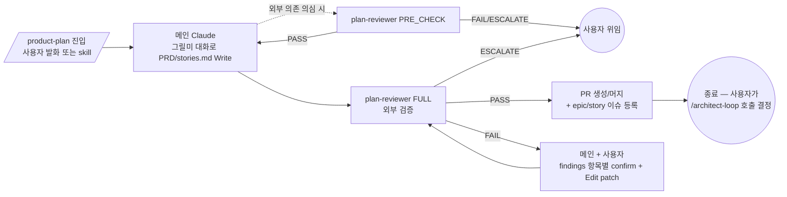
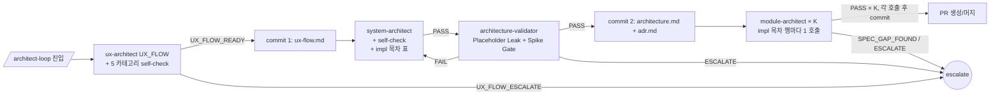
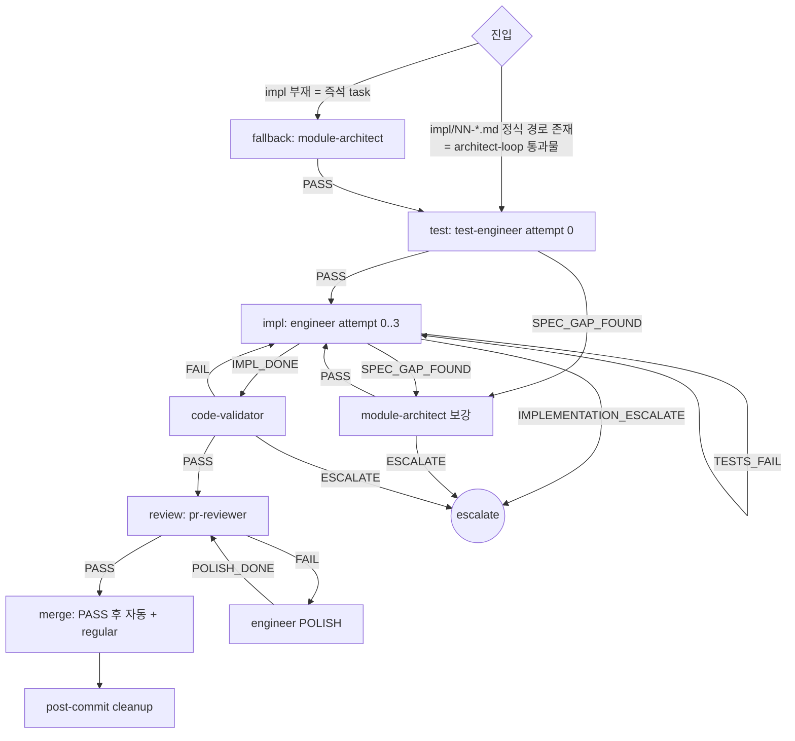

# Orchestration Rules — dcNess SSOT

> **Status**: ACTIVE
> **Scope**: dcNess 가 plugin 으로 배포돼 *사용자 프로젝트* 에서 활성화될 때의 시퀀스 / 진입 경로 / 8 loop 행별 풀스펙 SSOT.
> **본 문서 = "what"** (어떤 시퀀스 / 어떤 loop). **mechanics ("how")** = [`loop-procedure.md`](loop-procedure.md). **agent 측 강제 ("who")** = [`handoff-matrix.md`](handoff-matrix.md).

---

## 0. 정체성 — 강제하는 것 / 강제 안 하는 것

> **🔴 대 원칙** ([`dcness-rules.md`](dcness-rules.md) §1 §1 직접 인용):
> **harness 가 강제하는 것은 단 2가지 — (1) 작업 순서, (2) 접근 영역. 그 외 모두 agent 자율.**
> - **작업 순서** = 시퀀스 (code-validator → engineer → pr-reviewer 등) + retry 정책
> - **접근 영역** = file path 경계 (agent-boundary ALLOW/READ_DENY) + 외부 시스템 mutation 차단 (push, gh issue, plugin 디렉토리)
> - **출력 형식 / handoff 형식 / preamble 구조 / marker / status JSON / Flag = agent 자율, harness 강제 X.**

본 SSOT 는 위 2 개 강제 영역만 정의. 형식 강제 (마커 / status JSON / Flag) 는 [`dcness-rules.md`](dcness-rules.md) §1 에 의해 폐기 — 본 문서 안에서도 그 어휘는 사용하지 않는다.

---

## 1. 적용 모드

dcNess 가 plugin (`dcness@dcness`) 으로 사용자 프로젝트에 활성화된 환경. 다음 모두 강제:

- 본 문서 §2 시퀀스 (catastrophic 보존)
- handoff-matrix §4 권한 매트릭스 (agent-boundary hook 으로 강제)
- src/ 외 mutation 차단 + plugin-write-guard + READ_DENY

> dcness 자체 저장소 작업은 본 SSOT 미적용 — `CLAUDE.md §0` 가 진본.

---

## 2. 시퀀스

### 2.1 catastrophic 시퀀스 (보존 의무 — 원칙)

다음은 *어떤 동적 결정* 으로도 우회 금지 — `hooks/catastrophic-gate.sh` 가 PreToolUse 강제:

1. **src/ 변경 후 code-validator PASS 없이 pr-reviewer 호출 금지** (§2.1.1)
2. **engineer 가 module-architect `PASS` enum 발화 없이 src/ 작성 금지** (§2.1.3 — 신규 / 보강 / 버그픽스 모든 케이스 동일)
3. **PRD 변경 후 plan-reviewer PASS 없이 `/architect-loop` 진입 금지** (§2.1.4 — PRD 검증은 `/product-plan` 책임. 자연어 룰 — 메인 영역 강제)
4. **module-architect × N (architect-loop §4.2 Step 6) 진입 직전 architecture-validator PASS 없이 진입 금지** (§2.1.5 — architect-loop 한정 코드 강제)

원칙: "흐름 강제는 catastrophic 시퀀스만". 그 외 모든 시퀀스 = agent 자율.

### 2.2 기획 — `/product-plan` (§4.2 풀스펙)

진입: 사용자 발화 ("기획해줘", "기능 추가" 등) 또는 `/product-plan` skill. 종료 후 `/architect-loop` 자동 진입 X (사용자 명시 호출).

### 2.3 설계 — `/architect-loop` (§4.2 풀스펙)

architect-loop = 1 epic 처리 단위. 워크트리 ON 자동. 진입 전제: PRD/stories.md + epic/story 이슈 등록 완료 (`/product-plan` 책임). catastrophic §2.1.5 — module-architect × K 진입 직전 architecture-validator PASS 필수. 진입: 사용자 `/architect-loop <epic-path>` 명시.

### 2.4 구현 — `impl-task-loop` (§4.3 풀스펙)

default 진입 = test-engineer (architect-loop 통과물). fallback (즉석 task / 정식 경로 부재) 만 module-architect 호출. UI 작업 시 `impl-ui-design-loop` (§4.4) — designer + 사용자 PICK 단계 삽입.

---

## 4. 7 loop 행별 풀스펙

> *행별 풀스펙* SSOT (entry_point / task_list / advance / clean_enum / branch_prefix / Step 별 allowed_enums / 분기 / sub_cycles).
> 시퀀스 = §2. 실행 절차 = [`loop-procedure.md`](loop-procedure.md).

### 4.1 한눈 인덱스

| loop | entry_point | task_list (Step 1) | advance | clean_enum | expected_steps |
|------|-------------|--------------------|---------|------------|----------------|
| `architect-loop` (§4.2) | `architect-loop` (사용자 명시) | ux-architect:UX_FLOW (self-check) / system-architect (self-check) / architecture-validator / module-architect × K | `UX_FLOW_READY` → `PASS` → `PASS` → `PASS × K` | advance 동일 | 3 + K (K = system-architect impl 목차 행 수) |
| `impl-task-loop` (§4.3) | `impl` | (default) test-engineer / engineer:IMPL / code-validator / pr-reviewer · (fallback: impl 부재 시 module-architect 선두 추가) | `PASS` → `IMPL_DONE` → `PASS` → `PASS` | advance 동일 | 4 (default) / 5 (fallback) |
| `impl-ui-design-loop` (§4.4) | `impl` (UI 감지) | (default) designer / 사용자 PICK / test-engineer / engineer:IMPL / code-validator / pr-reviewer · (fallback: impl 부재 시 module-architect 선두 추가) | `PASS` → 사용자 PICK → `PASS` → `IMPL_DONE` → `PASS` → `PASS` | advance 동일 | 6 (default) / 7 (fallback) |
| `qa-triage` (§4.5) | `qa` | qa | (5 enum 모두 — 라우팅 추천) | advance 개념 X | 1 |
| `ux-design-stage` (§4.6) | `ux` | ux-architect:UX_FLOW / designer / 사용자 PICK | `UX_FLOW_READY` → `PASS` → 사용자 PICK | advance 동일 | 3 |
| `ux-refine-stage` (§4.7) | `ux` (REFINE) | ux-architect:UX_REFINE / designer / 사용자 PICK | `UX_REFINE_READY` → `PASS` → 사용자 PICK | advance 동일 | 3 |

### 4.2 `architect-loop` 풀스펙

**branch_prefix**: `docs/<epic-slug>`. **워크트리**: ON 자동 (`EnterWorktree(name="architect-{ts_short}")` — [`loop-procedure.md`](loop-procedure.md) §1.1).

**전제 조건** (진입 전 충족 의무):
- PRD/stories.md 이미 머지 (`/product-plan` 책임)
- epic + story 이슈 등록 완료 (`scripts/create_epic_story_issues.sh`)
- 사용자가 `/architect-loop <epic-path>` 명시 호출 (자동 진입 X)

**Step 별 allowed_enums + commit**:
| step | agent[:mode] | allowed_enums | commit |
|---|---|---|---|
| 2 | ux-architect:UX_FLOW (5 카테고리 self-check 의무) | `UX_FLOW_READY,UX_FLOW_PATCHED,UX_REFINE_READY,UX_FLOW_ESCALATE` | commit 1 (`[docs] ux-flow <epic-slug>`) — PASS 직후 |
| 3 | system-architect (self-check 의무) | `PASS,ESCALATE` (산출물에 `## impl 목차` 표 — Story → impl 매핑 + K 행 + `task_index: i/total` 열) | (working tree only) |
| 3.5 | architecture-validator | `PASS,FAIL,ESCALATE` | commit 2 (`[docs] architecture + adr <epic-slug>`) — PASS 직후 |
| 4.1 ~ 4.K | module-architect (신규 케이스, occurrence 1..K) | `PASS,SPEC_GAP_FOUND,ESCALATE` | commit 3..K+2 (`[docs] impl <NN>-<slug>`) — 각 PASS 직후 |

**module-architect × K 단계 (Step 4)**:
- 입력 = system-architect 산출물의 `## impl 목차` 표. 메인이 표 행 (NN, 파일명, 대응 Story, `task_index = i/total`, 의존) 순회하며 module-architect 1번씩 호출
- 각 호출이 `docs/milestones/vNN/epics/epic-NN-*/impl/<NN>-<slug>.md` 새로 작성. **frontmatter `story: <N>, task_index: <i>/<total>` 의무** — impl-task-loop PR body Closes/Part of 판정 입력 ([`issue-lifecycle.md`](issue-lifecycle.md) §1.4)
- 호출 순서 = impl 목차 의존 순서 (선행 impl 본문이 후행 `## 의존성` 입력 → 순차)
- K 호출 모두 `PASS` → architect-loop clean 종료 (Step 5)

**Step 5 — commit / push / PR / 머지**:
- `git push -u origin docs/<epic-slug>` + `gh pr create` (PR body = 설계 산출물 요약, `Part of #<epic-issue>`)
- `bash scripts/pr-finalize.sh` 머지 (squash 금지 — 커밋 히스토리 보존)
- `ExitWorktree` (squash 흡수 검사 후 자동 keep/remove)

**분기**:
- ux-architect self-check FAIL → ux-architect 재진입 (cycle ≤ 2, prose 내부)
- `UX_REFINE_READY` → designer 분기 (ux-design-stage / ux-refine-stage 권장)
- `UX_FLOW_ESCALATE` → 사용자 위임
- architecture-validator `FAIL` → system-architect 재진입 (cycle ≤ 2)
- architecture-validator `ESCALATE` → 사용자 위임
- module-architect `SPEC_GAP_FOUND` → module-architect (보강 케이스) cycle (≤ 2) → 신규 케이스 재진입
- module-architect `ESCALATE` → 사용자 위임

**sub_cycles**: 위 분기 재호출 시 동일 agent 로 별도 begin/end-step 1쌍. occurrence 카운터가 파일명 충돌 자동 처리 ([`dcness-rules.md`](dcness-rules.md) §3.4). module-architect × K 의 K 호출 = `module-architect.md` / `module-architect-2.md` ... 자동 명명.

### 4.3 `impl-task-loop` 풀스펙

**branch_prefix decision rule**:
- task 내 신규 기능 (src 신규 파일 또는 인터페이스 추가) → `feat/<task-slug>`
- 리팩토링 / 정리 / 테스트 보강 only → `chore/<task-slug>`
- 버그픽스 (의도 vs 실제 격차 수정) → `fix/<task-slug>`
- 메인 Claude 가 task 의 ## 변경 요약 / engineer prose 보고 결정.

**진입 모드 — default vs fallback**:

| 모드 | 조건 | 시작 step | 합계 step |
|---|---|---|---|
| default | task 경로 매치 + 정식 위치 (`docs/milestones/v\d+/epics/epic-\d+-*/impl/\d+-*.md`) 파일 존재 | test-engineer | 4 |
| fallback | 위 매치 실패 (즉석 task / direct-impl-loop / impl 부재) | module-architect | 5 |

**근거**: architect-loop §4.2 의 Step 4 (module-architect × K) 가 정식 위치 impl 파일 본문 detail 까지 채움. 즉 정식 경로 + 파일 존재 = 본문 detail 보장 + architecture-validator PASS 통과물. module-architect 재호출 redundant. 위치 자체가 도장.

**commit 구조** ([`loop-procedure.md`](loop-procedure.md) §3.4):
| stage | 시점 | 내용 |
|---|---|---|
| branch + commit (src) + PR | code-validator PASS 직후 | branch 새로 + src 파일 + push + `gh pr create` |
| merge | PASS 직후 | `gh pr merge` |

> `docs/impl/NN.md` 는 `/architect-loop` 산출물이 *미리 머지* 한 상태 (main 안). impl-task-loop 안에서 별도 commit X.

**Step 별 allowed_enums (default 모드)**:
| step | agent[:mode] | allowed_enums |
|---|---|---|
| 2 | test-engineer | `PASS,SPEC_GAP_FOUND` |
| 3 | engineer:IMPL | `IMPL_DONE,IMPL_PARTIAL,SPEC_GAP_FOUND,TESTS_FAIL,IMPLEMENTATION_ESCALATE` |
| 4 | code-validator | `PASS,FAIL,ESCALATE` |
| 5 | pr-reviewer | `PASS,FAIL` |

**fallback 모드**: 위 step 앞에 `module-architect` (allowed_enums = `PASS,SPEC_GAP_FOUND,ESCALATE`) 1 step 추가.

**분기**:
- `IMPL_PARTIAL` → engineer IMPL 재호출 (split < 3, 새 context window — DCN-30-34). 초과 시 `IMPLEMENTATION_ESCALATE` (작업 분해 부족 — system-architect 재진입 권고 / impl 목차 분할 재검토).
- `SPEC_GAP_FOUND` → module-architect (보강 케이스) cycle (≤ 2) → engineer 재진입
- `TESTS_FAIL` → engineer IMPL 재시도 (attempt < 3, 초과 → `IMPLEMENTATION_ESCALATE`)
- code-validator `ESCALATE` → 본문 사유 prose 보고 메인 분기: spec 부재면 module-architect (보강), 재시도 한도 초과면 사용자 위임
- module-architect `ESCALATE` / `IMPLEMENTATION_ESCALATE` → 사용자 위임
- `FAIL` → engineer POLISH cycle (≤ 2)
- code-validator `FAIL` → engineer IMPL 재시도

**sub_cycles** (재호출 시 begin-step 은 동일 agent 사용 — occurrence 카운터가 `<agent>-N.md` 자동 처리. `dcness-rules.md §3.4`):
- `module-architect` (engineer/test-engineer SPEC_GAP_FOUND 시, 보강 케이스) — allowed_enums = `PASS,ESCALATE`
- `engineer POLISH` (FAIL 시, ≤ 2 회) — allowed_enums = `POLISH_DONE,IMPLEMENTATION_ESCALATE`
- `engineer IMPL` 재시도 (TESTS_FAIL/FAIL 시, attempt < 3) — engineer IMPL 동일
- `engineer IMPL` split (IMPL_PARTIAL 시, split < 3, DCN-30-34) — engineer IMPL 동일. prose 의 `## 남은 작업` 컨텍스트로 진입.

### 4.4 `impl-ui-design-loop` 풀스펙

**branch_prefix**: §4.3 와 동일 (`feat` / `chore` / `fix`).

**진입 모드 — default vs fallback**: §4.3 룰 그대로 (정식 경로 + 파일 존재 시 default = module-architect skip).

**Step 별 allowed_enums (default 모드)**:
| step | agent[:mode] | allowed_enums |
|---|---|---|
| 2 | designer | `PASS,ESCALATE` |
| 2.5 | (사용자 PICK) | — (메인이 시안 경로 안내 + 사용자 OK/NG. NG 시 designer 재호출 자유) |
| 3 | test-engineer | §4.3 동일 |
| 4 | engineer:IMPL | §4.3 동일 |
| 5 | code-validator | §4.3 동일 |
| 6 | pr-reviewer | §4.3 동일 |

**fallback 모드**: 위 step 앞에 `module-architect` (allowed_enums = `PASS,SPEC_GAP_FOUND,ESCALATE`) 1 step 추가.

**Step 2.5 — 사용자 PICK**: designer PASS 후 test-engineer 진입 *전* 메인이 사용자에게 시안 경로 (Pencil 캔버스 또는 `design-variants/<screen>-v<N>.html`) + node-id 안내 + OK/NG 받음. NG 시 designer 재호출 — round 한도 명시 X (사용자 자유 결정). step 컨벤션 = `user-pick-2.5` (helper begin/end-step 비대상).

**분기**:
- `ESCALATE` → 사용자 위임
- 나머지 = §4.3 분기 동일

**sub_cycles**: §4.3 동일 + `designer-ROUND-<n>` (사용자 NG 시 재생성, 사용자 자유 결정).

### 4.5 `qa-triage` 풀스펙

**branch_prefix**: commit X (분류만, 코드 변경 X).

**Step 별 allowed_enums**:
| step | agent[:mode] | allowed_enums |
|---|---|---|
| 2 | qa | `FUNCTIONAL_BUG,CLEANUP,DESIGN_ISSUE,KNOWN_ISSUE,SCOPE_ESCALATE` |

**enum 별 라우팅 추천** (advance 개념 없음 — 메인이 사용자 결정 받음):
- `FUNCTIONAL_BUG` → `impl-task-loop` (`/impl`) fallback path (impl 부재 시 module-architect 선두 추가)
- `CLEANUP` → `impl-task-loop` (`/impl`) fallback path
- `DESIGN_ISSUE` → `ux-design-stage` (`/ux`) 또는 designer 직접
- `KNOWN_ISSUE` → 종료
- `SCOPE_ESCALATE` → 사용자 위임 (큰 변경 / 다중 모듈)

**sub_cycles**: 없음. AMBIGUOUS 시 [`dcness-rules.md`](dcness-rules.md) §6 cascade.

### 4.6 `ux-design-stage` 풀스펙

**branch_prefix**: commit X (design handoff, 코드 X).

**Step 별 allowed_enums**:
| step | agent[:mode] | allowed_enums |
|---|---|---|
| 2 | ux-architect:UX_FLOW | `UX_FLOW_READY,UX_FLOW_PATCHED,UX_REFINE_READY,UX_FLOW_ESCALATE` |
| 3 | designer | `PASS,ESCALATE` |
| 3.5 | (사용자 PICK) | — (메인이 시안 경로 안내 + OK/NG. NG 시 designer 재호출 자유) |

**designer 환경 감지**: `docs/design.md` frontmatter `medium: pencil|html` 따라 분기. 박힘 X 면 designer Step 0 에서 detect + 사용자 역질문 (가용 시).

**분기**:
- `PASS` + 사용자 OK → DESIGN_HANDOFF 패키지 (이슈 코멘트 + design.md + 시안 파일) → 종료
- `PASS` + 사용자 NG → designer 재호출 (사용자 자유 결정)
- `UX_REFINE_READY` (ux-architect) → ux-refine-stage 진입
- `ESCALATE` / `UX_FLOW_ESCALATE` → 사용자 위임

**sub_cycles**: `designer-ROUND-<n>` (사용자 NG 시 재생성, 사용자 자유 결정).

### 4.7 `ux-refine-stage` 풀스펙

**branch_prefix**: commit X.

**Step 별 allowed_enums**:
| step | agent[:mode] | allowed_enums |
|---|---|---|
| 2 | ux-architect:UX_REFINE | `UX_REFINE_READY,UX_FLOW_ESCALATE` |
| 2.5 | (사용자 승인) | — (메인이 사용자에게 ux refine 결과 검토 요청. 거절 시 ux-architect 재호출) |
| 3 | designer | `PASS,ESCALATE` |
| 3.5 | (사용자 PICK) | — (§4.6 동일) |

**designer 환경 감지**: §4.6 동일.

**Step 2.5 — 사용자 승인**: ux-architect UX_REFINE_READY 후 designer 진입 *전* 메인이 사용자에게 refine 결과 prose 발췌 + 진행 여부 확인. 거절 시 ux-architect 재호출 (cycle ≤ 2). step 컨벤션 = `user-approval-2.5` (helper begin/end-step 비대상).

**분기**: §4.6 동일.

### 4.8 다중 task chain (`impl-loop`)

`/impl-loop` = `impl-task-loop` × N. outer task `impl-<i>: <task>` + inner sub-task `b<i>.<agent>` (DCN-CHG-30-12). default = 4 sub-task (test-engineer / engineer / code-validator / pr-reviewer), fallback = 5 (module-architect 선두 추가). 각 task clean → 자동 7a + 다음 task. caveat → 멈춤 + 사용자 위임 (Step 2.5 — `commands/impl-loop.md` 참조).

---

## 5. 강제 vs 자율 vs 권고

- **강제 (코드)**: §2.1 catastrophic 시퀀스 + handoff-matrix §4 권한 매트릭스 (ALLOW / READ_DENY / DCNESS_INFRA_PATTERNS). escalate 결론은 자동 복구 금지.
- **자율 (agent)**: prose 형식 / handoff 페이로드 구조 / preamble / agent 가 사용하는 도구 순서 (단 §4 권한 안).
- **권고 (강제 X)**: handoff-matrix §1 라우팅 / §2 retry 한도 — 측정 + 사용자 개입.

자세히 = [`dcness-rules.md`](dcness-rules.md) §1.

---

## 6. 코드 Driver

§2.1 catastrophic = `hooks/catastrophic-gate.sh` (PreToolUse Agent) 강제. 메인 Claude = 시퀀스 결정자. 상세 = [`../archive/conveyor-design.md`](../archive/conveyor-design.md).

---

## 7. 참조

- [`handoff-matrix.md`](handoff-matrix.md) — agent 결정표 / Retry / Escalate / 접근 권한 SSOT
- [`loop-procedure.md`](loop-procedure.md) — 루프 실행 Step 0~8 mechanics
- [`dcness-rules.md`](dcness-rules.md) §1 — 본 SSOT 의 강제 영역 정의 현행 SSOT (대 원칙 + Anti-Pattern 5원칙)
- [`../archive/status-json-mutate-pattern.md`](../archive/status-json-mutate-pattern.md) — Prose-Only 원전 proposal (Phase 분할 / §11.4 도입 기준 / Risks) (역사 자료)
- [`../archive/conveyor-design.md`](../archive/conveyor-design.md) — 코드 driver 디자인 + 폐기된 옵션 카탈로그 (역사 자료)
- [`dcness-rules.md`](dcness-rules.md) — cross-cutting 룰 (echo / yolo / self-verify)
- [`../../CLAUDE.md`](../../CLAUDE.md) — 작업 절차 + 게이트 SSOT
- [`../archive/plugin-dryrun-guide.md`](../archive/plugin-dryrun-guide.md) — plugin 배포 dry-run (역사 자료)
- [`../archive/migration-decisions.md`](../archive/migration-decisions.md) §2.1 — RWHarness 모듈 분류 (impl_loop.py DISCARD) (역사 자료)
- `agents/*.md` — 각 agent prose writing guide + 결론 enum 출처 (system-architect / module-architect / engineer / test-engineer / code-validator / architecture-validator / designer / ux-architect / plan-reviewer / pr-reviewer / qa)
- `harness/signal_io.py` / `harness/interpret_strategy.py` — interpret_signal + heuristic
- `scripts/analyze_metrics.mjs` — fitness 측정
- RWHarness `docs/harness-spec.md` §4.2/§4.3 + `harness-architecture.md` §3 — 시퀀스 / 핸드오프 매트릭스 출처
