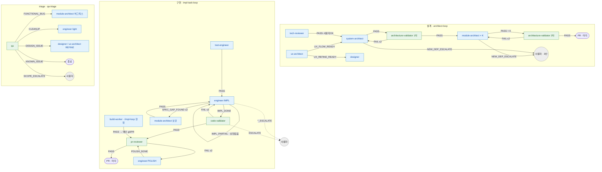

# Routing SSOT — agent 결론 → 다음 호출

> **Status**: ACTIVE
> **Scope**: dcNess 12 agent 의 결론 enum → 다음 호출 매핑 (**1-way 단일 진본**) + retry 한도 + escalate 처리. dcness 강제 영역 2가지 중 *작업 순서* 의 핵심 view.
> **Cross-ref**: catastrophic 보존 = [`hooks.md`](hooks.md) §3.2 · loop 한눈 인덱스 = [`loop-procedure.md`](loop-procedure.md) §7.0 · 강제 영역 2가지 + 안티패턴 (개발 원칙) = [`../../CLAUDE.md`](../../CLAUDE.md).

> 🔴 **라우팅 진본 (1-way)** — `agent 결론 → 다음 호출` 매핑은 **본 문서 §1 한눈표가 단일 진본**. `agents/<agent>.md` 본문은 자기 결론 vocabulary(enum + 판단 기준 + 사유)만 명시하고 다음 호출은 미주장. 라우팅 갱신(신 agent / enum / cycle 한도)은 본 §1 한 곳만 고치면 된다.
>
> agent 12 종이 prose 마지막 단락에 *어떤 결과로 끝났는지 (+ 사유)* 자기 언어로 명시 → 메인이 prose + 아래 표로 다음 호출 결정 (enum 형식 검증 없음 — 이슈 #280). prose 가 모호하거나 결론을 추출 못 하면 사용자 위임 (prose 본문 "결정 불가" 명시 — issue #392). 본 표는 형식 강제가 아니라 *판단 보조* — 의미만 맞으면 OK.

---

## 1. 라우팅 한눈표

### 1.1 라우팅 그래프 (한눈 흐름)

> 파랑 = 생산 agent / 초록 = 검증 agent / 회색 = 사용자 위임. 점선 = escalate. retry 한도 = 엣지의 `≤N` (§2).

### 1.2 enum 표 (정밀 레퍼런스)

| agent | 주요 결론 → 다음 호출 |
|---|---|
| tech-reviewer | PASS → (사용자 2차 OK) → `/architect-loop` 권고 / FAIL → PRD patch·항목 polish 후 재호출 / ESCALATE → 사용자. **단방향**: `/architect-loop` 진입 후 재호출 금지 ([`hooks.md`](hooks.md) §3.2 §2.1.4) |
| ux-architect | UX_FLOW_READY → system-architect / UX_REFINE_READY → designer / UX_FLOW_ESCALATE → 사용자. **UI-less epic 이면 메인이 호출 안 함** ([`commands/architect-loop.md`](../../commands/architect-loop.md) UI-less 분기) |
| system-architect | PASS → architecture-validator 1차 / ESCALATE → 사용자(`/product-plan`) / NEW_DEP_ESCALATE → 3안 (§3) |
| module-architect | PASS → (컨텍스트별: 다음 단위 module-architect / test-engineer / engineer / 후속 없음) / ESCALATE → 사용자 / NEW_DEP_ESCALATE → 3안 (§3). 호출 단위 = 1 Story 또는 공통 task 묶음, K = Story 수 + 공통 호출. self-check cross-task interface = PASS 게이트 |
| engineer | IMPL_DONE → code-validator / IMPL_PARTIAL → engineer(분할 — retry 아님, 상한 없음 §2) / SPEC_GAP_FOUND → module-architect(보강, ≤ 2) / TESTS_FAIL → engineer 재시도(≤ 3) / POLISH_DONE → pr-reviewer / IMPLEMENTATION_ESCALATE → 사용자 |
| test-engineer | PASS → engineer(attempt 0) / SPEC_GAP_FOUND → module-architect(보강) |
| designer | PASS → 사용자 PICK → (test 또는 impl) / ESCALATE → 사용자. 환경 감지 = `docs/design.md` frontmatter `medium`. 재호출 한도 X (사용자 자유) |
| code-validator | PASS → pr-reviewer / FAIL → engineer 재시도(≤ 3) / ESCALATE → module-architect(보강) 또는 사용자. impl 경로로 full/bugfix scope 자동 분기 |
| architecture-validator | PASS(1차) → module-architect × K / PASS(2차) → architect-loop Step 6 / FAIL → 해당 architect 재진입(cycle ≤ 2) / ESCALATE → 사용자. 두 시점 호출 — 1차(Step 3.5) = Placeholder + 공통 SSOT, 2차(Step 5) = Cross-Story Interface + Impl Simulation + Origin Anchor + Placeholder 재검증 |
| pr-reviewer | PASS → (CI PASS 후) 메인 즉시 regular merge / 변경 요청 → engineer POLISH |
| qa | FUNCTIONAL_BUG → module-architect(버그픽스) / CLEANUP → engineer(light) / DESIGN_ISSUE → designer·ux-architect(REFINE) / KNOWN_ISSUE → 종료 / SCOPE_ESCALATE → 사용자 |
| build-worker (`/impl-loop` 한정) | PASS → 메인 git/PR → pr-reviewer / SPEC_GAP_FOUND → module-architect(≤ 2) / TESTS_FAIL → engineer 재시도 또는 사용자 / IMPLEMENTATION_ESCALATE → 사용자. 권한 = engineer + test-engineer 합집합, git/PR/pr-reviewer 호출 금지(메인 위임). `/impl` 단발 미사용 |

> 각 agent 의 진입 입력 / 산출물 / self-check 의무 / 결론 prose 표현 상세 = `agents/<agent>.md` 본문 진본. Spike Gate 폐기(이슈 #511) — tech-reviewer 가 PRD 단계 외부 의존 검증 cover.
>
> 평탄화·흡수 이력: architect → system-architect + module-architect 2분할, validator → code-validator + architecture-validator 2분할, security-reviewer → pr-reviewer §F-Security 흡수, design-critic → 사용자 PICK + design.md §8/code-validator grep, product-planner → 메인 직접 그릴미, plan-reviewer 폐기(이슈 #515) → tech-reviewer 가 선행 기술 검증, build-worker 신규(#446).

---

## 2. Retry 한도

> RWHarness `harness-architecture.md` §4.3 핵심 상수 + impl_loop 정책 정합. dcNess 는 boolean Flag 대신 `.claude/harness-state/<run_id>/.attempts.json` 카운터로 표현.
>
> ⚠️ **분할(IMPL_PARTIAL)은 retry 아님** — engineer 가 단일 호출에 다 못 끝내 남은 작업을 명시하고 재호출되는 것 (`agents/engineer.md` 작업 분할 — DCN-30-38). attempt 카운터 미소비, **상한 없음 (자율 판단)**. 실패 재시도(retry, 한도 있음)와 구분.

| 항목 | 한도 | 초과 시 |
|---|---|---|
| engineer attempt (TESTS_FAIL → 재시도) | 3 | `IMPLEMENTATION_ESCALATE` |
| engineer SPEC_GAP_FOUND → module-architect (보강) → engineer 재진입 | 2 | `IMPLEMENTATION_ESCALATE` |
| code-validator FAIL → engineer 재진입 | engineer attempt 흡수 | engineer attempt 한도 (3) 도달 시 escalate |
| architecture-validator FAIL → architect 재진입 | 2 cycle | 사용자 위임 |
| pr-reviewer FAIL → POLISH 라운드 | 2 | 사용자 escalate |
| build-worker phase 2 (TESTS_FAIL → src retry, `/impl-loop` 한정) | 3 (worker 내부) | `TESTS_FAIL` emit → 메인이 engineer 재호출 또는 사용자 위임 |
| ESCALATE 누적 (동일 fail_type) | 2 | module-architect (보강 케이스) 자동 호출 |

`.attempts.json` = fail_type → 카운터 매핑 (예: `{"code_validation": 2, "spec_gap": 1}`). force-retry 시 리셋.

---

## 3. Escalate 처리

escalate 결론 enum (`IMPLEMENTATION_ESCALATE` / `UX_FLOW_ESCALATE` / `ESCALATE` / `SCOPE_ESCALATE` / `NEW_DEP_ESCALATE`) 수신 시 **메인 / driver 가 즉시 사용자 보고 후 대기** (자동 복구 / 우회 / 재시도 금지 — [`../../CLAUDE.md`](../../CLAUDE.md) 강제 영역). 각 enum 의 출처 agent·의미 = §1 표 + 해당 agent 본문. escalate 분기 풀스펙(architect-loop) = [`commands/architect-loop.md`](../../commands/architect-loop.md) `## 분기 / cycle (요약)`.

`NEW_DEP_ESCALATE` (system-architect / module-architect — architect-loop 도중 tech-review 미검증 새 외부 의존 발견) 만 예외적으로 "단순 대기"가 아니라 메인이 사용자에게 **3안 메뉴** 제시 — (1) 채택+수동검증 → architect 재진입 / (2) 대안 기술 우회 → architect 재진입 / (3) 전체 원점 회귀 (`/architect-loop` 중단 + `/product-plan` 재진입 + 새 tech-review). (1)/(2) cycle ≤ 2. **어느 옵션이든 tech-reviewer 재호출 없음 ([`hooks.md`](hooks.md) §3.2 §2.1.4 단방향 catastrophic 보존)**. 흐름 = [`commands/architect-loop.md`](../../commands/architect-loop.md) `## 분기 / cycle (요약)`.
