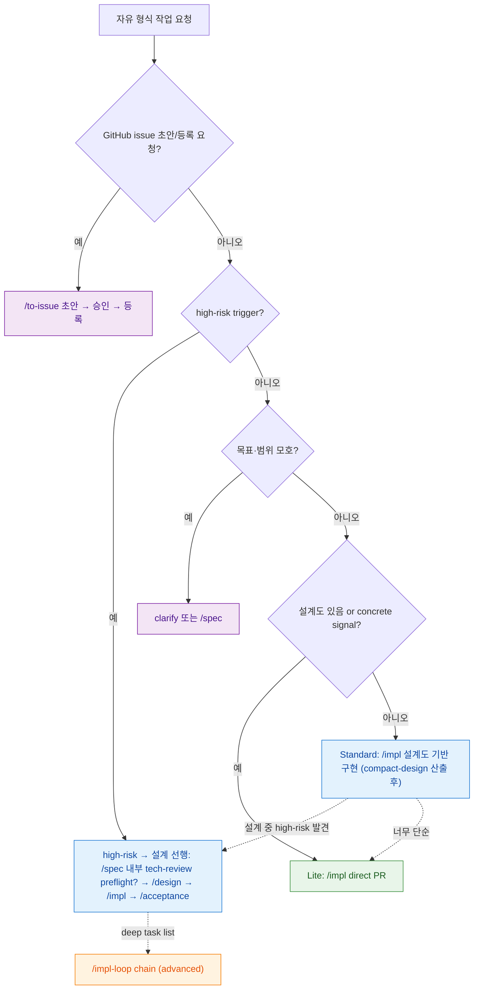

# workflow-router 분기 규칙 SSOT

> **Status**: ACTIVE
> **Scope**: 자유 형식 작업 요청을 받았을 때 **어떤 workflow(skill)로 진입할지** 고르는 분기 규칙의 단일 진본. **진입점 선택(skill 진입 *전*) 전용** — skill 진입 *후* 의 agent 결론 → 다음 호출 판단은 각 `<skill>-routing.md` 영역이다. 본 문서는 그 하위 분기 규칙을 *가리키되* 하위는 본 문서를 역참조하지 않는다 (top-down 단방향).
> **Cross-ref**: 용어 기준 = [`terms.md`](terms.md) · 이슈 초안/등록 = [`to-issue`](../../skills/to-issue/SKILL.md) · 강제 vs 권고 = [`CLAUDE.md`](../../CLAUDE.md).

## 읽는 법

> 🟢 **운영 원칙 — 기본은 가볍게, 무거운 절차는 필요할 때만.** 모든 요청을 같은 full chain(`/spec -> /design -> /impl -> /acceptance`)으로 보내지 않는다. low-risk 는 *가장 작은 구현 경로* 로 직행하고, spec / tech-review / design / consensus 같은 무거운 절차는 **high-risk trigger 가 있을 때만** 조건부로 호출한다. 상위 SSOT = [`CLAUDE.md` dcness 강제 원칙](../../CLAUDE.md#dcness-강제-원칙-룰-추가설계-시-가드레일).

분기 규칙은 **권고**다 — 강제 hook 이 아니다. 메인 Claude 가 자유 형식 작업 요청을 받으면, 먼저 이 표로 리스크를 판정해 *요청을 만족하는 가장 작은 workflow* 를 고른다. 최종 결정은 메인/사용자. 모호하면 clarify 또는 Standard 가 기본이다. **명령명을 외우는 게 아니라 리스크로 고른다.**

## 판정 규칙 — 공개 진입점과 구현 경로는 다르다

기본 공개 진입점은 `/spec -> /design -> /impl -> /acceptance` 다. 이 네 단계는 제품 생명주기 이름이고, Lite / Standard 는 `/impl` 안의 내부 구현 경로다. high-risk 작업은 `/impl` 내부 구현 경로가 아니라 `/impl` 진입 *전* 설계 선행(`/spec`·`/design`)으로 분기된다. 구현 경로별 command 를 공개 진입점으로 늘리지 않는다. 기본 공개 진입점 계약은 [`positioning.md`](positioning.md) 가 진본이다.

구현 경로는 작업 크기보다 **되돌리기 비용과 불확실성**으로 나눈다.

- **Lite** (`/impl` 내부): high-risk 가 없고, 구현 경계와 테스트 기준이 이미 충분히 concrete 하다. 설계 문서·계획 파일 없이 메인이 직접 구현한다.
- **Standard** (`/impl` 내부): 설계 문서(경로)가 들어온 구현 경로다. impl 은 설계를 만들지 않고 받은 설계도로 구현만 한다 — 경량 설계 산출은 impl 밖 [`compact-design`](../../skills/compact-design/SKILL.md)(`module-architect` 1-pass) 또는 full `/design` 이 담당하고, 그 산출물 경로가 진입 사전 조건이다. 엔진(풀4/경량 build-worker)은 구현 경로와 직교다.
- **high-risk → 설계 선행** (`/impl` 내부 구현 경로 아님): high-risk trigger 가 있거나 새 epic/product feature 처럼 사전 설계 합의가 필요하다. impl 진입 *전* `/spec` 내부 tech-review preflight 필요 시 / `/design` / `/impl` / `/acceptance` 흐름으로 설계를 선행하고, 산출된 설계도를 들고 `/impl` Standard 로 진입한다.

경량화 대상은 사전 ceremony 다. branch / PR / test / review / CI / false-clean 방지 같은 safety gate 는 약화하지 않는다.

**gate 축** (먼저 — 어떤 구현 경로/진입점으로 진입할지):

1. GitHub issue 초안/등록 요청인가? → `/to-issue`
2. high-risk trigger 가 있나? → 설계 선행 (`/spec`·`/design`, `/impl` 밖)
3. 목표/범위/성공 기준이 모호한가? → clarify 또는 `/spec`
4. 설계 문서(경로)가 들어왔거나 concrete signal 이 있고 즉시 구현 경계가 명확한가? → `/impl` (설계도 있으면 Standard, 없으면 Lite)
5. high-risk 는 없지만 구현 경계나 테스트 기준이 애매한가? → `compact-design` 산출 후 `/impl` Standard

**shape 축** (gate 통과 후 — 구현을 어떻게 실행할지):

- 단일 PR 이면 single.
- 여러 task/PR 로 나뉘면 chain.
- chain 은 deep impl task list 또는 compact plan 분할이 있어야 시작한다. 모호한 multi-PR 요청은 chain 으로 직행하지 말고 먼저 clarify/Standard/설계 선행 gate 로 보낸다.
- chain 은 기본 직렬이다. 서로 독립인 task 의 opt-in 병렬은 [`parallel-policy.md`](parallel-policy.md) 가 정의하는 별도 peer 세션 모델로만 진행한다 (독립 interactive 세션 + claim board + merge lock).

> 깨진 동작 신고라도 사용자가 "고쳐줘"를 원하면 `/impl`, "issue 로 만들어줘"를 원하면 `/to-issue`, 의도와 성공 기준이 불명확하면 메인이 짧게 명확화한다. 이미 분류·승인된 GitHub issue/PR 번호를 "구현/수정해줘"는 concrete signal 이므로 곧장 `/impl` 판정으로 들어간다.

## 분기 그래프

> gate 축이 구현 경로를 정하고, shape 축은 단일 PR 인지 여러 PR 인지를 정한다. `/impl-loop` 은 기본 구현 진입점이 아니라 deep impl task 파일용 advanced runner 다.

## 구현 경로 표

| 구현 경로 | 트리거 | 진입점 | 왜 이 경로 |
|---|---|---|---|
| **Lite** | concrete signal(파일 path · 함수/클래스/symbol · 이미 분류·승인된 issue/PR 번호 · 명시 테스트 명령 · 작은 docs-only · 작은 refactor) 1개 이상 AND high-risk trigger 0개 AND 구현 경계/테스트 기준 명확 | `/impl` — 메인 직접 `test -> impl -> test pass -> pr-reviewer -> PR` | 의도·범위·수용 기준이 신호로 이미 명확 → 사전 계획 gate 만 비용. `code-validator` 는 계획 파일이 없어서 호출하지 않음 |
| **Standard** | 설계 문서(경로)가 들어옴, 또는 경량 설계 필요 → `compact-design` 산출 후 진입 | `/impl` — `--design-doc` 기록 후 받은 설계도로 구현 (엔진 풀4/경량 직교) | impl 은 설계 생성 X — 설계도 충실 구현 |
| **high-risk → 설계 선행** (impl 내부 구현 경로 아님) | high-risk trigger 1개 이상 또는 새 epic/product feature | impl 진입 *전* `/spec` 내부 tech-review preflight 필요 시 → `/design` → `/impl` → `/acceptance` (deep task 파일이 있으면 `/impl-loop` advanced 위임) | 되돌리기 비싼 결정 → 설계·검증 consensus 필요 |
| **shape: chain** | 구현 경로 판정 후 여러 task/PR 로 분할 · resume/handoff/audit · long-running | deep task list 는 `/impl-loop` chain, Standard 는 compact plan 분할 후 순차 PR | 실행 형태. risk 구현 경로가 아님 |

### high-risk trigger — 각각 왜 사전 설계가 필요한가

| high-risk trigger | 왜 설계 선행 |
|---|---|
| 새 product feature / epic | 사용자 가치·범위가 미확정 → 기획부터 |
| 외부 dependency / API / SDK / model 선택 | 실현성·비용·라이선스 검증 필요 (`/spec` 내부 `/tech-review` preflight) |
| 비용 / 라이선스 / 성능 / 품질이 MVP 성패를 좌우 | PRD 최종화 전 실측·근거 검증 필요 (`/spec` 내부 `/tech-review` preflight) |
| "이게 되는지"가 기능 정의 자체를 바꿀 수 있음 | 가능/불가능 결과가 PRD 범위를 바꿈 (`/spec` 내부 `/tech-review` preflight) |
| auth / security / PII / compliance | 보안·규제 결함은 사후 회복 비용이 큼 → 설계 합의 |
| migration / destructive change | 되돌리기 어려움 → 설계 단계에서 안전장치 |
| public API breakage | 다운스트림 영향 → 인터페이스 합의 필요 |
| cross-module / cross-story interface | 모듈 경계 정합 → architecture 검증 |
| 비용 / 성능 / 운영 리스크 | 운영 영향 → 사전 설계·측정 |

## tech-review / architecture-validator 조건

경량화는 사전 ceremony 를 줄이는 것이지 검증을 없애는 것이 아니다. 다만 검증의 종류는 구현 경로별로 다르다.

| 조건 | 처리 |
|---|---|
| 새 외부 dependency / API / SDK / model 선택이 없고 비용 / 라이선스 / 성능 / 품질 / 실현성 trigger 도 없음 | Lite / Standard 에서 `/tech-review` 생략 |
| 새 외부 dependency / API / SDK / model 선택이 필요함 | 설계 선행으로 (impl 밖) `/spec` 내부 `/tech-review` preflight |
| 비용 / 라이선스 / 성능 / 품질이 MVP 성패를 좌우하거나 "이게 되는지"가 기능 정의를 바꿈 | 설계 선행으로 (impl 밖) `/spec` 내부 `/tech-review` preflight |
| auth / security / PII / compliance, migration, public API breakage, cross-module / cross-story interface 영향 | 설계 선행으로 (impl 밖) `/design` + architecture-validator 2-pass |
| high-risk 0개지만 구현 경계나 테스트 기준이 애매함 | `compact-design` compact plan 산출(impl 밖) 후 `/impl` Standard: 받은 설계도로 구현 + `code-validator`. 이것이 architecture-lite 역할이며 architecture-validator 2-pass 는 호출하지 않음 |
| high-risk 0개이고 설계도 없이 concrete signal 이 충분함 | Lite: 계획 파일 없이 직접 구현 + `pr-reviewer`. `code-validator` / architecture-validator 호출 없음 |

즉 architecture-validator 2-pass 는 high-risk 설계 선행(`/design`)의 설계 검증이다. Standard 의 architecture-lite 는 별도 새 public command 가 아니라 impl 밖 `compact-design` compact plan 1-pass 로 흡수하고, `/impl` 은 그 설계도를 받아 구현만 한다.

## low-risk regression scenario (full chain 빨림 방지)

이 운영 원칙에서 가장 피해야 할 실패는 *low-risk 작업이 무거운 full chain 으로 빨려 들어가는 것*이다. 분기 규칙은 강제 hook 이 아니라 권고이므로(코드로 막을 수 없음), 아래 표가 판정 기준의 **회귀 가드** 역할을 한다 — 새 구현 경로/trigger 를 손볼 때 이 시나리오들이 여전히 성립하는지 확인한다.

| # | 요청 예시 | 올바른 구현 경로 | 회귀 (이러면 안 됨) |
|---|---|---|---|
| R1 | 파일/symbol 명시한 "이 함수 버그 고쳐줘" | Lite (`/impl` 직접) | `/spec` 내부 tech-review preflight → `/design` → `/impl` → `/acceptance` full chain |
| R2 | 작은 docs-only 오타/문구 수정 | Lite | architect 2-pass / consensus 호출 |
| R3 | 이미 분류·승인된 issue/PR 번호 "구현해줘" | Lite | `/spec` 재기획으로 우회 |
| R4 | high-risk 0개지만 수정 범위·테스트 기준이 애매 | `compact-design` 산출 후 Standard | full 설계(`/design`) 과승격 |
| R5 | 새 외부 API/SDK/model 도입이 필요 | 설계 선행 (`/spec` 내부 `/tech-review` preflight, impl 밖) | Lite 직행으로 검증 생략 |

R5 는 **반대 방향** 가드다 — high-risk 를 light 구현 경로로 *내리는 것*도 회귀다. regression 은 "무거운 걸 가볍게(R5)" 와 "가벼운 걸 무겁게(R1~R4)" **양방향**을 모두 막는다. low-risk → light, high-risk → escalation 이 동시에 성립해야 운영 원칙이 지켜진다. 경량화 대상은 사전 ceremony 이지 safety gate(branch / PR / test / review / CI / false-clean 방지)가 아니다 — R1~R4 도 PR·review·CI 는 그대로 탄다.

## 되돌림(backpressure) 원리

> 🟢 **일급 원리 — 되돌림은 예외가 아니라 완성도를 만드는 정상 루프다.** 분기 흐름은 spec → design → impl → review 로 흐르기만 하는 단방향 파이프가 아니다. downstream 단계가 upstream 산출물의 부족을 발견하면 upstream 으로 **되돌려 보강**하고, 부족이 남으면 다시 되돌릴 수 있다. 이 되돌림을 "되돌릴 수 없는 경계의 예외" 로 취급하지 않는다 — 정상 루프다.

dcNess 는 단계 *내부* 되돌림 루프는 이미 일급으로 갖췄다. 본 절은 단계 *간* 되돌림까지 같은 원리로 통합 기술한다.

| 되돌림 경로 | 발견 주체 → 되돌림 목적지 | 트리거 | 비고 |
|---|---|---|---|
| **design → spec** | design 중 PRD/요구사항 부족 발견 → 메인 `/spec` 재진입 권고 | architect 가 PRD 충돌/누락(`ESCALATE`) 또는 미검증 새 외부 의존(`NEW_DEP_ESCALATE`) 보고 | 진본 = [`design-routing.md` escalate 처리](../../skills/design/design-routing.md#escalate-처리) |
| **impl → 설계** | impl 진입 시 설계 산출물 부족 발견 → 경량은 [`compact-design`](../../skills/compact-design/SKILL.md) 내부 skill, full 은 `/design` | 설계 문서가 없고 메인이 "직접 고칠 수준 아님 / 설계 필요" 로 판정 | compact-design 산출물 경로가 후속 impl 의 engineer 게이트 사전 조건 |
| **review → 구현** (단계 내부) | pr-reviewer FAIL / 꼼꼼구현 리뷰 결함 발견 → engineer 재시도 | finding 발생 | **이미 존재** — 단계 내부 되돌림. 단계 간 되돌림과 동일 원리 |

**단계 내부 되돌림** (pr-reviewer → engineer 재시도, code-validator FAIL → engineer 재진입, 꼼꼼구현 codex/서브에이전트 리뷰 → 근본원인 재수정)과 **단계 간 되돌림** (design→spec, impl→설계)은 *같은 원리의 다른 반경*일 뿐이다 — 둘 다 "downstream 이 upstream 부족을 판단하면 upstream 으로 되돌려 보강한다". retry 한도와 escalate 는 각 `<skill>-routing.md` 가 소유한다([impl](../../skills/impl/impl-routing.md) · [design](../../skills/design/design-routing.md)).

되돌림이 무한 추격이 되지 않도록 한도가 붙는다 — 같은 영역 부족이 반복되면 점 패치 retry 로 한도를 소진하지 말고 한 단계 더 upstream 에서 근본을 본다. cycle 한도 초과 시 사용자 위임이 기본이다([`loop-procedure.md` finding 수용 원칙](loop-procedure.md#finding-수용-원칙-점-패치-금지-근본-수정)).

## to-issue 와 작업 분기의 경계

본 분기 규칙과 [`to-issue`](../../skills/to-issue/SKILL.md) 는 **scope 가 다르다**:

- **to-issue (issue 초안/등록)** = 사용자가 문제/작업 후보를 GitHub issue 로 만들려는 의도가 있을 때 메인이 질문하고 Issue Brief 초안 승인 후 등록한다.
- **acceptance gap issue** = [`/acceptance`](../../skills/acceptance/acceptance-routing.md) 제품 검수 후속이다. story/epic 검수에서 나온 PRD / AC 미충족, 구현 증거 부족, cross-story gap, security/ops risk 를 다음 작업 단위로 바꾼다.
- **본 분기 규칙** = *자유 형식 작업 요청* 을 사전 분류해 진입점을 고른다.

issue 생성, Project field 설정, repo label 부여가 목표인 요청은 `/to-issue` 로 보낸다. 단, 이미 승인된 대화나 `/to-issue` 외 agent workflow 가 issue 를 직접 생성해야 하는 경우에도 `gh issue create` 직전 `scripts/check_issue_body.mjs` pre-create validation 을 통과해야 한다. 즉 /to-issue 외 경로도 같은 Issue Brief 형식과 IssueType/Priority/label 계약을 지킨다. 버그를 바로 고칠 요청은 `/impl` 로 보낸다. 의도와 성공 기준이 불명확한 버그 신고는 별도 agent 로 넘기지 말고 메인이 필요한 질문을 한다.

깨진 동작 신고가 이미 파일, 증상, 재현 경로, 기대 동작, 테스트 기준을 충분히 포함하면 `/impl` 의 concrete signal 로 본다. 큰 변경이나 다중 모듈 영향이 보이면 impl 밖 설계 선행으로 승격한다. 반면 **이미 분류·승인된** GitHub issue/PR 번호를 "구현/수정해줘"는 그 자체가 concrete signal 이라 곧장 `/impl` 판정으로 들어간다.

acceptance gap issue 는 이미 제품 검수에서 근거가 생긴 후속이다. 사용자 승인 후 issue 를 만들었다면 concrete signal 로 보고 `/impl`, `/design`, `/spec`, `/ux` 등 해당 후속 분기로 진입한다.

## 하위 분기 규칙과의 관계 (top-down 단방향)

본 문서는 진입점을 *고르는* 데서 끝난다. skill 진입 후의 agent 결론 → 다음 호출 판단은 각 skill 의 `<skill>-routing.md` 가 진본이다:

- `/impl` → [`impl-routing.md`](../../skills/impl/impl-routing.md)
- `/spec` → [`spec-routing.md`](../../skills/spec/spec-routing.md)
- `/impl-loop` → [`impl-loop-routing.md`](../../skills/impl-loop/impl-loop-routing.md)
- `/design` → [`design-routing.md`](../../skills/design/design-routing.md)
- `/to-issue` → [`to-issue/SKILL.md`](../../skills/to-issue/SKILL.md)

이 참조는 **단방향**이다 — 하위 분기 규칙은 본 문서를 역참조하지 않는다. 진입점 선택은 그들의 scope(skill 진입 후)가 아니기 때문이다.
