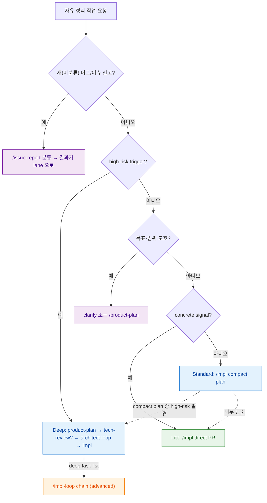

# workflow-router 라우팅 SSOT

> **Status**: ACTIVE
> **Scope**: 자유 형식 작업 요청을 받았을 때 **어떤 workflow(skill)로 진입할지** 고르는 router 의 단일 진본. **entrypoint 선택(skill 진입 *전*) 전용** — skill 진입 *후* 의 agent 결론 → 다음 호출 라우팅은 각 `<skill>-routing.md` 영역이다. 본 문서는 그 하위 routing 을 *가리키되* 하위는 본 문서를 역참조하지 않는다 (top-down 단방향).
> **Cross-ref**: 이슈 분류(이미 발견된 버그) = [`issue-report-routing.md`](../../skills/issue-report/issue-report-routing.md) · 강제 vs 권고 = [`CLAUDE.md`](../../CLAUDE.md).

## 읽는 법

> 🟢 **doctrine — 기본은 light, 무거운 절차는 조건부다.** 모든 요청을 같은 full chain(product-plan → tech-review → architect-loop → impl)으로 보내지 않는다. low-risk 는 *가장 작은 lane* 으로 직행하고, product-plan / tech-review / architect / consensus 같은 무거운 절차는 **high-risk trigger 가 있을 때만** 조건부로 호출한다 (risk-triggered escalation). 상위 SSOT = [`CLAUDE.md` dcness 강제 원칙](../../CLAUDE.md#dcness-강제-원칙-룰-추가설계-시-가드레일).

라우팅은 **권고**다 — 강제 hook 이 아니다. 메인 Claude 가 자유 형식 작업 요청을 받으면, 먼저 이 표로 리스크를 판정해 *요청을 만족하는 가장 작은 workflow* 를 고른다. 최종 결정은 메인/사용자. 모호하면 clarify 또는 Standard 가 기본이다. **명령명을 외우는 게 아니라 리스크로 고른다.**

## 판정 규칙 — public surface 와 lane 은 다르다

사용자-facing 기본 구현 진입점은 [`/impl`](../../skills/impl/SKILL.md) 하나다. Lite / Standard / Deep 은 `/impl` 안의 내부 lane 이며, lane 별 command 를 public surface 로 늘리지 않는다. 기본 표면 계약은 [`positioning.md`](positioning.md) 가 진본이다.

lane 은 작업 크기보다 **되돌리기 비용과 불확실성**으로 나눈다.

- **Lite**: high-risk 가 없고, 구현 경계와 테스트 기준이 이미 충분히 concrete 하다. 계획 파일 없이 메인이 직접 구현한다.
- **Standard**: high-risk 는 없지만 Lite 로 바로 가기에는 구현 경계, 테스트 기준, 작은 내부 contract 가 애매하다. `module-architect` 가 compact plan 을 1-pass 로 만든다.
- **Deep**: high-risk trigger 가 있거나 새 epic/product feature 처럼 사전 설계 합의가 필요하다. 현행 PRD / tech-review / architect-loop / deep impl task 흐름을 유지한다.

경량화 대상은 사전 ceremony 다. branch / PR / test / review / CI / false-clean 방지 같은 safety gate 는 약화하지 않는다.

**gate 축** (먼저 — 어떤 lane/entrypoint 로 진입할지):

1. 새 미분류 버그/이슈 신고인가? → `/issue-report`
2. high-risk trigger 가 있나? → Deep
3. 목표/범위/성공 기준이 모호한가? → clarify 또는 `/product-plan`
4. concrete signal 이 있고 즉시 구현 경계가 명확한가? → Lite
5. high-risk 는 없지만 구현 경계나 테스트 기준이 애매한가? → Standard

**shape 축** (gate 통과 후 — 구현을 어떻게 실행할지):

- 단일 PR 이면 single.
- 여러 task/PR 로 나뉘면 chain.
- chain 은 deep impl task list 또는 compact plan 분할이 있어야 시작한다. 모호한 multi-PR 요청은 chain 으로 직행하지 말고 먼저 clarify/Standard/Deep gate 로 보낸다.
- chain 은 기본 직렬이다. 서로 독립인 task 의 opt-in 병렬 wave 는 [`parallel-policy.md`](parallel-policy.md) 가 정의한다 (driver 후속 — 현재는 직렬만 동작).

> **아직 분류 안 된 새 버그/이슈 신고**("이거 안 돼 / 이상해")는 gate 판정 *전*에 `/issue-report` 로 먼저 분류한다 ([issue-report 와의 경계](#issue-report-와의-경계)) — KNOWN_ISSUE / DESIGN_ISSUE / SCOPE_ESCALATE 를 건너뛰지 않기 위해. 분류 결과가 다시 lane 판정으로 흐른다. (반면 이미 분류·승인된 GitHub issue/PR 번호를 "구현/수정해줘"는 concrete signal 이므로 곧장 `/impl` 판정으로 들어간다.)

## 라우팅 그래프

> gate 축이 lane 을 정하고, shape 축은 단일 PR 인지 여러 PR 인지를 정한다. `/impl-loop` 은 기본 구현 진입점이 아니라 deep impl task 파일용 advanced runner 다.

## Lane 표

| lane | 트리거 | 진입점 | 왜 이 lane |
|---|---|---|---|
| **Lite** | concrete signal(파일 path · 함수/클래스/symbol · 이미 분류·승인된 issue/PR 번호 · 명시 테스트 명령 · 작은 docs-only · 작은 refactor) 1개 이상 AND high-risk trigger 0개 AND 구현 경계/테스트 기준 명확 | `/impl` — 메인 직접 `test -> impl -> test pass -> pr-reviewer -> PR` | 의도·범위·수용 기준이 신호로 이미 명확 → 사전 계획 gate 만 비용. `code-validator` 는 계획 파일이 없어서 호출하지 않음 |
| **Standard** | high-risk 0개지만 수정 허용/금지, 테스트 기준, 작은 internal contract 가 애매함 | `/impl` — `module-architect` compact plan 1-pass 후 구현 | Lite 로 바로 가기엔 불확실하지만 Deep ceremony 는 과함 |
| **Deep** | high-risk trigger 1개 이상 또는 새 epic/product feature | `/product-plan` → `/tech-review` 필요 시 → `/architect-loop` → `/impl` (deep task 파일이 있으면 `/impl-loop` advanced 위임) | 되돌리기 비싼 결정 → 설계·검증 consensus 필요 |
| **shape: chain** | lane 판정 후 여러 task/PR 로 분할 · resume/handoff/audit · long-running | deep task list 는 `/impl-loop` chain, Standard 는 compact plan 분할 후 순차 PR | 실행 형태. risk lane 이 아님 |

### Deep trigger — 각각 왜 사전 설계가 필요한가

| high-risk trigger | 왜 Deep |
|---|---|
| 새 product feature / epic | 사용자 가치·범위가 미확정 → 기획부터 |
| 외부 dependency / API / SDK / model 선택 | 실현성·비용·라이선스 검증 필요 (`/tech-review`) |
| auth / security / PII / compliance | 보안·규제 결함은 사후 회복 비용이 큼 → 설계 합의 |
| migration / destructive change | 되돌리기 어려움 → 설계 단계에서 안전장치 |
| public API breakage | 다운스트림 영향 → 인터페이스 합의 필요 |
| cross-module / cross-story interface | 모듈 경계 정합 → architecture 검증 |
| 비용 / 성능 / 운영 리스크 | 운영 영향 → 사전 설계·측정 |

## tech-review / architecture-validator 조건

경량화는 사전 ceremony 를 줄이는 것이지 검증을 없애는 것이 아니다. 다만 검증의 종류는 lane 별로 다르다.

| 조건 | 처리 |
|---|---|
| 새 외부 dependency / API / SDK / model 선택이 없음 | Lite / Standard 에서 `/tech-review` 생략 |
| 새 외부 dependency / API / SDK / model 선택이 필요함 | Deep 승격 후 `/tech-review` 선행 |
| auth / security / PII / compliance, migration, public API breakage, cross-module / cross-story interface 영향 | Deep 승격 후 `/architect-loop` + architecture-validator 2-pass |
| high-risk 0개지만 구현 경계나 테스트 기준이 애매함 | Standard: `module-architect` compact plan 1-pass + `code-validator`. 이것이 architecture-lite 역할이며 architecture-validator 2-pass 는 호출하지 않음 |
| high-risk 0개이고 concrete signal 이 충분함 | Lite: 계획 파일 없이 직접 구현 + `pr-reviewer`. `code-validator` / architecture-validator 호출 없음 |

즉 architecture-validator 2-pass 는 Deep lane 의 설계 검증이다. Standard 의 architecture-lite 는 별도 새 public command 가 아니라 compact plan 1-pass 로 흡수한다.

## low-risk regression scenario (full chain 빨림 방지)

doctrine 의 핵심 실패 모드는 *low-risk 작업이 무거운 full chain 으로 빨려 들어가는 것*이다. 라우팅은 강제 hook 이 아니라 권고이므로(코드로 막을 수 없음), 아래 표가 판정 기준의 **회귀 가드** 역할을 한다 — 새 lane/trigger 를 손볼 때 이 시나리오들이 여전히 성립하는지 확인한다.

| # | 요청 예시 | 올바른 lane | 회귀 (이러면 안 됨) |
|---|---|---|---|
| R1 | 파일/symbol 명시한 "이 함수 버그 고쳐줘" | Lite (`/impl` 직접) | product-plan → tech-review → architect-loop full chain |
| R2 | 작은 docs-only 오타/문구 수정 | Lite | architect 2-pass / consensus 호출 |
| R3 | 이미 분류·승인된 issue/PR 번호 "구현해줘" | Lite | `/product-plan` 재기획으로 우회 |
| R4 | high-risk 0개지만 수정 범위·테스트 기준이 애매 | Standard (compact plan 1-pass) | Deep `/architect-loop` 승격 |
| R5 | 새 외부 API/SDK/model 도입이 필요 | Deep (`/tech-review` 선행) | Lite 직행으로 검증 생략 |

R5 는 **반대 방향** 가드다 — high-risk 를 light lane 으로 *내리는 것*도 회귀다. regression 은 "무거운 걸 가볍게(R5)" 와 "가벼운 걸 무겁게(R1~R4)" **양방향**을 모두 막는다. low-risk → light, high-risk → escalation 이 동시에 성립해야 doctrine 이 지켜진다. 경량화 대상은 사전 ceremony 이지 safety gate(branch / PR / test / review / CI / false-clean 방지)가 아니다 — R1~R4 도 PR·review·CI 는 그대로 탄다.

## issue-report 와의 경계

본 router 와 [`issue-report`](../../skills/issue-report/issue-report-routing.md) 의 qa 분류는 **scope 가 다르다**:

- **issue-report (qa 분류)** = *아직 분류 안 된 새 버그/이슈 신고* 를 분류한다 (KNOWN_ISSUE / DESIGN_ISSUE / SCOPE_ESCALATE 등).
- **본 router** = *자유 형식 작업 요청* 을 사전 분류해 entrypoint 를 고른다.

아직 분류 안 된 새 버그/이슈 신고는 먼저 `/issue-report` 로 분류하고, 그 결과가 다시 본 router 의 lane 으로 흐른다 — 예: 기능 버그/정리 작업 → `/impl` Lite/Standard, 큰 변경/다중 모듈 → Deep. 반면 **이미 분류·승인된** GitHub issue/PR 번호를 "구현/수정해줘"는 그 자체가 concrete signal 이라 곧장 `/impl` 판정으로 들어간다.

## 하위 routing 과의 관계 (top-down 단방향)

본 문서는 entrypoint 를 *고르는* 데서 끝난다. skill 진입 후의 agent 결론 → 다음 호출은 각 skill 의 `<skill>-routing.md` 가 진본이다:

- `/impl` → [`impl-routing.md`](../../skills/impl/impl-routing.md)
- `/product-plan` → [`product-plan-routing.md`](../../skills/product-plan/product-plan-routing.md)
- `/impl-loop` → [`impl-loop-routing.md`](../../skills/impl-loop/impl-loop-routing.md)
- `/architect-loop` → [`architect-loop-routing.md`](../../skills/architect-loop/architect-loop-routing.md)
- `/issue-report` → [`issue-report-routing.md`](../../skills/issue-report/issue-report-routing.md)

이 참조는 **단방향**이다 — 하위 routing 은 본 문서를 역참조하지 않는다. entrypoint 선택은 그들의 scope(skill 진입 후)가 아니기 때문이다.
