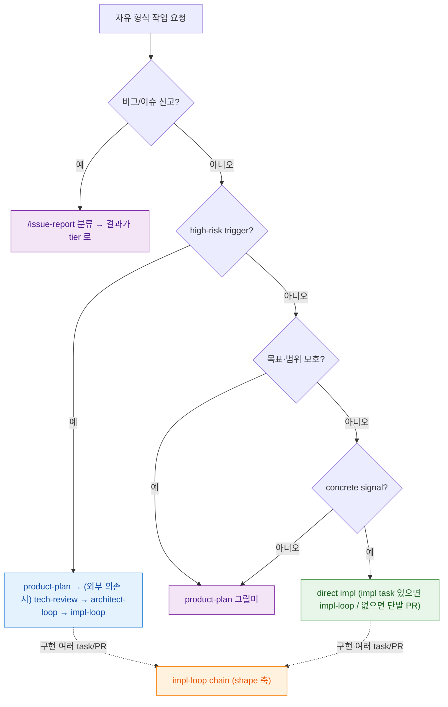

# workflow-router 라우팅 SSOT

> **Status**: ACTIVE
> **Scope**: 자유 형식 작업 요청을 받았을 때 **어떤 workflow(skill)로 진입할지** 고르는 router 의 단일 진본. **entrypoint 선택(skill 진입 *전*) 전용** — skill 진입 *후* 의 agent 결론 → 다음 호출 라우팅은 각 `<skill>-routing.md` 영역이다. 본 문서는 그 하위 routing 을 *가리키되* 하위는 본 문서를 역참조하지 않는다 (top-down 단방향).
> **Cross-ref**: 이슈 분류(이미 발견된 버그) = [`issue-report-routing.md`](../../skills/issue-report/issue-report-routing.md) · 강제 vs 권고 = [`CLAUDE.md`](../../CLAUDE.md).

## 읽는 법

라우팅은 **권고**다 — 강제 hook 이 아니다. 메인 Claude 가 자유 형식 작업 요청을 받으면, 먼저 이 표로 리스크를 판정해 *요청을 만족하는 가장 작은 workflow* 를 고른다. 최종 결정은 메인/사용자. 모호하면 tier 2(clarify) 가 기본. **명령명을 외우는 게 아니라 리스크로 고른다.**

## 판정 규칙 — gate 축과 shape 축은 직교다

risk tier 는 "더 무거운 하나"를 고르는 배타 선택이 **아니다**. 두 가지 서로 다른 질문에 답한다:

- **high-risk = planning gate** 를 결정한다 (기획/기술검토/설계 루프가 필요한가).
- **durable = implementation shape** 를 결정한다 (단일 PR 인가, 여러 PR chain 인가).

세 문장으로 못 박는다:

1. **concrete signal 은 direct impl 의 *필요조건*이지 *충분조건*이 아니다** — high-risk trigger 가 하나라도 있으면 direct impl 이 아니다. (예: "auth/payment 파일 X 고쳐 구독 SDK 붙여줘" 는 파일 path 가 있어도 high-risk 라 tier 3.)
2. **direct impl 은 *절차 생략*이 아니라 *기획/설계 gate 생략*이다** — branch / PR / test / pr-reviewer / CI 게이트는 그대로 지킨다. 새 command/skill 이 아니라 메인이 직접 도는 단발 구현 경로다.
3. **high-risk 와 durable 은 합성된다** — 둘 다 맞으면 `/product-plan → (외부 의존 시) /tech-review → /architect-loop → /impl-loop chain`.

**gate 축** (먼저 — *어느 workflow 로 진입*할지. 위에서 아래로):

1. **high-risk trigger 가 있나?** → **plan + review** (tier 3)
2. **목표/범위가 모호한가?** → **clarify** (tier 2)
3. **high-risk 없고 concrete signal 이 있나?** → **direct impl** (tier 1). impl task/issue 가 있으면 `/impl-loop`, 없으면 단발 구현 경로 — 이건 tier 1 *내부* 분기일 뿐, 진입 조건이 아니다.

**shape 축** (gate 통과 *후* — *구현을 어떻게 실행*할지):

4. 구현이 여러 task/PR 로 나뉘나(resume/handoff/long-running 포함)? → `/impl-loop` **chain**, 아니면 single. chain 은 impl task list 가 있어야 시작하므로, **모호한 multi-PR 요청은 durable 로 직행하지 말고 먼저 gate(1~2)로** 보낸다.

> 버그/이슈 신고는 gate 판정 *전*에 `/issue-report` 로 먼저 분류한다 ([issue-report 와의 경계](#issue-report-와의-경계)) — KNOWN_ISSUE / DESIGN_ISSUE / SCOPE_ESCALATE 를 건너뛰지 않기 위해. 분류 결과가 다시 위 tier 로 흐른다.

## 라우팅 그래프

> gate 축(high-risk / 모호 / direct)이 *어느 workflow 로 진입할지*를 정하고, shape 축(점선)은 진입 *후* 구현이 여러 task/PR 이면 `/impl-loop` chain 으로 실행한다. tier 4(durable chain)는 "더 높은 리스크"가 아니라 실행 형태일 뿐 — **gate 보다 먼저 판정하지 않는다.**

## tier 표

| tier | 트리거 (signal) | 진입점 | 왜 이 tier |
|---|---|---|---|
| **1. direct impl** | concrete signal(파일 path · 함수/클래스/symbol · issue/PR 번호 · 명시 테스트 명령 · 작은 docs-only · 이미 승인된 impl 파일) **1개 이상 AND high-risk trigger 0개**. (버그/이슈 신고는 tier 1 직행 X — 먼저 `/issue-report` 분류) | impl task/issue 있으면 `/impl-loop`, 없으면 **메인이 branch → PR → test → pr-reviewer → CI 를 지키는 단발 구현 경로** (새 skill 아님) | 의도·범위·수용 기준이 신호로 이미 명확 → 기획/설계 gate 만 비용. **검증·리뷰 게이트는 유지** |
| **2. clarify** | 목표/사용자/성공 기준 모호 · "좋게 만들어줘 / 개선해줘 / 새 기능"처럼 범위 넓음 · 사용자가 "뭘 원하는지 모르겠다" | `/product-plan` 그릴미 (또는 메인이 명확화 질문) | shared understanding 부재 → 구현 전에 의도부터 |
| **3. plan + review** | high-risk trigger 1개 이상 (아래 표) | `/product-plan` → (외부 의존 시) `/tech-review` → `/architect-loop` → `/impl-loop` | 되돌리기 비싼 결정 → 설계·검증 consensus 필요 |
| **4. durable chain** | (gate 통과 후) 구현이 여러 task/PR 로 분할 · resume/handoff/audit · long-running · 병렬 후보 | `/impl-loop` chain 모드 — **impl task list 가 있어야 시작** (모호하면 먼저 tier 2/3) | **shape 축** — gate 가 아니라 실행 형태. 단일 PR 로 안 끝남 → task 경계 라우팅·재개 이득 |

### tier 3 (plan + review) 트리거 — 각각 왜 full chain 인가

| high-risk trigger | 왜 full chain |
|---|---|
| 새 product feature / epic | 사용자 가치·범위가 미확정 → 기획부터 |
| 외부 dependency / API / SDK / model 선택 | 실현성·비용·라이선스 검증 필요 (`/tech-review`) |
| auth / security / PII / compliance | 보안·규제 결함은 사후 회복 비용이 큼 → 설계 합의 |
| migration / destructive change | 되돌리기 어려움 → 설계 단계에서 안전장치 |
| public API breakage | 다운스트림 영향 → 인터페이스 합의 필요 |
| cross-module / cross-story interface | 모듈 경계 정합 → architecture 검증 |
| 비용 / 성능 / 운영 리스크 | 운영 영향 → 사전 설계·측정 |

## issue-report 와의 경계

본 router 와 [`issue-report`](../../skills/issue-report/issue-report-routing.md) 의 qa 분류는 **scope 가 다르다**:

- **issue-report (qa 분류)** = *이미 발견된 버그/이슈* 를 분류한다.
- **본 router** = *자유 형식 작업 요청* 을 사전 분류해 entrypoint 를 고른다.

버그/이슈 신고는 먼저 `/issue-report` 로 분류하고, 그 결과가 다시 본 router 의 tier 로 흐른다 — 예: 기능 버그/정리 작업 → tier 1(direct impl) fallback, 큰 변경/다중 모듈 → tier 3(plan + review).

## 하위 routing 과의 관계 (top-down 단방향)

본 문서는 entrypoint 를 *고르는* 데서 끝난다. skill 진입 후의 agent 결론 → 다음 호출은 각 skill 의 `<skill>-routing.md` 가 진본이다:

- `/product-plan` → [`product-plan-routing.md`](../../skills/product-plan/product-plan-routing.md)
- `/impl-loop` → [`impl-loop-routing.md`](../../skills/impl-loop/impl-loop-routing.md)
- `/architect-loop` → [`architect-loop-routing.md`](../../skills/architect-loop/architect-loop-routing.md)
- `/issue-report` → [`issue-report-routing.md`](../../skills/issue-report/issue-report-routing.md)

이 참조는 **단방향**이다 — 하위 routing 은 본 문서를 역참조하지 않는다. entrypoint 선택은 그들의 scope(skill 진입 후)가 아니기 때문이다.
