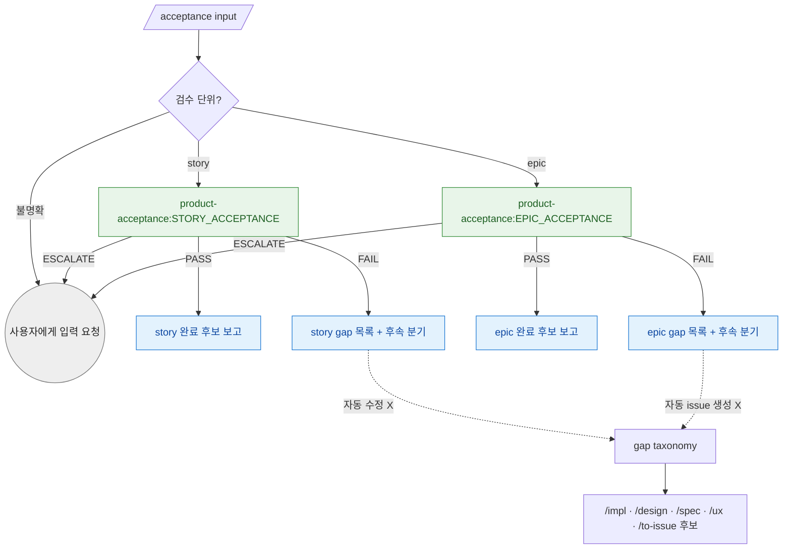

# acceptance 분기 규칙 SSOT

> **Status**: ACTIVE
> **Scope**: `/acceptance` skill 단일 전용 분기 규칙 진본. MVP 범위는 story / epic 제품 검수다. 진행 절차는 [`SKILL.md`](SKILL.md).

## 분기 그래프

## 결론 → 다음 행동

| 입력 | 다음 |
|---|---|
| `product-acceptance:STORY_ACCEPTANCE` `PASS` | story 완료 후보로 보고. 자동 close 는 하지 않는다. |
| `product-acceptance:STORY_ACCEPTANCE` `FAIL` | AC / PR / test evidence gap 과 동작 증거 부족, mock-only green 을 보고하고 `/impl` 또는 `/design` 회수 후보를 제안한다. |
| `product-acceptance:EPIC_ACCEPTANCE` `PASS` | epic 완료 후보로 보고. 자동 close 는 하지 않는다. |
| `product-acceptance:EPIC_ACCEPTANCE` `FAIL` | PRD Must, cross-story 동작 gap, mock-only green, security/ops risk 를 보고하고 후속 분기를 제안한다. |
| `ESCALATE` | 기준 문서, 구현 PR 목록, 권한, 사용자 결정 부족을 보고하고 대기한다. |

## 깊이 차이

Story acceptance 는 가볍게 AC / PR / test evidence 중심으로 돈다. 단, 핵심 AC는 단순 파일/테스트 존재가 아니라 동작 증거와 연결돼야 하며, mock-only green 은 gap 으로 분리한다. story마다 full product/security/performance audit 을 강제하지 않는다.

Epic acceptance 는 PRD Must, cross-story gap, security/ops risk 를 포함한다. 여러 story가 합쳐질 때 생기는 흐름, 권한, 데이터, 운영 위험을 보며, PR/story 경계를 넘는 통합 동작 검증의 책임은 이 epic acceptance 에 있다. code-validator / pr-reviewer 가 PR diff 범위를 보는 동안, product-acceptance 는 story/epic 마감 경계에서 사용자 약속이 실제 동작 증거로 닫혔는지 확인한다.

## 동작 증거 판정

동작 증거는 사람 E2E만 뜻하지 않는다. 핵심 AC 성격에 맞으면 정적 타입검사/compile, 실데이터(non-mock) 통합 테스트, UI 자동화, API/CLI smoke, 실제 앱 진입점 실행 기록을 인정한다.

mock/stub/fake 기반 unit test 는 보조 증거다. 핵심 AC가 mock-only green으로만 닫히고 실제 제품 경계(API/CLI/UI/통합 wiring/compile-time contract)가 확인되지 않았으면 `검수 증거 부족 / 스모크 실패` 계열 gap 으로 보고한다.

정적 타입검사나 compile gate 가 의미 있는 stack 인데 증거에 없으면 품질 게이트 warning 으로 보고한다. warning 자체는 자동 FAIL 이 아니지만, 그 부재 때문에 핵심 AC의 wiring/contract 동작을 증명할 수 없으면 FAIL gap 이다.

## Gap taxonomy → 후속 분기

`FAIL` 이면 product-acceptance prose 에서 gap 을 아래 taxonomy 로 묶어 보고한다. 후속은 자동 진입이 아니라 사용자에게 제안하는 다음 작업 단위다.

| gap 종류 | 후속 |
|---|---|
| PRD / AC 미충족 | `/to-issue` 후보 + `/impl` |
| 설계 결함 / 범위 재정의 필요 | `/design` 또는 `/spec` |
| 검수 증거 부족 / 스모크 실패 | gap 또는 bug `/to-issue` 후보 + `/impl` |
| mock-only green / 동작 증거 부족 | gap 또는 bug `/to-issue` 후보 + `/impl` |
| UX 미완성 | `/ux` |
| 성능 병목 / 리팩토링 필요 | `/to-issue` 후보 + `/impl` 또는 `/design` |
| 보안 / 권한 / 데이터 리스크 | `/to-issue` 후보 + `/design` 또는 사용자 위임 |

story acceptance 는 주로 PRD / AC 미충족, 검수 증거 부족 / 스모크 실패, mock-only green / 동작 증거 부족을 만든다. epic acceptance 는 cross-story gap, 성능 병목 / 리팩토링 필요, 보안 / 권한 / 데이터 리스크까지 같이 본다.

품질 게이트 warning 은 gap 과 별개로 남길 수 있다. 예를 들어 TypeScript 프로젝트에 `tsc --noEmit` 또는 그에 준하는 compile/typecheck 증거가 전혀 없으면 warning 으로 보고하고, 핵심 AC 검증에도 영향을 주는 경우에만 위 gap taxonomy 로 승격한다.

`/design` 은 `/design` 호환 alias 이므로 acceptance gap 의 설계 회수 후보는 사용자-facing 공개 진입점인 `/design` 으로 제안한다.

acceptance gap issue 는 제품 검수 후속이다. 이미 기준 문서와 구현 증거에서 나온 gap 이므로, 별도 분류 흐름으로 되돌리지 않는다.

## Gap 처리

`FAIL` 은 끝이 아니라 다음 작업 단위로 돌아가기 위한 보고다.

- 자동 수정하지 않는다. (standalone `/acceptance` 한정 — `/impl-loop` 의 story/epic 마감 inline 검수는 마감 PR 이 아직 열려 있어 auto-fixable gap 의 수정 루프를 돌며, 그 결론→다음은 [`impl-loop-routing.md` 마감 acceptance 분기](../impl-loop/impl-loop-routing.md#마감-acceptance-분기) 가 소유한다.)
- 자동 issue 생성하지 않는다.
- 사용자 승인 없이 GitHub issue 를 만들지 않는다.
- gap 은 기준 문서, 구현 증거, 누락 사실, 후속 분기를 포함한다.
- gap 을 GitHub issue 로 만들 때는 `/to-issue` 로 Issue Brief 초안과 사용자 승인을 먼저 거친다.

## Issue 생성 단계 전략

- 1차: 자동 issue 생성 없이 gap 목록 + 후속 분기 prose 만 안정화한다.
- 2차: 사용자 승인 또는 명시 옵션이 있을 때만 `/to-issue` 흐름으로 GitHub issue 를 만든다.
- 3차: story/epic sub-issue 연결과 close 정책 정합을 다룬다.
- 후속: release/product acceptance 에서 사람 full E2E gap loop 를 별도로 설계한다. 사람 full E2E gap loop 는 MVP 범위 밖이지만, 자동 동작 증거 판정은 story/epic acceptance 의 현재 범위다.

후속 분기는 MVP 에서 prose 보고만 한다. acceptance gap issue 생성과 자동 연결은 후속 단계에서 다룬다.

## Non-goals

- 사람 full E2E 검증은 MVP 범위 밖이다.
- Lite `/impl` 단발 작업을 `/acceptance` 로 강제하지 않는다.
- 기존 `code-validator`, `architecture-validator`, `pr-reviewer` 를 대체하지 않는다.
