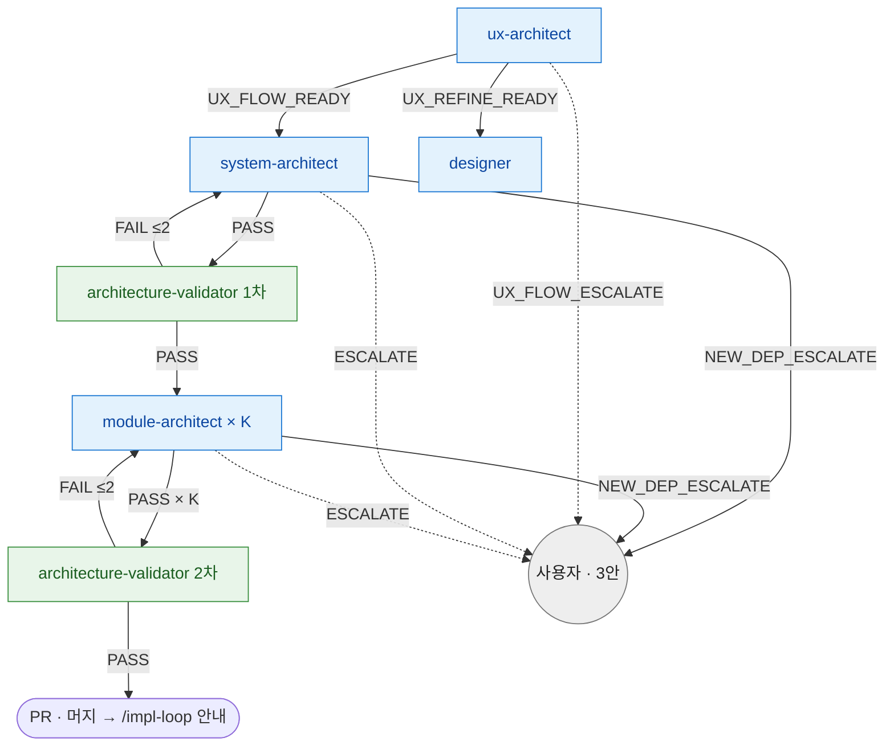

# architect-loop 라우팅 SSOT

> **Status**: ACTIVE
> **Scope**: `/architect-loop` skill **단일 전용** 라우팅 진본 — 이 skill 안 agent (ux-architect / system-architect / architecture-validator / module-architect / designer) 의 결론 → 다음 호출 + retry 한도 + escalate 처리. 진행 절차(Step) 는 [`SKILL.md`](SKILL.md).
> **Cross-ref**: catastrophic 보존 = [`hooks.md`](../../docs/plugin/hooks.md#catastrophic-gatesh) · 권한 경계 = [`agent_boundary.py`](../../harness/agent_boundary.py).

## 읽는 법

agent 는 일을 마치면 prose 마지막 단락에 *어떤 결과로 끝났는지 + 사유* 를 자기 언어로 적는다. 메인 Claude 가 그 prose 를 읽고 아래 매핑으로 다음 호출을 정한다. 이 문서는 형식 강제가 아니라 *판단 보조* — 의미만 맞으면 된다. prose 가 모호하면 사용자에게 위임한다.

라우팅은 **skill 이 소유**한다. agent 는 결론(enum)만 내고, "그 결론이면 다음 누구" 는 본 문서가 정한다. 같은 agent 가 다른 skill (impl 등) 에 나와도 그건 *그 skill 의 라우팅* 이지 본 문서 영역이 아니다.

## 라우팅 그래프

> 파랑 = 생산 agent · 초록 = 검증 agent · 회색 = 사용자 위임. 점선 = escalate. 엣지의 `≤N` = retry 한도 ([retry 한도](#retry-한도)).
>
> tech-reviewer 는 architect-loop 진입 *전* (`/tech-review` skill) 단계라 본 그래프에 없다. architect-loop 진입 후 tech-reviewer 재호출은 **하지 않는다** — architect-loop 안엔 tech-reviewer 가 없고, `/tech-review` 재진입도 자연어 관례상 비권장 (코드 강제 아님, [escalate 처리](#escalate-처리)).

## 결론 → 다음 호출 매핑

| agent | 결론 → 다음 호출 |
|---|---|
| **ux-architect** | `UX_FLOW_READY` → system-architect · `UX_REFINE_READY` → designer · `UX_FLOW_ESCALATE` → 사용자. (UI-less epic 이면 메인이 호출 안 함 — [`SKILL.md`](SKILL.md) UI-less 분기) |
| **system-architect** | `PASS` → architecture-validator(1차) · `ESCALATE` → 사용자(`/product-plan` 재진입) · `NEW_DEP_ESCALATE` → 3안([escalate 처리](#escalate-처리)) |
| **architecture-validator** | `PASS`(1차) → module-architect × K · `PASS`(2차) → SKILL.md Step 6 PR · `FAIL` → 해당 architect 재진입([결론 → 다음 호출 매핑](#결론-다음-호출-매핑)) · `ESCALATE` → 사용자 |
| **module-architect** | `PASS` → 다음 단위 module-architect / (마지막이면) architecture-validator 2차 · `SPEC_GAP_FOUND` → module-architect 보강([retry 한도](#retry-한도)) · `ESCALATE` → 사용자 · `NEW_DEP_ESCALATE` → 3안([escalate 처리](#escalate-처리)) |
| **designer** | `PASS` → 사용자 PICK · `ESCALATE` → 사용자. (UX_REFINE 분기 진입 시) |

표만으로 안 풀리는 맥락:

- **module-architect 호출 단위** = 1 Story 또는 공통 task 묶음 → epic 전체에서 `K = Story 수 + 공통 호출` 회 반복. self-check 의 cross-task interface 점검이 PASS 게이트.
- **architecture-validator 2시점** — 1차(Step 3.5) = Placeholder + 공통 SSOT 룰 위반, 2차(Step 5) = Cross-Story Interface + Implementation Simulation + Origin Anchor + Placeholder 재검증.

## retry 한도

| 재시도 경로 | 한도 | 초과 시 |
|---|---|---|
| ux-architect self-check FAIL → ux-architect 재진입 (prose 내부) | 2 cycle | 사용자 위임 |
| architecture-validator FAIL → architect 재진입 | 2 cycle | 사용자 위임 |
| module-architect `SPEC_GAP_FOUND` → 보강 → 신규 케이스 재진입 | 2 cycle | 사용자 위임 |

> **architecture-validator FAIL 재진입 대상 = 시점·영역별** — **1차**(Placeholder·공통 SSOT) → **system-architect** 재진입 (이 시점 module-architect 미실행 — 검증 대상이 system-architect 산출물이므로). **2차**(Cross-Story Interface·Implementation Simulation·Origin Anchor) → 해당 **module-architect** 재진입, 단 모듈 의존 그래프 영역이면 **system-architect** 재진입.
> cycle 발생 시 **working tree only — commit X.** PASS 후에만 commit (cycle 도중 산출물은 덮어쓰기 전제).

> **finding 수용 자세** (점 패치 X, 근본 재설계) — 같은 영역 finding 이 2회+ 반복되면 점 패치 retry 로 한도를 소진하지 말고 근본 원인을 짚어 그 영역을 재설계한다. 진본 = [`loop-procedure.md` finding 수용 원칙](../../docs/plugin/loop-procedure.md#finding-수용-원칙-점-패치-금지-근본-수정).

## escalate 처리

escalate 계열 결론(`UX_FLOW_ESCALATE` / `ESCALATE` / `NEW_DEP_ESCALATE`) 수신 시 **메인이 즉시 사용자 보고 후 대기** (자동 복구 / 우회 / 재시도 금지 — [`../../CLAUDE.md`](../../CLAUDE.md) 강제 영역).

- **기술 스택 그릴미 미합의** (Step 2.9 — 사용자가 스택 결정 못 냄 / 보류) → loop 진행 보류 + 사용자 위임 (강제 자율 결정 X). system-architect PASS 후 스택 번복 원하면 새 cycle 신설 X — 기존 system-architect 재진입 (또는 `ESCALATE` → `/product-plan` 재진입) 재활용.
- **`*_ESCALATE`** → 사용자 위임.

### NEW_DEP_ESCALATE — 3안 (단순 대기 아님)

system-architect / module-architect 가 **architect-loop 도중 tech-review 미검증 새 외부 의존을 발견** 했을 때. loop 자동 중단 X. 메인이 사용자에게 3안 제시:

1. **채택 + 수동 검증** — 사용자 승인 → 해당 architect 재진입 (architecture.md/adr.md 에 "사용자 승인, tech-review 미경유" 흔적 명시)
2. **대안 기술 우회** — 이미 tech-review 검증된 대안 지정 → architect 재진입
3. **전체 원점 회귀** — `/architect-loop` 중단 + `/product-plan` 재진입 + 새 tech-review

(1)·(2) 재진입 cycle ≤ 2. **어느 옵션이든 tech-reviewer 재호출 없음** — architect-loop 안엔 tech-reviewer 가 없어 호출 경로 자체 부재 (재호출 비권장은 코드 강제 아닌 자연어 관례, [`hooks.md`](../../docs/plugin/hooks.md#catastrophic-gatesh) 의 tech-review 자연어 관례).

## 후속 (loop 종료 후)

- 본 loop clean → 자동 commit/PR + 머지 → 사용자에게 "`/impl-loop <epic-path>` 로 구현 진입할까요?" 안내
- 주의사항 → 사용자 결정 (수동)
- spec gap 발견 + cycle 한도 초과 → 사용자 위임 (`/product-plan` 재진입 권고)
