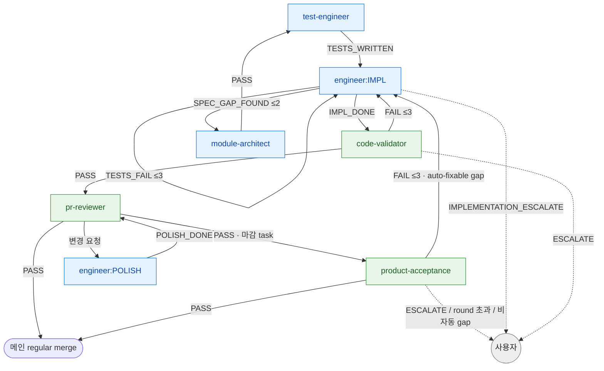
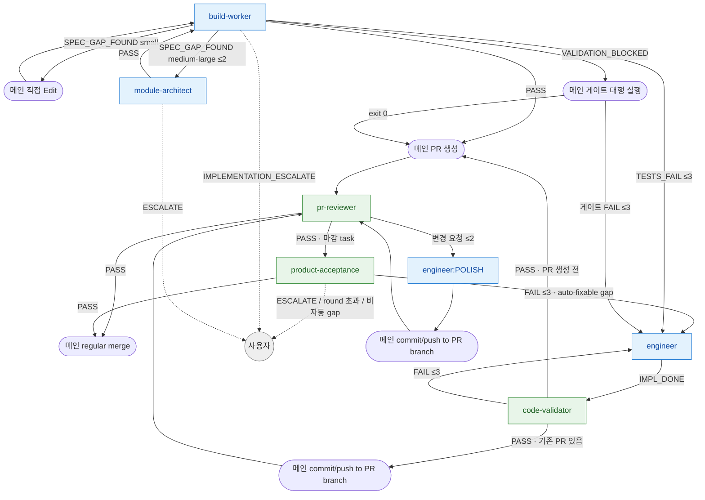

# impl-loop 라우팅 SSOT

> **Status**: ACTIVE
> **Scope**: `/impl-loop` skill **단일 전용** 라우팅 진본 — 이 skill 안 agent (test-engineer / engineer / code-validator / pr-reviewer / build-worker / module-architect / designer / product-acceptance) 의 결론 → 다음 호출 + retry 한도 + escalate 처리. 진행 절차(Step) 는 [`SKILL.md`](SKILL.md).
> **Cross-ref**: catastrophic 보존 = [`hooks.md`](../../docs/plugin/hooks.md#catastrophic-gatesh) · 권한 경계 = [`agent_boundary.py`](../../harness/agent_boundary.py).

## 읽는 법

agent 는 일을 마치면 prose 마지막 단락에 *어떤 결과로 끝났는지 + 사유* 를 자기 언어로 적는다. 메인 Claude 가 그 prose 를 읽고 아래 매핑으로 다음 호출을 정한다. 이 문서는 형식 강제가 아니라 *판단 보조* — 의미만 맞으면 된다. prose 가 모호하면 사용자에게 위임한다.

라우팅은 **skill 이 소유**한다. agent 는 결론(enum)만 내고, "그 결론이면 다음 누구" 는 본 문서가 정한다. 같은 agent 가 다른 skill 에 나와도 그건 *그 skill 의 라우팅* 이지 본 문서 영역이 아니다.

**개수 vs 엔진** — 개수(single/chain)는 절차 골격(1 run vs N run), 엔진(풀 4-agent / build-worker)은 각 run 안의 시퀀스를 정한다 ([진입 분기](SKILL.md#진입-분기-개수-엔진-직교)). 본 라우팅은 *엔진별* 시퀀스 안의 결론→다음을 다룬다. chain 의 task 경계 라우팅(`clean`/`error`/`blocked`)은 [chain 모드 task 경계 라우팅](#chain-모드-task-경계-라우팅).

**고위험 task 승격** — build-worker 는 비용 절감 엔진이지 보안 경계가 아니다. 고위험 trigger([`workflow-router.md`](../../docs/plugin/workflow-router.md) high-risk trigger 표 — auth·PII / migration·destructive / public API breakage / cross-module·cross-story interface / 외부 dependency — 에 impl-loop 런타임 고위험인 외부 HTTP·네트워크 어댑터 / URL·파일·사용자 입력 파싱 / 도메인 invariant 변경을 더한 집합) task 는 chain 안에서도 해당 task만 풀 4-agent 경로로 라우팅한다. 일반 UI/문구/순수 내부 도메인 task 는 build-worker 경량 경로를 유지한다. **이 판정의 진본 = impl 문서 frontmatter 의 `risk`/`engine` (#703)**: `risk: high` → 풀 4-agent 승격, `engine: 4agent` → 풀 4-agent · `engine: 2agent` → build-worker. 설계자(module-architect)가 task 를 자르는 시점에 박은 값이라 진입마다 재추론하지 않는다. 단 **유효한 단일 값일 때만** 신뢰한다 — 템플릿 placeholder(`risk: normal|high|low` 처럼 `|` 포함)·빈 값은 부재로 간주해 추론으로 떨어진다([`SKILL.md`](SKILL.md) placeholder 가드). frontmatter 에 risk 필드가 **없거나 placeholder 일 때만** 메인이 위 고위험 trigger 기준으로 추론한다(하위호환). 어느 경로든 결과를 task1 진입 전 dry preview 표의 `risk / engine / reason` 열에 남기고, `risk: high` slug 를 `wave-plan --high-risk` 입력으로 도출한다([병렬 wave](SKILL.md#병렬-wave-opt-in-chain-한정)). 고위험 trigger 는 build-worker 선호보다 우선하며, 사용자가 고위험 사유를 인지하고도 경량 강행을 명시한 경우에만 그 결정을 `reason` 에 기록한다.

**verify-only 예외** — task 산출물이 코드 변경이 아니라 검증 결과이고 검증 exit 0 + 변경 0 이면 PR 생성이 정상적으로 생략된다. 이때 `code-validator:VERIFY_ONLY` prose `PASS` 기록을 clean 증거로 삼고 `pr-create.sh` 를 호출하지 않는다. 검증 실패나 BROKEN 확인 시 일반 impl 수정 경로로 전환한다.

## 라우팅 그래프

### 엔진 A — 풀 4-agent (default = single)

> advanced fallback (deep task 보강 필요) → MA 선두 1 step 추가. 이것은 Lite direct 구현이 아니라 deep task 보강 경로다. UI 감지 → designer + 사용자 PICK 선두 (designer `PASS` → 사용자 PICK → test-engineer).

### 엔진 B — build-worker (default = chain)

> 파랑 = 생산 agent · 초록 = 검증 agent · 회색 = 사용자 위임. 점선 = escalate. 엣지의 `≤N` = retry 한도 ([retry 한도](#retry-한도)).
> build-worker 는 git/PR/pr-reviewer 직접 호출 금지 — 권한 = engineer + test-engineer 합집합, git/PR 은 메인 위임 ([`agent_boundary.py`](../../harness/agent_boundary.py)). deep task 보강 필요 시 module-architect 선두 (3-step).
> **TESTS_FAIL 폴백 = 검증 복원 (MUST)**: build-worker 가 self-validate 미통과(TESTS_FAIL)면 engineer 가 마저 구현하되, build-worker phase 3 self-validate 가 건너뛴 검증을 **code-validator 가 대신 수행**한다. engineer `IMPL_DONE` → code-validator `PASS` 후에만 메인 git/PR. 검증 없이 degraded 산출이 PR 되는 경로 차단 (원본 `commands/impl-loop.md` "engineer 단발 4-agent 진입" 정합).
> **VALIDATION_BLOCKED 폴백 = 메인 게이트 대행 (MUST)**: build-worker 가 환경 제약(도구 차단·의존성 부재 등)으로 검증 명령을 실행하지 못했다고 보고하면, 메인이 worker 가 남긴 검증 명령을 같은 cwd(worktree)에서 직접 실행해 종료코드로 판정을 복원한다. exit 0 → `PASS` 와 동일 진행(메인 git/PR → pr-reviewer) · 게이트 FAIL → engineer 재시도(TESTS_FAIL 경로 합류, ≤3) · 메인에서도 실행 불가 → 사용자 위임. 검증 미실행 상태로 git/PR 진행 금지 — 정적 분석만으로 PASS 를 흡수하는 false-clean 차단. chain 에서 대행 exit 0 으로 진행할 때는 다음 task 인계용 한 줄 요약(`prev-tasks-append`)도 메인이 대신 남긴다 (worker 는 PASS 일 때만 남기므로 누락되면 다음 task 의 `[PREVIOUS_TASKS]` 가 빈다).

## 결론 → 다음 호출 매핑

| agent | 결론 → 다음 호출 |
|---|---|
| **test-engineer** | `TESTS_WRITTEN`(=PASS) → engineer(attempt 0) · `SPEC_GAP_FOUND` → module-architect(보강) |
| **engineer** | `IMPL_DONE` → code-validator · `IMPL_PARTIAL` → engineer(분할 — retry 아님, 상한 없음 [retry 한도](#retry-한도)) · `SPEC_GAP_FOUND` → module-architect(보강, ≤2) · `TESTS_FAIL` → engineer 재시도(≤3) · `POLISH_DONE` → pr-reviewer · `IMPLEMENTATION_ESCALATE` → 사용자 |
| **code-validator** | `PASS` → pr-reviewer · `FAIL` → engineer 재시도(≤3) · `ESCALATE` → module-architect(보강) 또는 사용자. impl/bugfix/compact plan 경로로 scope 자동 분기 |
| **pr-reviewer** | `PASS`(LGTM) → (CI PASS 후) 메인 즉시 regular merge — **단 story/epic 마감 task 는 merge 전 product-acceptance 선행** ([마감 acceptance 라우팅](#마감-acceptance-라우팅)) · 변경 요청 → engineer POLISH → **메인 commit/push to PR branch** (엔진 B 는 PR 이 이미 생성됨 — POLISH 변경 반영 필수) → pr-reviewer 재리뷰(≤2) |
| **build-worker** | `PASS` → 메인 git/PR → pr-reviewer · `SPEC_GAP_FOUND` → 분량 메타 분기(아래) · `TESTS_FAIL` → engineer(마저 구현) → **`IMPL_DONE` → code-validator → `PASS` 후 메인 git/PR** (self-validate 미통과분을 code-validator 가 복원 — 검증 없이 PR 금지) 또는 attempt 한도 초과 시 사용자 · `VALIDATION_BLOCKED` → **메인이 worker 가 남긴 검증 명령을 직접 실행(게이트 대행)** — exit 0 → 메인 git/PR → pr-reviewer · 게이트 FAIL → engineer 재시도(TESTS_FAIL 경로 합류, ≤3) · 메인도 실행 불가 → 사용자 · `IMPLEMENTATION_ESCALATE` → 사용자 |
| **module-architect** | `PASS` → (impl 파일 생성·보강 후) build-worker 또는 test-engineer · `ESCALATE` → 사용자 |
| **designer** | `PASS` → 사용자 PICK → test-engineer · `ESCALATE` → 사용자. 환경 = `docs/design.md` frontmatter `medium`. 재호출 한도 X |
| **product-acceptance** | 마감 task 한정 (pr-reviewer PASS 후 · pr-finalize 전, [마감 acceptance 라우팅](#마감-acceptance-라우팅)). `PASS` → 메인 pr-finalize 머지 (epic 마감은 STORY → EPIC 2회 모두 PASS 후) · `FAIL` (auto-fixable gap) → engineer:IMPL 재진입(gap 수정 — POLISH 아님, run 의 `--design-doc` prerequisite 사용) → code-validator → 메인 commit/push to PR branch → pr-reviewer 재리뷰 → product-acceptance 재검수 (round ≤3) · `FAIL` (설계 결함·범위 재정의·보안/권한/데이터 gap) 또는 round 초과 → 정지 + 사용자 위임 · `ESCALATE` → 정지 + 사용자 위임 |

**build-worker `SPEC_GAP_FOUND` 분량 메타 분기** (외부 사용자 [F4 실측](https://github.com/alruminum/dcNess/issues/506)):
- **small** (1 enum 값 / 1 필드 / 1 메서드 시그니처) → 메인이 직접 Edit (`docs/impl/NN-*.md` / `docs/domain-model.md`) + build-worker 재호출. **cycle 카운트 불포함** (경량 예외).
- **medium / large** (multiple field / 새 module / 도메인 모델 변경) → module-architect (보강) → build-worker 재호출 (cycle ≤2).

## retry 한도

| 재시도 경로 | 한도 | 초과 시 |
|---|---|---|
| engineer attempt (TESTS_FAIL → 재시도) | 3 | `IMPLEMENTATION_ESCALATE` |
| engineer SPEC_GAP_FOUND → module-architect 보강 → engineer 재진입 | 2 | `IMPLEMENTATION_ESCALATE` |
| code-validator FAIL → engineer 재진입 | engineer attempt 흡수 | engineer attempt 한도(3) 도달 시 escalate |
| pr-reviewer 변경 요청 → engineer POLISH 라운드 | 2 | 사용자 escalate |
| build-worker `SPEC_GAP_FOUND`(medium/large) → module-architect 보강 → build-worker 재진입 | 2 | 사용자 위임 |
| build-worker `VALIDATION_BLOCKED` → 메인 대행 게이트 FAIL → engineer 재진입 | engineer attempt 흡수 | engineer attempt 한도(3) 도달 시 사용자 위임 |
| build-worker phase 2 (TESTS_FAIL → src retry, worker 내부) | 3 (worker 내부) | `TESTS_FAIL` emit → 메인이 engineer 재호출 또는 사용자 위임 |
| chain task 자동 재시도 (`--retry-limit`) | 3 (default, 0 = 첫 실패 즉시 정지) | 정지 + 사용자 위임 |
| product-acceptance `FAIL` → gap 수정 → 재검수 round (story/epic 경계당 독립 카운트) | 3 | 정지 + 사용자 위임 |

> **분할(IMPL_PARTIAL)은 retry 아님** — engineer 가 단일 호출에 다 못 끝내 남은 작업을 명시하고 재호출되는 것. attempt 카운터 미소비, 상한 없음 (자율 판단). 실패 재시도(retry, 한도 있음)와 구분.
> cycle 발생 시 **working tree only — commit X.** PASS 후에만 commit.
> `.attempts.json` = fail_type → 카운터 매핑. force-retry 시 리셋.

> **finding 수용 자세** (점 패치 X, 근본 재설계) — code-validator / pr-reviewer finding 이 같은 task 의 같은 파일·주제·위험 클래스에서 2회+ 반복되면 단순 POLISH 재진입을 멈추고 "클래스형 결함 의심 — 점 수정 금지"를 명시한다. 코드 내 root cause 가 보이면 근본 재설계 후 1회 재검증하고, 스펙·설계 차원이면 `SPEC_GAP_FOUND` 로 module-architect 보강한다. root cause 를 특정할 수 없거나 retry 한도에 닿으면 사용자 escalate 다. 진본 = [`loop-procedure.md` finding 수용 원칙](../../docs/plugin/loop-procedure.md#finding-수용-원칙-점-패치-금지-근본-수정).

## 마감 acceptance 라우팅

story/epic 마감 task (PR 트레일러 `Closes #story` / `Closes #epic` 대상) 의 pr-reviewer `PASS` 후 · pr-finalize(머지) *전* 에 product-acceptance 검수를 끼운다 (절차·경계 판정·시점 전제조건 = [`SKILL.md` 마감 acceptance](SKILL.md#마감-acceptance) — 병렬 peer 는 같은 story sibling 완료 확인 후, 통합 브랜치 모드는 sub-PR 이 아니라 마지막 main 머지 PR 전). 기본 ON, `--no-acceptance` 명시 run 만 비대상. epic 마감 task 는 `STORY_ACCEPTANCE` → `EPIC_ACCEPTANCE` 직렬 2회 — 앞이 PASS 못 닫으면 뒤로 진행하지 않는다.

standalone `/acceptance` 의 라우팅([`acceptance-routing.md`](../acceptance/acceptance-routing.md) — 자동 수정 X, 보고만)과 **별개** — 같은 agent 지만 inline 검수의 결론→다음은 본 문서가 소유한다 (위 "라우팅은 skill 이 소유" 원칙). inline 검수에서 gap 수정 루프가 도는 이유: 마감 PR 이 아직 열려 있어 gap 수정이 같은 PR 의 commit 으로 수렴 가능한 시점이기 때문이다.

**`FAIL` → gap 분류 분기** (gap taxonomy = [`acceptance-routing.md`](../acceptance/acceptance-routing.md) 기준):

| gap 종류 | 라우팅 |
|---|---|
| PRD / AC 미충족 · 검수 증거 부족 · 스모크 실패 (auto-fixable) | engineer:IMPL 재진입(gap 수정 — POLISH 아님: POLISH 는 pr-reviewer finding 전용·로직 변경 금지 모드, [`engineer-agent.md`](../../agents/engineer/engineer-agent.md) 정합). build-worker 엔진도 run 시작 시 `--design-doc <task impl 문서>` 를 기록하므로 engineer gate 를 통과한다. → `IMPL_DONE` → code-validator `PASS` → lint/build/test green → 메인 commit/push to PR branch → pr-reviewer 재리뷰 → product-acceptance 재검수 (round ≤3) |
| 설계 결함 / 범위 재정의 필요 | 정지 + 사용자 위임 (`/design`·`compact-design` 회수 후보 제시) |
| 성능 병목 / 리팩토링 필요 | 정지 + 사용자 위임 (마감 PR 범위 초과 가능성 — follow-up `/to-issue` 후보 제시. 사용자가 본 PR 범위 내 수정을 지시한 경우에만 auto-fixable 루프 재사용) |
| 보안 / 권한 / 데이터 리스크 | 정지 + 사용자 위임 |
| UX 미완성 | 정지 + 사용자 위임 (`/ux` 후보 제시) |

- gap 수정도 [finding 수용 자세](#retry-한도) 를 따른다 — 같은 클래스 gap 이 반복되면 점 패치 대신 root cause 를 의심한다.
- **gap 수정 commit 후 재검수는 마감 시퀀스 처음부터** — epic 마감에서 STORY PASS → EPIC FAIL 로 수정 commit 이 생겼으면, 그 commit 이 마지막 story 의 동작을 바꿀 수 있으므로 이전 STORY PASS 는 stale 다. `STORY_ACCEPTANCE` 부터 다시 돌린다. clean 게이트가 인정하는 STORY/EPIC PASS 흔적은 *마지막 acceptance gap 수정 commit 이후* 의 PASS 만이다.
- round 카운트는 story 경계와 epic 경계가 독립이다 (STORY round ≤3, EPIC round ≤3). round = "FAIL → gap 수정 → 재검수" 사이클 기준 — epic fix 에 따른 확인용 STORY 재검수(수정 없음)는 STORY round 를 소비하지 않는다.
- round 초과 → 정지 + 사용자 위임: 남은 gap 목록 + follow-up 분리 후보 + 머지/보류 판단 지점을 보고한다. 사용자 결정(머지 강행 / gap 수정 계속 / follow-up 분리) 전 pr-finalize 금지.
- `ESCALATE` (기준 문서·구현 증거 부족) → 정지 + 사용자 위임 (하드스톱).
- chain 에서 acceptance 정지는 해당 task 의 `blocked` 와 동일하게 다음 task 진입을 막는다 — 검수 안 된 story 위에 다음 story 를 쌓지 않는다.

## escalate 처리

escalate 계열 결론 수신 시 **메인이 즉시 사용자 보고 후 대기** (자동 복구 / 우회 / 재시도 금지 — [`../../CLAUDE.md`](../../CLAUDE.md) 강제 영역). **단 아래 code-validator `ESCALATE`(사유: spec 부재) 만 예외** — 그 외 모든 escalate 는 하드스톱.

- **`IMPLEMENTATION_ESCALATE`** (engineer / build-worker attempt 한도 초과) → 사용자 위임 (하드스톱).
- **`ESCALATE`** (module-architect / designer) → 사용자 위임 (하드스톱).
- **code-validator `ESCALATE` = 하드스톱 예외, 사유별 분기** ([`loop-procedure.md`](../../docs/plugin/loop-procedure.md#enum-분기) 정합): *사유 = spec 부재* → module-architect(보강 케이스) 자동 호출 (spec 갭 메움이지 trust boundary 우회 아님) · *사유 = 재시도 한도 초과 등 그 외* → 사용자 위임 (하드스톱). prose 에 사유가 모호하면 사용자 위임이 기본.
- **`blocked`** (chain task — false-clean 의심 / 권한 위반 / phase prose 부재) → 즉시 정지 + 사용자 위임 ([chain 모드 task 경계 라우팅](#chain-모드-task-경계-라우팅)).
- **product-acceptance `ESCALATE` / `FAIL`(round 초과·비자동 gap)** → 정지 + 사용자 위임 (하드스톱 — [마감 acceptance 라우팅](#마감-acceptance-라우팅)).

## chain 모드 task 경계 라우팅

chain (N task) 에서 *각 task run* 의 종료 결론에 따른 다음 task 진입 ([chain 모드](SKILL.md#chain-모드-n-task-오케스트레이션)):

| task 결론 | 다음 |
|---|---|
| `clean` | `dcness-helper next-task --entry-point impl` → 다음 task 진입 |
| `error` | 자동 재시도 (한도 `--retry-limit`, default 3). 한도 초과 시 정지 + 사용자 위임 |
| `blocked` | 즉시 정지 + 사용자 위임 (재호출 또는 수동 처리) |

- `clean` 판정 게이트 = code-validator(또는 build-worker self-validate) PASS + pr-reviewer 실행 + 메인 PR 생성·머지 완료 흔적 (셋 중 하나 부재 → false-clean → `blocked` 강등, #431). build-worker `VALIDATION_BLOCKED` 는 메인 게이트 대행 exit 0 증거가 있을 때만 self-validate PASS 와 동치 — 대행 증거 없는 `VALIDATION_BLOCKED` 진행은 false-clean 으로 `blocked` 강등.
- **story/epic 마감 task 의 `clean` 판정 게이트에는 product-acceptance PASS 흔적이 추가된다** (epic 마감은 STORY + EPIC 둘 다, `--no-acceptance` 명시 run 제외) — 흔적 부재, 또는 PASS 가 마지막 acceptance gap 수정 commit *이전* 의 stale 흔적이면 false-clean 으로 `blocked` 강등 ([마감 acceptance 라우팅](#마감-acceptance-라우팅)).
- verify-only task 의 `clean` 판정 게이트 = `code-validator:VERIFY_ONLY` prose PASS + 검증 명령 exit 0 증거 + `git status --porcelain` 변경 0. 이 경우 pr-reviewer/PR 생성·머지 흔적은 요구하지 않는다.
- 전체 완료 → 보고 (처리 N/N + 각 PR URL). 마지막 task = `next-task` 대신 `end-run` 단독.

## 후속 (loop 종료 후)

- single clean → review.md 원본 echo (rigor) + 자율 insight 1줄 (선택).
- chain clean → 5줄 요약 echo (task 별) + 전체 완료 보고. 자율 작업 진입 전 `post-task-begin` marker (#472).
- error / blocked + 한도 초과 → 사용자 위임.
- spec gap + cycle 한도 초과 → 사용자 위임 (module-architect 보강 또는 `/design` 재진입 권고).
