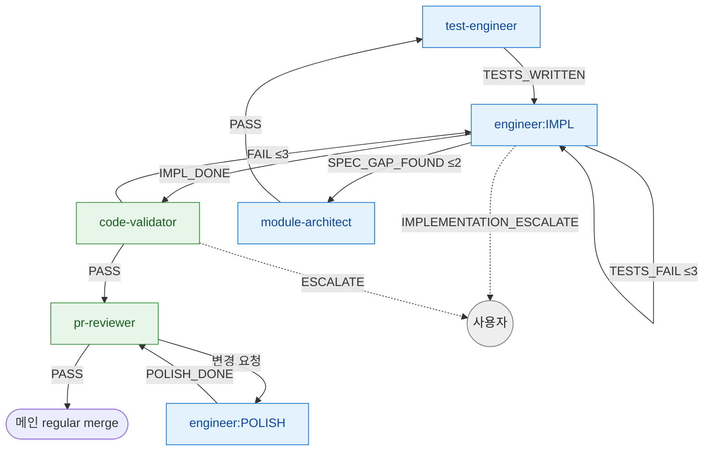
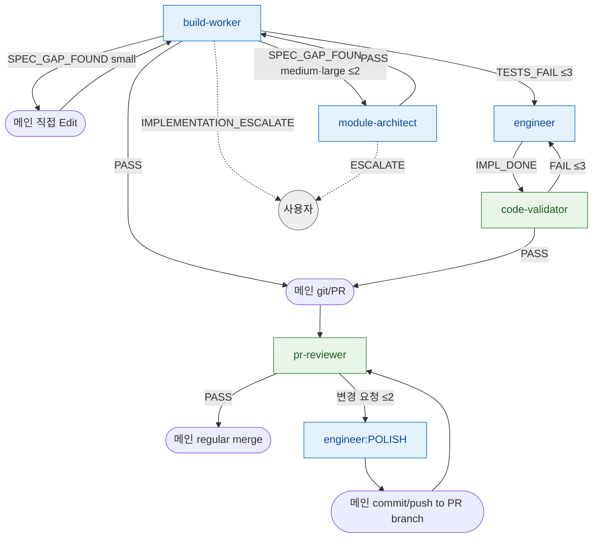

# impl-loop 라우팅 SSOT

> **Status**: ACTIVE
> **Scope**: `/impl-loop` skill **단일 전용** 라우팅 진본 — 이 skill 안 agent (test-engineer / engineer / code-validator / pr-reviewer / build-worker / module-architect / designer) 의 결론 → 다음 호출 + retry 한도 + escalate 처리. 진행 절차(Step) 는 [`SKILL.md`](SKILL.md).
> **Cross-ref**: catastrophic 보존 = [`hooks.md`](../../docs/plugin/hooks.md#catastrophic-gatesh) · 권한 경계 = [`agent_boundary.py`](../../harness/agent_boundary.py).

## 읽는 법

agent 는 일을 마치면 prose 마지막 단락에 *어떤 결과로 끝났는지 + 사유* 를 자기 언어로 적는다. 메인 Claude 가 그 prose 를 읽고 아래 매핑으로 다음 호출을 정한다. 이 문서는 형식 강제가 아니라 *판단 보조* — 의미만 맞으면 된다. prose 가 모호하면 사용자에게 위임한다.

라우팅은 **skill 이 소유**한다. agent 는 결론(enum)만 내고, "그 결론이면 다음 누구" 는 본 문서가 정한다. 같은 agent 가 다른 skill 에 나와도 그건 *그 skill 의 라우팅* 이지 본 문서 영역이 아니다.

**개수 vs 엔진** — 개수(single/chain)는 절차 골격(1 run vs N run), 엔진(풀 4-agent / build-worker)은 각 run 안의 시퀀스를 정한다 ([진입 분기](SKILL.md#진입-분기-개수-엔진-직교)). 본 라우팅은 *엔진별* 시퀀스 안의 결론→다음을 다룬다. chain 의 task 경계 라우팅(`clean`/`error`/`blocked`)은 [chain 모드 task 경계 라우팅](#chain-모드-task-경계-라우팅).

## 라우팅 그래프

### 엔진 A — 풀 4-agent (default = single)

> fallback (impl 파일 부재) → MA 선두 1 step 추가. UI 감지 → designer + 사용자 PICK 선두 (designer `PASS` → 사용자 PICK → test-engineer).

### 엔진 B — build-worker (default = chain)

> 파랑 = 생산 agent · 초록 = 검증 agent · 회색 = 사용자 위임. 점선 = escalate. 엣지의 `≤N` = retry 한도 ([retry 한도](#retry-한도)).
> build-worker 는 git/PR/pr-reviewer 직접 호출 금지 — 권한 = engineer + test-engineer 합집합, git/PR 은 메인 위임 ([`agent_boundary.py`](../../harness/agent_boundary.py)). impl 파일 부재 시 module-architect 선두 (3-step).
> **TESTS_FAIL 폴백 = 검증 복원 (MUST)**: build-worker 가 self-validate 미통과(TESTS_FAIL)면 engineer 가 마저 구현하되, build-worker phase 3 self-validate 가 건너뛴 검증을 **code-validator 가 대신 수행**한다. engineer `IMPL_DONE` → code-validator `PASS` 후에만 메인 git/PR. 검증 없이 degraded 산출이 PR 되는 경로 차단 (원본 `commands/impl-loop.md` "engineer 단발 4-agent 진입" 정합).

## 결론 → 다음 호출 매핑

| agent | 결론 → 다음 호출 |
|---|---|
| **test-engineer** | `TESTS_WRITTEN`(=PASS) → engineer(attempt 0) · `SPEC_GAP_FOUND` → module-architect(보강) |
| **engineer** | `IMPL_DONE` → code-validator · `IMPL_PARTIAL` → engineer(분할 — retry 아님, 상한 없음 [retry 한도](#retry-한도)) · `SPEC_GAP_FOUND` → module-architect(보강, ≤2) · `TESTS_FAIL` → engineer 재시도(≤3) · `POLISH_DONE` → pr-reviewer · `IMPLEMENTATION_ESCALATE` → 사용자 |
| **code-validator** | `PASS` → pr-reviewer · `FAIL` → engineer 재시도(≤3) · `ESCALATE` → module-architect(보강) 또는 사용자. impl 경로로 full/bugfix scope 자동 분기 |
| **pr-reviewer** | `PASS`(LGTM) → (CI PASS 후) 메인 즉시 regular merge · 변경 요청 → engineer POLISH → **메인 commit/push to PR branch** (엔진 B 는 PR 이 이미 생성됨 — POLISH 변경 반영 필수) → pr-reviewer 재리뷰(≤2) |
| **build-worker** | `PASS` → 메인 git/PR → pr-reviewer · `SPEC_GAP_FOUND` → 분량 메타 분기(아래) · `TESTS_FAIL` → engineer(마저 구현) → **`IMPL_DONE` → code-validator → `PASS` 후 메인 git/PR** (self-validate 미통과분을 code-validator 가 복원 — 검증 없이 PR 금지) 또는 attempt 한도 초과 시 사용자 · `IMPLEMENTATION_ESCALATE` → 사용자 |
| **module-architect** | `PASS` → (impl 파일 생성·보강 후) build-worker 또는 test-engineer · `ESCALATE` → 사용자 |
| **designer** | `PASS` → 사용자 PICK → test-engineer · `ESCALATE` → 사용자. 환경 = `docs/design.md` frontmatter `medium`. 재호출 한도 X |

**build-worker `SPEC_GAP_FOUND` 분량 메타 분기** (외부 사용자 [F4 실측](https://github.com/alruminum/dcNess/issues/506)):
- **small** (1 enum 값 / 1 필드 / 1 메서드 시그니처) → 메인이 직접 Edit (`docs/impl/NN-*.md` / `docs/domain-model.md`) + build-worker 재호출. **cycle 카운트 불포함** (경량 예외).
- **medium / large** (multiple field / 새 module / 도메인 모델 변경) → module-architect (보강) → build-worker 재호출 (cycle ≤2).

## retry 한도

| 재시도 경로 | 한도 | 초과 시 |
|---|---|---|
| engineer attempt (TESTS_FAIL → 재시도) | 3 | `IMPLEMENTATION_ESCALATE` |
| engineer SPEC_GAP_FOUND → module-architect 보강 → engineer 재진입 | 2 | `IMPLEMENTATION_ESCALATE` |
| code-validator FAIL → engineer 재진입 | engineer attempt 흡수 | engineer attempt 한도(3) 도달 시 escalate |
| pr-reviewer 변경 요청 → engineer POLISH 라운드 | 2 | 사용자 escalate |
| build-worker `SPEC_GAP_FOUND`(medium/large) → module-architect 보강 → build-worker 재진입 | 2 | 사용자 위임 |
| build-worker phase 2 (TESTS_FAIL → src retry, worker 내부) | 3 (worker 내부) | `TESTS_FAIL` emit → 메인이 engineer 재호출 또는 사용자 위임 |
| chain task 자동 재시도 (`--retry-limit`) | 3 (default, 0 = 첫 실패 즉시 정지) | 정지 + 사용자 위임 |

> **분할(IMPL_PARTIAL)은 retry 아님** — engineer 가 단일 호출에 다 못 끝내 남은 작업을 명시하고 재호출되는 것. attempt 카운터 미소비, 상한 없음 (자율 판단). 실패 재시도(retry, 한도 있음)와 구분.
> cycle 발생 시 **working tree only — commit X.** PASS 후에만 commit.
> `.attempts.json` = fail_type → 카운터 매핑. force-retry 시 리셋.

## escalate 처리

escalate 계열 결론 수신 시 **메인이 즉시 사용자 보고 후 대기** (자동 복구 / 우회 / 재시도 금지 — [`../../CLAUDE.md`](../../CLAUDE.md) 강제 영역). **단 아래 code-validator `ESCALATE`(사유: spec 부재) 만 예외** — 그 외 모든 escalate 는 하드스톱.

- **`IMPLEMENTATION_ESCALATE`** (engineer / build-worker attempt 한도 초과) → 사용자 위임 (하드스톱).
- **`ESCALATE`** (module-architect / designer) → 사용자 위임 (하드스톱).
- **code-validator `ESCALATE` = 하드스톱 예외, 사유별 분기** ([`loop-procedure.md`](../../docs/plugin/loop-procedure.md#enum-분기) 정합): *사유 = spec 부재* → module-architect(보강 케이스) 자동 호출 (spec 갭 메움이지 trust boundary 우회 아님) · *사유 = 재시도 한도 초과 등 그 외* → 사용자 위임 (하드스톱). prose 에 사유가 모호하면 사용자 위임이 기본.
- **`blocked`** (chain task — false-clean 의심 / 권한 위반 / phase prose 부재) → 즉시 정지 + 사용자 위임 ([chain 모드 task 경계 라우팅](#chain-모드-task-경계-라우팅)).

## chain 모드 task 경계 라우팅

chain (N task) 에서 *각 task run* 의 종료 결론에 따른 다음 task 진입 ([chain 모드](SKILL.md#chain-모드-n-task-오케스트레이션)):

| task 결론 | 다음 |
|---|---|
| `clean` | `dcness-helper next-task --entry-point impl` → 다음 task 진입 |
| `error` | 자동 재시도 (한도 `--retry-limit`, default 3). 한도 초과 시 정지 + 사용자 위임 |
| `blocked` | 즉시 정지 + 사용자 위임 (재호출 또는 수동 처리) |

- `clean` 판정 게이트 = code-validator(또는 build-worker self-validate) PASS + pr-reviewer 실행 + 메인 PR 생성·머지 완료 흔적 (셋 중 하나 부재 → false-clean → `blocked` 강등, #431).
- 전체 완료 → 보고 (처리 N/N + 각 PR URL). 마지막 task = `next-task` 대신 `end-run` 단독.

## 후속 (loop 종료 후)

- single clean → review.md 원본 echo (rigor) + 자율 insight 1줄 (선택).
- chain clean → 5줄 요약 echo (task 별) + 전체 완료 보고. 자율 작업 진입 전 `post-task-begin` marker (#472).
- error / blocked + 한도 초과 → 사용자 위임.
- spec gap + cycle 한도 초과 → 사용자 위임 (module-architect 보강 또는 `/architect-loop` 재진입 권고).
