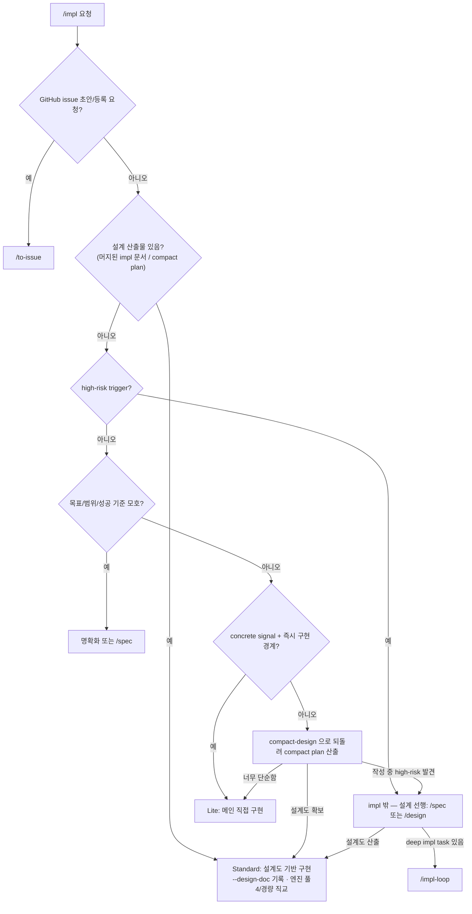

# impl 라우팅 SSOT

> **Status**: ACTIVE
> **Scope**: `/impl` skill 전용. 자유 구현 요청을 lane(설계도 유무 — Lite/Standard)과 엔진(풀4/경량 build-worker) 직교 2축으로 판정하고, 각 경로의 다음 호출과 retry/escalate 를 정한다. 진행 절차는 [`SKILL.md`](SKILL.md).

## 읽는 법

라우팅은 권고다. hard safety gate 는 branch/PR/test/review/CI 와 기존 catastrophic hook 이 보존한다. 사용자는 lane 을 외우지 않고 `/impl <작업>`만 말하면 된다. impl 은 설계를 하지 않는다 — 설계도를 보고 구현만 한다.

## Lane 판정 그래프

> 그래프 최상단 `DOC{설계 산출물 있음?}` 가 impl 의 **1차 분기**다 — 있으면 Standard, 없으면 그 아래(`HR`/`CS`)로 내려 Lite 직접 구현인지 설계 선행인지를 가른다. 설계 깊이(경량/full) 판단은 impl 이 직접 하지 않고 설계 레이어로 내려보낸다. high-risk 는 impl *내부 lane 이 아니라* impl 밖 설계 선행이다. 아래 `## 설계 산출물 유무` 절은 이 노드의 prose 진술이다.

## 설계 산출물 유무 — lane 판정 1차 기준 (되돌림)

lane 판정 *전*에 "이 작업을 닫을 설계 산출물이 이미 있는가" 를 먼저 본다([`SKILL.md`](SKILL.md) Step 0.5) — 위 그래프의 `DOC` 노드다. 이것이 impl 의 1차 분기이며, 설계 깊이(경량/full) 판단은 impl 이 직접 하지 않고 설계 레이어로 내려보낸다. 원리 SSOT = [`workflow-router.md` 되돌림 원리](../../docs/plugin/workflow-router.md#되돌림backpressure-원리).

- 설계 문서 있음 → **Standard**. `begin-run impl --design-doc <경로>` 로 기록하고 받은 설계도로 구현만 한다. 엔진(풀4/경량)은 직교로 별도 판정.
- 설계 문서 없음 + 경량 설계 필요 → 내부 [`compact-design`](../../skills/compact-design/SKILL.md) skill 로 **되돌려** compact plan 을 산출한 뒤, 그 경로를 들고 Standard 로 진입한다. impl 은 설계를 직접 만들지 않는다.
- 설계 문서 없음 + concrete signal 충분 + high-risk 0개 → **Lite** (메인 직접 구현).
- 설계 문서 없음 + full 설계 필요(high-risk) → impl *밖* — 설계 선행(`/design`·`/spec`) 후 설계도를 들고 Standard 재진입.

## Lane × 엔진 실행 매핑

lane(설계도 유무)과 엔진(풀4/경량)은 직교다. 이번 범위에서 엔진 선택은 Standard 에 적용한다 — Lite 는 메인 직접 구현이고, Lite 에 sub-agent 엔진을 붙이는 조합은 engineer 게이트(설계 산출물 prerequisite)·lane 인프라 선행이 필요해 follow-up 으로 분리한다.

| 경로 | 다음 |
|---|---|
| Lite | 메인 직접 `test -> impl -> test pass` 후 `pr-reviewer` local diff. `code-validator` 없음 |
| Standard · 풀 4-agent (디폴트) | `begin-run impl --design-doc <경로>` 기록 후 `test-engineer -> engineer:IMPL -> code-validator -> pr-reviewer` |
| Standard · 경량 build-worker | `begin-run impl --design-doc <경로>` 기록 후 `build-worker` 1 step (테스트·구현·자체검증) |

Standard 의 설계도는 (a) 이미 머지된 설계 문서이거나 (b) `compact-design` 이 방금 산출한 compact plan 이다. 두 경우 모두 메인이 `begin-run impl --design-doc <경로>` 로 같은 경로를 기록하며, Standard 는 same-run module-architect step 없이 받은 설계도로 구현만 한다 — `--design-doc` 이 engineer 게이트 prerequisite 의 단일 메커니즘이다.

high-risk 는 impl 밖 — deep impl task 있으면 `/impl-loop`, 없으면 `/spec` / `/tech-review` / `/design` 선행. 산출된 설계도를 들고 Standard 로 (재)진입한다.

## 결론 → 다음 호출

| 단계 | 결론 → 다음 |
|---|---|
| Lite `pr-reviewer` | `PASS` → commit/PR/CI · `FAIL` → 메인 root-cause 수정 + test 재통과 + pr-reviewer 재호출(≤3) |
| Standard `test-engineer` | `TESTS_WRITTEN` → engineer:IMPL · `SPEC_GAP_FOUND` → `compact-design` 으로 설계 되돌림 |
| Standard `engineer` | `IMPL_DONE` → code-validator · `TESTS_FAIL` → engineer 재시도(≤3) · `SPEC_GAP_FOUND` → `compact-design` 설계 되돌림(≤2) · `IMPLEMENTATION_ESCALATE` → 사용자 |
| Standard `code-validator` | `PASS` → pr-reviewer · `FAIL` → engineer 재진입(≤3) · `ESCALATE` → `compact-design` 설계 되돌림 또는 사용자 |
| Standard `pr-reviewer` | `PASS` → commit/PR/CI/merge · `FAIL` → engineer:POLISH + test 재통과 + pr-reviewer 재호출(≤3) |
| Standard `build-worker` (경량) | `PASS` → commit/PR/CI · `FAIL`/`BLOCKED` → 메인 root-cause 수정 또는 풀 4-agent 승격 |

## Retry 한도

| 경로 | 한도 | 초과 시 |
|---|---|---|
| Lite pr-reviewer FAIL → 메인 root-cause 수정 | 3 | 사용자에게 남은 finding 보고 |
| Standard engineer TESTS_FAIL | 3 | 사용자 |
| Standard code-validator FAIL → engineer | 3 | 사용자 |
| Standard SPEC_GAP_FOUND → compact-design 설계 되돌림 | 2 | impl 밖 설계 선행 또는 사용자 |
| Standard pr-reviewer FAIL → engineer:POLISH | 3 | 사용자 |

finding 수용 원칙은 `/impl-loop` 와 같다. 같은 영역 finding 이 반복되면 줄 단위 점 패치가 아니라 root cause 를 재검토한다.

## Escalate

다음 신호는 자동 우회하지 않는다.

- 새 외부 dependency/API/SDK/model 필요 → impl 밖 설계 선행(`/spec` 내부 `/tech-review` preflight / `/design`)
- auth/security/PII/compliance 영향
- migration/destructive/public API breakage
- cross-module/cross-story contract 변화
- 테스트 기준 또는 수용 기준이 끝까지 모호함
- review finding 이 3회 안에 수렴하지 않음

위 high-risk 신호는 impl 내부 lane 으로 흡수하지 않고 impl *밖* 설계 선행으로 보낸다.

## pr-reviewer provider

`pr-reviewer` 가 Claude 로 돌든 Codex 로 route 되든 `/impl` 의 단계 이름은 `pr-reviewer` 하나다. Codex companion 같은 별도 public review command 를 만들지 않는다.
