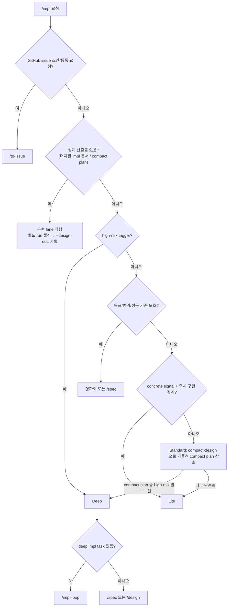

# impl 라우팅 SSOT

> **Status**: ACTIVE
> **Scope**: `/impl` skill 전용. 자유 구현 요청을 Lite / Standard / Deep lane 으로 나누고, 각 lane 의 다음 호출과 retry/escalate 를 정한다. 진행 절차는 [`SKILL.md`](SKILL.md).

## 읽는 법

라우팅은 권고다. hard safety gate 는 branch/PR/test/review/CI 와 기존 catastrophic hook 이 보존한다. 사용자는 lane 을 외우지 않고 `/impl <작업>`만 말하면 된다.

## Lane 판정 그래프

> 그래프 최상단 `DOC{설계 산출물 있음?}` 가 impl 의 **1차 분기**다 — 설계 깊이(경량/full) 판단은 그 아래(`HR`/`CS`)로 내려보낸다. 아래 `## 설계 산출물 유무` 절은 이 노드의 prose 진술이다.

## 설계 산출물 유무 — lane 판정 1차 기준 (되돌림)

lane 판정 *전*에 "이 작업을 닫을 설계 산출물이 이미 있는가" 를 먼저 본다([`SKILL.md`](SKILL.md) Step 0.5) — 위 그래프의 `DOC` 노드다. 이것이 impl 의 1차 분기이며, 설계 깊이(경량/full) 판단은 impl 이 직접 하지 않고 설계 레이어로 내려보낸다. 원리 SSOT = [`workflow-router.md` 되돌림 원리](../../docs/plugin/workflow-router.md#되돌림backpressure-원리).

- 설계 문서 있음 → 곧장 구현 lane. 별도 run 풀4 진입이면 `begin-run impl --design-doc <경로>` 기록.
- 설계 문서 없음 + 경량 설계 필요 → 내부 [`compact-design`](../../skills/compact-design/SKILL.md) skill 로 **되돌려** compact plan 산출 후 구현(= Standard lane 의 `module-architect:COMPACT_PLAN` 단계가 그 wrapper).
- 설계 문서 없음 + full 설계 필요(high-risk) → Deep.

## Lane 별 실행 매핑

| lane | 다음 |
|---|---|
| Lite | 메인 직접 `test -> impl -> test pass` 후 `pr-reviewer` local diff. `code-validator` 없음 |
| Standard | `module-architect:COMPACT_PLAN` (= [`compact-design`](../../skills/compact-design/SKILL.md) wrapper) `-> test-engineer -> engineer:IMPL -> code-validator -> pr-reviewer` |
| Deep | deep impl task 있으면 `/impl-loop`, 없으면 `/spec` / `/tech-review` / `/design` 선행 |

## 결론 → 다음 호출

| 단계 | 결론 → 다음 |
|---|---|
| Lite `pr-reviewer` | `PASS` → commit/PR/CI · `FAIL` → 메인 root-cause 수정 + test 재통과 + pr-reviewer 재호출(≤3) |
| Standard `module-architect:COMPACT_PLAN` | `PASS` → test-engineer · `NEW_DEP_ESCALATE` 또는 high-risk 발견 → Deep 승격 · `ESCALATE` → 사용자 |
| Standard `test-engineer` | `TESTS_WRITTEN` → engineer:IMPL · `SPEC_GAP_FOUND` → module-architect 보강 |
| Standard `engineer` | `IMPL_DONE` → code-validator · `TESTS_FAIL` → engineer 재시도(≤3) · `SPEC_GAP_FOUND` → module-architect 보강(≤2) · `IMPLEMENTATION_ESCALATE` → 사용자 |
| Standard `code-validator` | `PASS` → pr-reviewer · `FAIL` → engineer 재진입(≤3) · `ESCALATE` → module-architect 보강 또는 사용자 |
| Standard `pr-reviewer` | `PASS` → commit/PR/CI/merge · `FAIL` → engineer:POLISH + test 재통과 + pr-reviewer 재호출(≤3) |

## Retry 한도

| 경로 | 한도 | 초과 시 |
|---|---|---|
| Lite pr-reviewer FAIL → 메인 root-cause 수정 | 3 | 사용자에게 남은 finding 보고 |
| Standard engineer TESTS_FAIL | 3 | 사용자 |
| Standard code-validator FAIL → engineer | 3 | 사용자 |
| Standard SPEC_GAP_FOUND → module-architect 보강 | 2 | Deep 또는 사용자 |
| Standard pr-reviewer FAIL → engineer:POLISH | 3 | 사용자 |

finding 수용 원칙은 `/impl-loop` 와 같다. 같은 영역 finding 이 반복되면 줄 단위 점 패치가 아니라 root cause 를 재검토한다.

## Escalate

다음 신호는 자동 우회하지 않는다.

- 새 외부 dependency/API/SDK/model 필요
- auth/security/PII/compliance 영향
- migration/destructive/public API breakage
- cross-module/cross-story contract 변화
- 테스트 기준 또는 수용 기준이 끝까지 모호함
- review finding 이 3회 안에 수렴하지 않음

## pr-reviewer provider

`pr-reviewer` 가 Claude 로 돌든 Codex 로 route 되든 `/impl` 의 단계 이름은 `pr-reviewer` 하나다. Codex companion 같은 별도 public review command 를 만들지 않는다.
