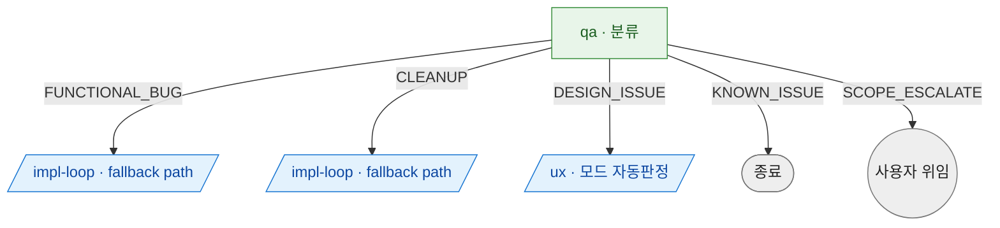

# issue-report 라우팅 SSOT

> **Status**: ACTIVE
> **Scope**: `/issue-report` skill **단일 전용** 라우팅 진본 — qa 에이전트의 분류 결론 (5 enum) → 메인이 추천할 다음 호출 + escalate. 진행 절차(Step) 는 [`SKILL.md`](SKILL.md). qa 는 issue-report 전용 agent 라 본 문서가 qa 라우팅의 유일 진본 (맥락 분기 없음).
> **Cross-ref**: catastrophic 보존 = [`hooks.md`](../../docs/plugin/hooks.md#catastrophic-gatesh) · 권한 경계 = [`agent_boundary.py`](../../harness/agent_boundary.py).

## 읽는 법

qa 는 이슈를 접수해 *원인 분석 + 분류* 를 prose 로 내고, 메인 Claude 가 그 결론을 읽어 다음 액션을 *추천* 한다. qa 는 직접 다음 agent 를 호출하지 않는다 (HARNESS_ONLY — qa 권한 밖). 후속 skill 자동 진입 X — **사용자 결정**. 이 문서는 형식 강제가 아니라 *판단 보조* — 의미만 맞으면 된다.

## 라우팅 그래프

> 초록 = 분류 agent · 파랑 = 추천 후속 skill · 회색 = 사용자/종료. 모든 후속은 **추천** — 자동 진입 X.

## 결론 → 다음 호출 추천 매핑

| qa 분류 | 다음 호출 추천 |
|---|---|
| **FUNCTIONAL_BUG** | `/impl-loop` fallback path (impl 부재 시 module-architect 선두 추가 — 버그픽스 케이스) |
| **CLEANUP** | `/impl-loop` fallback path (경량 수정) |
| **DESIGN_ISSUE** | `/ux` — 모드는 `/ux` 가 판정 (기존 화면 결함이면 **ux-refine-stage / UX_REFINE** — ux-architect 분석 → 사용자 승인 → designer → PICK, [`skills/ux/ux-routing.md`](../ux/ux-routing.md)). qa 는 designer 직접 호출 X (HARNESS_ONLY) — 반드시 `/ux` skill 경유 |
| **KNOWN_ISSUE** | 종료 (이미 알려진/추적 중 — 추가 작업 없음) |
| **SCOPE_ESCALATE** | 사용자 위임 (큰 변경 / 다중 모듈 — `/product-plan` 또는 `/architect-loop` 재진입 후보) |

> **HARNESS_ONLY 정합** — qa 는 engineer / module-architect / designer 를 *직접 호출하지 않는다*. 메인이 위 추천을 받아 `/impl-loop` (fallback) / `/ux` skill 로 진입한다. 옛 "engineer 직접 / module-architect 직접" 표현은 추천 대상 *skill 의 선두 agent* 를 가리킨 축약 — 실제 진입은 skill 경유. qa 결론 → 다음 호출 라우팅은 본 문서가 진본.

## escalate 처리

- **SCOPE_ESCALATE** (큰 변경 / 다중 모듈) → 사용자 위임. qa 가 단독 처리 범위를 넘는다고 판단한 경우.
- **권한/툴/정보 부족** → qa 가 *추측 분류 X*. 메인에게 명시 요청 후 진행 ([`agents/qa.md`](../../agents/qa.md) 권한 부족 룰).

## 후속 (skill 종료 후)

- FUNCTIONAL_BUG / CLEANUP → 사용자 confirm 후 `/impl-loop` fallback path (버그픽스 = module-architect 선두 추가)
- DESIGN_ISSUE → `/ux` (DESIGN_ISSUE 후속 진입)
- KNOWN_ISSUE → 종료 · SCOPE_ESCALATE → 사용자 위임
