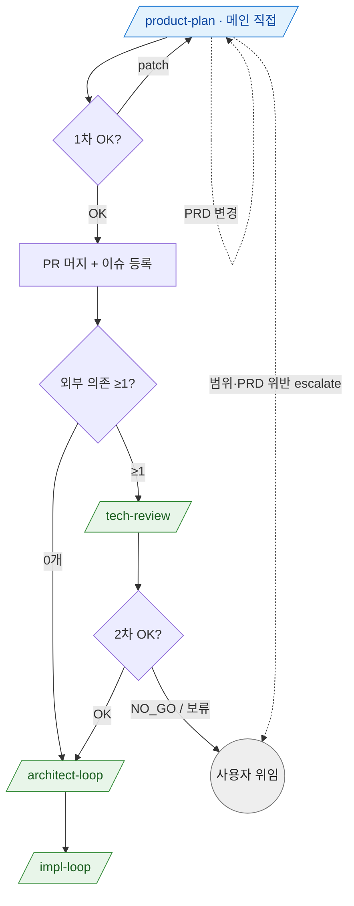

# product-plan 라우팅 SSOT

> **Status**: ACTIVE
> **Scope**: `/product-plan` skill **단일 전용** 라우팅 진본. 본 skill 은 **메인 Claude 직접 작업** (product-planner sub-agent 폐기) 이라 *agent 결론 → 다음 호출* 매핑이 없다. 대신 **skill 간 시퀀스** (PRD → `/tech-review` → `/architect-loop` → `/impl-loop`) + 체크포인트 분기 + 재진입 + escalate + 단방향 catastrophic + 비대상 추천이 라우팅의 전부다. 진행 절차(Step) 는 [`SKILL.md`](SKILL.md).
> **Cross-ref**: catastrophic 보존 = [`hooks.md`](../../docs/plugin/hooks.md) §3.2 · 강제 영역 = [`../../CLAUDE.md`](../../CLAUDE.md).

## 읽는 법

본 skill 은 메인이 사용자와 직접 그릴미 대화하며 산출물을 만든다. 각 Step 끝 *사용자 체크포인트* 의 응답(OK / patch / Y / n) 에 따라 다음 단계가 갈린다. 이 문서는 그 분기와 skill 간 이동을 정한다. 형식 강제가 아니라 *판단 보조* — 의미만 맞으면 된다. 모호하면 사용자에게 위임한다.

## 1. skill 시퀀스 그래프

> 파랑 = 본 skill (메인 직접) · 초록 = 후속 skill · 회색 = 사용자 위임. 점선 = 재진입 / escalate.
>
> `/tech-review` 는 본 skill *종료 후* 단계다. 외부 의존 0 개 PRD 면 skip 하고 바로 `/architect-loop`. **`/architect-loop` 진입 후 `/tech-review` 재호출은 금지** (단방향 catastrophic, §3).

## 2. 체크포인트 → 다음 단계 매핑

| 체크포인트 (SKILL.md Step) | 응답 → 다음 |
|---|---|
| **1차 OK** (Step 5) | `OK` → Step 6 (통합 브랜치 그릴) → Step 7 머지 · `patch` → 해당 섹션 Edit 후 Step 5 재진입 |
| **이슈 등록** (Step 8) | `Y` → `create_epic_story_issues.sh` 실행 → Step 9 · `n` → 이슈 등록 보류 (사용자 자율) |
| **`/tech-review` 권고** (Step 9) | 외부 의존 0 개 → skip + 바로 `/architect-loop` 권고 echo · `Y` → `/tech-review` 진입 · `/tech-review` 종료 + 2차 OK → `/architect-loop` 권고 echo |

표만으로 안 풀리는 맥락:

- **`/product-plan` 종료 시점** = PRD/stories.md/tech-review 스켈레톤 머지 + (선택) 이슈 등록 완료. 다음 명시 호출은 사용자 trigger (`/tech-review` 또는 `/architect-loop`) — 자동 진입 X.
- **외부 의존 0 개 분기** = tech-review.md 스켈레톤이 "외부 의존 없음 — `/tech-review` skip" 상태면 `/tech-review` 단계 전체 skip.

## 3. escalate · 재진입 · 단방향 catastrophic

escalate 계열 수신 시 **메인이 즉시 사용자 보고 후 대기** (자동 복구 / 우회 / 재시도 금지 — [`../../CLAUDE.md`](../../CLAUDE.md) 강제 영역).

- **기존 PRD 변경** → 본 skill 재진입. `Edit` 도구 *섹션 단위 patch* 의무 (Write 통째 X — 기존 PRD 의 모르는 부분 silent 변경 위험).
- **PRD 위반 / 범위 escalate** → 설계·구현 단계의 agent (system-architect / module-architect / ux-architect / engineer) 가 PRD 불일치·범위 모호를 발견하면 작업 중단 + `/product-plan` 재진입 권고로 본 skill 로 되돌아온다 (해당 agent 가 직접 PRD 수정 X).
- **`UX_REFINE_READY` 후속** — ux-architect 가 REFINE 분기로 끝나면 designer 호출 (그 라우팅은 [`../architect-loop/architect-loop-routing.md`](../architect-loop/architect-loop-routing.md) 영역 — 본 skill 은 PRD 단계라 여기서 끝).

### 단방향 catastrophic — `/architect-loop` 진입 후 `/tech-review` 재호출 금지

기술 NO_GO (사용 불가 / 비용 초과 / 라이선스 결격) 발견은 **`/tech-review` 단계에서 확정** 해야 한다. `/architect-loop` 진입 후엔 tech-reviewer 재호출이 catastrophic hook ([`hooks.md`](../../docs/plugin/hooks.md) §3.2 (§2.1.4)) 으로 차단된다. architect-loop 도중 미검증 외부 의존이 발견되면 그쪽 `NEW_DEP_ESCALATE` 3안으로 처리 ([`../architect-loop/architect-loop-routing.md`](../architect-loop/architect-loop-routing.md) §4) — 어느 옵션이든 tech-reviewer 재호출 없음.

## 4. 비대상 (다른 skill 추천)

- 버그 → `/issue-report` (qa 분류)
- 한 줄 수정 / 버그픽스 → `/issue-report` (분류 후 impl-task-loop fallback)
- 디자인만 → designer 직접 (Pencil 또는 `design-variants/*.html`)
- 이미 PRD/stories.md 머지 완료 → 설계는 `/architect-loop`, 구현은 `/impl-loop`

## 5. 후속 (skill 종료 후)

- PRD/stories/tech-review 스켈레톤 완성 + 머지 + 이슈 등록 → `/tech-review` (선행 기술 검증) → 사용자 2차 OK → `/architect-loop` (설계 루프) → `/impl-loop` (구현 루프)
- 외부 의존 0 개 PRD → `/tech-review` skip + 바로 `/architect-loop`
- 기존 PRD 변경 → 본 skill 재진입 (`Edit` 섹션 단위 patch 의무)
