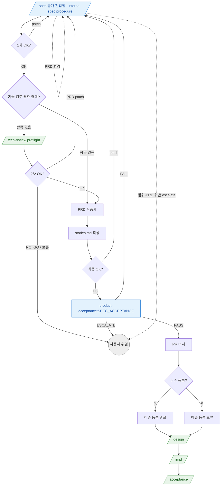

# spec 분기 규칙 SSOT

> **Status**: ACTIVE
> **Scope**: `/spec` 공개 진입점 절차 분기 규칙 진본. 본 skill 은 **메인 Claude 직접 작업** 이라 내부 구현 agent 매핑은 거의 없다. 단 `/spec` 이행 기준 검수로 `product-acceptance:SPEC_ACCEPTANCE` 를 호출한다. skill 간 시퀀스 (PRD 초안 → 사용자 초안 확인 → 기술 검토 필요 영역에 항목이 있으면 `/tech-review` preflight → PRD 최종화 → stories.md → SPEC_ACCEPTANCE → PR 머지 → 이슈 등록 여부 확인 → `/design` → `/impl` → `/acceptance`) + 체크포인트 분기 + 재진입 + escalate + 단방향 관례 + 비대상 추천이 분기 규칙의 전부다. 진행 절차(Step) 는 [`SKILL.md`](SKILL.md).
> **Cross-ref**: 순서 차단 훅 보존 = [`hooks.md`](../../docs/plugin/hooks.md#catastrophic-gatesh) · 강제 영역 = [`../../CLAUDE.md`](../../CLAUDE.md) · 용어 기준 = [`terms.md`](../../docs/plugin/terms.md).

## 읽는 법

본 skill 은 메인이 사용자와 직접 그릴미 대화하며 산출물을 만든다. PRD 초안 확인과 최종 확인은 별도 체크포인트다. 각 Step 끝 *사용자 체크포인트* 의 응답(OK / patch / Y / n) 에 따라 다음 단계가 갈린다. 이 문서는 그 분기와 skill 간 이동을 정한다. 형식 강제가 아니라 *판단 보조* — 의미만 맞으면 된다. 모호하면 사용자에게 위임한다.

## skill 시퀀스 그래프

> 파랑 = 본 skill (메인 직접) · 초록 = 후속 skill · 회색 = 사용자 위임. 점선 = 재진입 / escalate.
>
> `/tech-review` 는 PRD 최종화 / stories 작성 / PR 머지 / 이슈 등록 전에 실행되는 preflight 다. PRD 초안의 기술 검토 필요 영역에 검토 항목이 없으면 skip 하고 PRD 최종화로 간다. **`/design` 진입 후 `/tech-review` 재호출은 비권장** (단방향 관례 — 코드 강제 아님, [escalate · 재진입 · 단방향 관례](#escalate-재진입-단방향-관례)).

## 체크포인트 → 다음 단계 매핑

| 체크포인트 (SKILL.md Step) | 응답 → 다음 |
|---|---|
| **PRD 초안 확인** (Step 3) | `OK` → Step 4 기술 검토 필요 영역 확인 · `patch` → PRD 초안 patch 후 Step 3 재진입 |
| **tech-review preflight** (Step 4) | 기술 검토 필요 영역에 검토 항목 없음 → Step 5 PRD 최종화 · 검토 항목 있음 → `/tech-review` 진입 · `/tech-review` PASS + 사용자 2차 OK → Step 5 · FAIL / NO_GO / PRD patch → PRD patch 후 필요 시 재검토 · ESCALATE / 보류 → 사용자 위임 |
| **최종 OK** (Step 7) | `OK` → Step 8 `product-acceptance:SPEC_ACCEPTANCE` · `patch` → 해당 섹션 Edit 후 기술 검토 필요 영역 영향에 따라 Step 4 또는 Step 7 재진입 |
| **SPEC_ACCEPTANCE** (Step 8) | `PASS` → Step 9 (통합 브랜치 그릴) → Step 10 PR 머지 · `FAIL` → gap patch 후 Step 7 재진입 · `ESCALATE` → 사용자 위임 |
| **이슈 등록** (Step 11) | `Y` → `create_epic_story_issues.sh` 실행 → Step 12 · `n` → 이슈 등록 보류 marker 기록/머지 후 Step 12 |
| **`/design` 권고** (Step 12) | 사용자 `Y` → `/design` 진입 · `n` → 사용자가 나중에 직접 호출 |

표만으로 안 풀리는 맥락:

- **`/spec` 종료 시점** = PRD 최종본 + stories.md + 필요한 tech-review 산출물이 `SPEC_ACCEPTANCE` 를 통과한 뒤 머지하고, 이슈 등록 여부를 확인한 뒤 `/design` 을 권고한 시점. 이슈 등록은 선택이며 보류 시 stories.md 에 `미등록 (사유: …)` marker 를 남겨 `/design` pre-flight 와 정합시킨 뒤 Step 12 로 간다. 다음 명시 호출은 사용자 trigger (`/design`) — 자동 진입 X.
- **`SPEC_ACCEPTANCE` 의미** = 좋은 아이디어인지 평가하는 단계가 아니라, 이후 구현과 검수가 가능한 spec 인지 확인하는 단계다. full E2E 검증은 MVP `/spec` 이행 범위 밖이다.
- **tech-review skip 의미** = PRD 초안의 기술 검토 필요 영역이 "해당 없음" 이라서 preflight 를 생략하는 것이다. "뒤에 둬도 됨" 예외표는 없다.

## escalate · 재진입 · 단방향 관례

escalate 계열 수신 시 **메인이 즉시 사용자 보고 후 대기** (자동 복구 / 우회 / 재시도 금지 — [`../../CLAUDE.md`](../../CLAUDE.md) 강제 영역).

- **기존 PRD 변경** → 본 skill 재진입. `Edit` 도구 *섹션 단위 patch* 의무 (Write 통째 X — 기존 PRD 의 모르는 부분 silent 변경 위험).
- **PRD 위반 / 범위 escalate** → 설계·구현 단계의 agent (system-architect / module-architect / ux-architect / engineer) 가 PRD 불일치·범위 모호를 발견하면 작업 중단 + `/spec` 재진입 권고로 본 skill 로 되돌아온다 (해당 agent 가 직접 PRD 수정 X).
- **`UX_REFINE_READY` 후속** — ux-architect 가 REFINE 분기로 끝나면 designer 호출 (그 분기 규칙은 [`../design/design-routing.md`](../design/design-routing.md) 영역 — 본 skill 은 PRD 단계라 여기서 끝).

### 단방향 관례 — `/design` 진입 후 `/tech-review` 재호출 비권장

기술 NO_GO (사용 불가 / 비용 초과 / 라이선스 결격) 발견은 PRD 최종화 전에 **`/tech-review` preflight** 로 확정한다. `/design` 진입 후엔 전역 `/tech-review` 재진입이 관례상 비권장 — 코드 강제 아닌 자연어 관례 ([`hooks.md`](../../docs/plugin/hooks.md#catastrophic-gatesh) 의 tech-review 자연어 관례). `/design` 도중 미검증 외부 의존이 발견되면 그쪽 `NEW_DEP_ESCALATE` 4안으로 처리한다 ([`../design/design-routing.md`](../design/design-routing.md#escalate-처리)).

## 비대상 (다른 skill 추천)

- 버그 수정 / 한 줄 수정 → `/impl`
- GitHub issue 초안/등록 → `/to-issue`
- 디자인만 → designer 직접 (Pencil 또는 `design-variants/*.html`)
- 이미 PRD/stories.md 머지 완료 → PRD 의 **기술 검토 필요 영역**과 `docs/tech-review.md` 존재 여부를 먼저 확인. 미검증 검토 항목이 남았으면 `/design` 으로 가지 말고 `/spec` 재진입 또는 `/tech-review` preflight 로 회수한다.

## 후속 (skill 종료 후)

- PRD 최종본 + stories.md + 필요한 tech-review 산출물 완성 + PR 머지 → 이슈 등록 여부 확인 → `/design` → `/impl` → `/acceptance`
- 기술 검토 필요 영역이 "해당 없음" 인 PRD → `/tech-review` skip + PRD 최종화 + stories.md 작성
- 기존 PRD 변경 → 본 skill 재진입 (`Edit` 섹션 단위 patch 의무)
