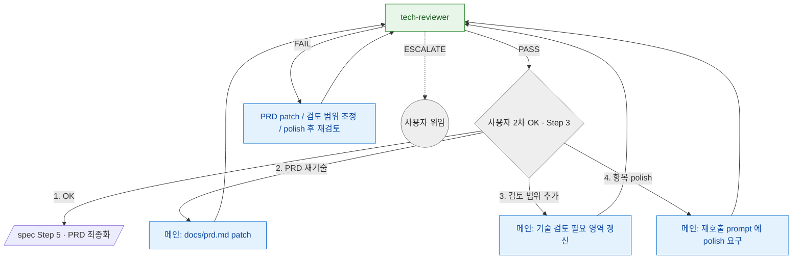

# tech-review 분기 규칙 SSOT

> **Status**: ACTIVE
> **Scope**: `/tech-review` skill **단일 전용** 분기 규칙 진본 — tech-reviewer 의 결론 (PASS / FAIL / ESCALATE) → 다음 호출 + 사용자 2차 OK 분기 + cycle 재진입 + **단방향 관례 (재진입 비권장)** + 비대상 + 후속. 진행 절차(Step) 는 [`SKILL.md`](SKILL.md). tech-reviewer 는 tech-review 전용 agent 라 본 문서가 유일 진본 (맥락 분기 없음).
> **Cross-ref**: 단방향 관례 (코드 강제 아님) = [`hooks.md`](../../docs/plugin/hooks.md#catastrophic-gatesh) 의 tech-review 자연어 관례 · 강제 영역 = [`../../CLAUDE.md`](../../CLAUDE.md) · 용어 기준 = [`terms.md`](../../docs/plugin/terms.md).

## 읽는 법

tech-reviewer 는 stateless — `docs/prd.md` 의 **기술 검토 필요 영역**을 받아 `docs/tech-review.md`, `docs/tech-review/evidence/**`, `docs/tech-review/report.html` 을 생성/갱신하고 prose 결론 (PASS / FAIL / ESCALATE) 을 낸다. 메인 Claude 가 그 결론을 사용자에게 echo 하고, 사용자 2차 OK 응답 (OK / PRD patch / 검토 범위 추가 / polish) 에 따라 다음을 정한다. cycle 컨텍스트는 메인이 재호출 prompt 에 명시한다.

## 분기 그래프

> 초록 = 검증 agent · 파랑 = 메인 patch 작업 · 회색 = 사용자 체크포인트 / 위임. 점선 = escalate 경계.
>
> **PASS** → 사용자 2차 OK 체크포인트. OK 면 `/spec` Step 5 로 돌아가 PRD 최종화. **FAIL** → PRD patch / 검토 범위 조정 / polish 후 재검토가 기본이다. **ESCALATE** → 정상 체크포인트 우회, 사용자 위임 only.

## 결론 → 다음 호출 매핑

| 입력 | 다음 |
|---|---|
| **tech-reviewer PASS** | → 메인이 산출물 echo → 사용자 2차 OK 체크포인트. OK → `/spec` Step 5 PRD 최종화 |
| **tech-reviewer FAIL** | → 메인이 *FAIL + 미해결 항목* 명시 echo → PRD patch / 검토 범위 추가 / polish 후 Step 1 재검토 |
| **tech-reviewer ESCALATE** | → 정상 체크포인트 우회 — 사용자 위임 only |
| **사용자 2차 OK — 1. OK** | → `/spec` Step 5 로 복귀해 PRD 최종화 |
| **사용자 — 2. PRD 재기술** | → 메인 `docs/prd.md` patch → Step 1 재진입 |
| **사용자 — 3. 검토 범위 추가** | → 메인 `docs/prd.md` 의 기술 검토 필요 영역 갱신 → Step 1 재진입 |
| **사용자 — 4. 항목 polish** | → 메인 재호출 prompt 에 polish 요구 명시 → Step 1 재진입 |

> tech-reviewer 는 issue 생성·git 외부 상태 변경 없음 — PRD patch 와 재호출 컨텍스트 정리는 모두 **메인**이 수행한다.

## 단방향 관례 (재진입 비권장)

`/design` 진입 *후* `/tech-review` (tech-reviewer) 재호출은 **관례상 비권장** — 코드 강제 아닌 *자연어 관례* (메인/사용자 자율 판단, [`hooks.md`](../../docs/plugin/hooks.md#catastrophic-gatesh) 의 tech-review 자연어 관례).

**왜 단방향?**
- tech-reviewer 단계 = PRD 최종화 전 기술 검증 기회. 검증 충실 의무 가중 (증거물 / HTML 리포트 룰의 가치 근거).
- /design 진입 후 역방향 회귀 = ping-pong 사고 패턴 (옛 plan-reviewer cycle 한도 룰이 누적된 원인, 이슈 [#515](https://github.com/alruminum/dcNess/issues/515)).

**/design 도중 미검증 새 외부 의존 발견 시 → `NEW_DEP_ESCALATE` 3안** (tech-reviewer 재호출 *없이*):
1. **채택 + 수동 검증** — 사용자 승인 → 해당 architect 재진입
2. **대안 기술 우회** — tech-review 기검증 대안 지정 → architect 재진입
3. **전체 원점 회귀** — `/design` 중단 + `/spec` 재진입 + 새 tech-review

(1)·(2) cycle ≤ 2. **어느 옵션이든 tech-reviewer 재호출 0** — design 안엔 tech-reviewer 가 없어 NO_GO 판정 자체 불가 — 그래서 "전체 회귀 only" 가 아니라 사용자 선택 3안. 상세 흐름 = [`../design/design-routing.md`](../design/design-routing.md#escalate-처리).

## 비대상 (다른 skill 추천)

- PRD 미작성 / 기술 검토 필요 영역 부재 → `/spec` 먼저
- 기술 검토 필요 영역이 "해당 없음" → `/tech-review` skip 후 `/spec` Step 5 PRD 최종화
- 설계 단계 진입 → `/design`
- 구현 단계 진입 → `/impl`
- GitHub issue 초안/등록 → `/to-issue`

## 후속 (skill 종료 후)

- tech-review 통과 + 사용자 OK → `/spec` Step 5 로 복귀해 PRD 최종화
- tech-review 실패 (FAIL / ESCALATE) → 메인 + 사용자 patch 토론 → Step 1 재진입 또는 사용자 위임
- tech-review 완료 후 *기술 자체 폐기* 결정 → `/spec` 재진입 (PRD 자체 수정)
