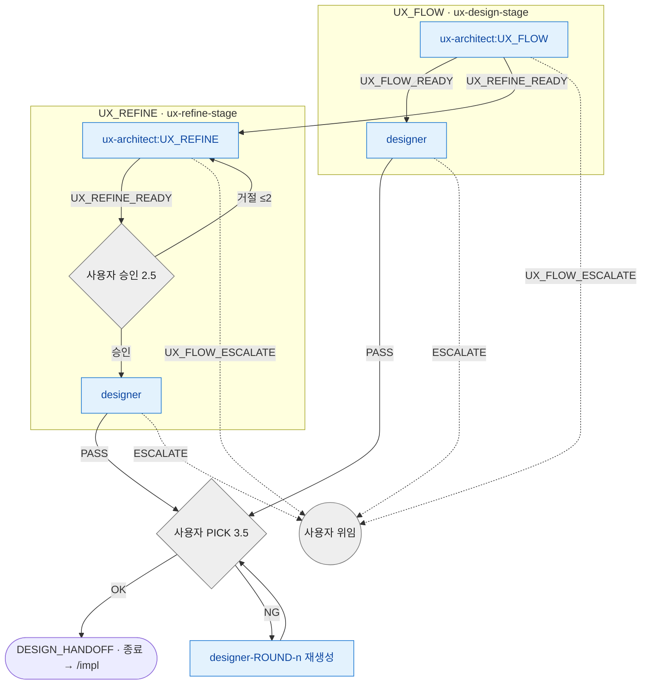

# ux 라우팅 SSOT

> **Status**: ACTIVE
> **Scope**: `/ux` skill **단일 전용** 라우팅 진본 — 이 skill 안 agent (ux-architect / designer) 의 결론 → 다음 호출 + 모드 전환 (UX_FLOW ↔ UX_REFINE) + cycle 한도 + escalate + 후속. 진행 절차(Step) 는 [`SKILL.md`](SKILL.md).
> **Cross-ref**: catastrophic 보존 = [`hooks.md`](../../docs/plugin/hooks.md#catastrophic-gatesh) · 권한 경계 = [`agent_boundary.py`](../../harness/agent_boundary.py).

## 읽는 법

agent 는 일을 마치면 prose 마지막 단락에 *어떤 결과로 끝났는지 + 사유* 를 자기 언어로 적는다. 메인 Claude 가 그 prose 를 읽고 아래 매핑으로 다음 호출을 정한다. 이 문서는 형식 강제가 아니라 *판단 보조* — 의미만 맞으면 된다. prose 가 모호하면 사용자에게 위임한다.

라우팅은 **skill 이 소유**한다. agent 는 결론(enum)만 내고, "그 결론이면 다음 누구" 는 본 문서가 정한다. 같은 agent (ux-architect / designer) 가 다른 skill (architect-loop / impl-loop) 에 나와도 그건 *그 skill 의 라우팅* 이지 본 문서 영역이 아니다.

## 라우팅 그래프

> 파랑 = 생산 agent · 회색 = 사용자 체크포인트 / 위임. 점선 = escalate. 엣지의 `≤N` = cycle 한도 ([cycle 한도](#cycle-한도)).
>
> 사용자 PICK(3.5) · 사용자 승인(2.5) 은 helper begin/end-step 비대상 (컨벤션 `user-pick-3.5` / `user-approval-2.5`). design handoff loop 자체가 **commit 없음** — cycle 산출물은 덮어쓰기 전제.

## 결론 → 다음 호출 매핑

| agent | 결론 → 다음 호출 |
|---|---|
| **ux-architect:UX_FLOW** | `UX_FLOW_READY` → designer · `UX_REFINE_READY` → UX_REFINE 모드 전환 (ux-architect:UX_REFINE 재진입) · `UX_FLOW_ESCALATE` → 사용자 |
| **ux-architect:UX_REFINE** | `UX_REFINE_READY` → 사용자 승인(Step 2.5) → designer · `UX_FLOW_ESCALATE` → 사용자. (allowed_enums = `UX_REFINE_READY,UX_FLOW_ESCALATE`) |
| **designer** | `PASS` → 사용자 PICK(Step 3.5) · `ESCALATE` → 사용자 |

표만으로 안 풀리는 맥락:

- **모드 전환** — UX_FLOW 진행 중 ux-architect 가 "기존 화면 개선이 맞다" 판단해 `UX_REFINE_READY` 로 끝나면 UX_REFINE 절차로 전환 (ux-architect:UX_REFINE 재진입).
- **designer 재생성** — 사용자 PICK NG 는 round 한도가 **없다** (사용자 자유 결정, sub_cycle `designer-ROUND-<n>`). cycle 한도([cycle 한도](#cycle-한도))는 *self-check FAIL / 승인 거절* 경로에만 적용.

## cycle 한도

| 재시도 경로 | 한도 | 초과 시 |
|---|---|---|
| ux-architect self-check FAIL (UX_FLOW) → ux-architect 재진입 | 2 cycle | 사용자 위임 |
| 사용자 승인 거절 (UX_REFINE Step 2.5) → ux-architect 재진입 | 2 cycle | 사용자 위임 |
| designer `PASS` + 사용자 PICK NG → `designer-ROUND-<n>` 재생성 | 한도 X | (사용자 자유 결정) |

> cycle 발생 시 commit 없음 — design handoff loop 자체가 commit X (working tree only).

## escalate 처리

escalate 계열 결론(`UX_FLOW_ESCALATE` / designer `ESCALATE`) 수신 시 **메인이 즉시 사용자 보고 후 대기** (자동 복구 / 우회 / 재시도 금지 — [`../../CLAUDE.md`](../../CLAUDE.md) 강제 영역).

- **화면 전환 / 인터랙션 모호** (ux-architect) → 추측 X. 다중 해석 제시 + 사용자 위임 (PRD 범위 문제면 메인 `/spec` 재진입 권고 (`/product-plan` 호환)).
- **designer 환경 미감지 / 시안 불가** → 사용자 위임.

## 후속 (skill 종료 후)

- DESIGN_HANDOFF 완료 → 구현은 `/impl`
- 본 skill 진입 경로 — `/issue-report` 의 DESIGN_ISSUE 후속 + `/architect-loop` 의 `UX_REFINE_READY` 후속
